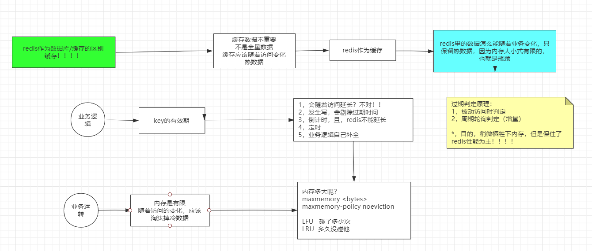

# 0. 基本常识

磁盘寻址耗费时间是ms级别，带宽是G/M

内存寻址耗费时间是ns级别，带宽很大

磁盘比内存在寻址上慢了10W倍

磁盘有磁道和和扇区，一个扇区有512Byte，如果容量增大时，索引也会变大。所以随着文件变大，速度变慢

操作系统，无论你读多少，都是以4K的倍数去读取数据


关系型数据库建表：必须给出schema类型，即可得出字节宽度，

会倾向行级存储，根据类型字节宽度存储，不足的位置部0，这样存储长度固定，修改数据时，不会移动数据


当数据库表很大的时候，性能会下降吗？如果表有索引，增删改变很慢，查询速度呢？

1. 1个或者商量查询依然很快
2. 并发大的时候会受磁盘带宽影响速度


数据库排行网址 https://db-engines.com/en/ranking


redis官网 http://redis.cn/


# 1. redis介绍

Redis 是一个开源（BSD许可）的，内存中的数据结构存储系统，它可以用作数据库、缓存和消息中间件。 它支持多种类型的数据结构，如 [字符串（strings）](http://redis.cn/topics/data-types-intro.html#strings)， [散列（hashes）](http://redis.cn/topics/data-types-intro.html#hashes)， [列表（lists）](http://redis.cn/topics/data-types-intro.html#lists)， [集合（sets）](http://redis.cn/topics/data-types-intro.html#sets)， [有序集合（sorted sets）](http://redis.cn/topics/data-types-intro.html#sorted-sets) 与范围查询， [bitmaps](http://redis.cn/topics/data-types-intro.html#bitmaps)， [hyperloglogs](http://redis.cn/topics/data-types-intro.html#hyperloglogs) 和 [地理空间（geospatial）](http://redis.cn/commands/geoadd.html) 索引半径查询。 Redis 内置了 [复制（replication）](http://redis.cn/topics/replication.html)，[LUA脚本（Lua scripting）](http://redis.cn/commands/eval.html)， [LRU驱动事件（LRU eviction）](http://redis.cn/topics/lru-cache.html)，[事务（transactions）](http://redis.cn/topics/transactions.html) 和不同级别的 [磁盘持久化（persistence）](http://redis.cn/topics/persistence.html)， 并通过 [Redis哨兵（Sentinel）](http://redis.cn/topics/sentinel.html)和自动 [分区（Cluster）](http://redis.cn/topics/cluster-tutorial.html)提供高可用性（high availability）。


## 1.1 redis与memcached对比

redis和memcached都是基于内存的key-value存储的，可以用于缓存

**区别在于mencached是没有类型的。**

1. 类型不是很重要，mencached没有类型，也可以通过json格式存储负责的数据结构。
2. mencached缺点在于，如果需要查询list中的某一个值时，mencached需要返回value的所有数据到client，服务器会受到网卡IO的限制，同时client要有实现的代码去解码，而redis的服务器对每种类型都有自己的方法，如index()，lpop等。


## 1.2 redis命令

```
./redis_cli -h 127.0.0.1 -p 6379

#使用help命令查看帮助文档
>help
>help <command>

#查看指定key的类型
>type key
```


redis采用字节流存储


# 2. Redis类型

## 2.1 string

1. 字符串

   set

   get

   append  追加字符串

   setrange  从指定偏移量开始，覆盖字符串的内容

   getrange  获取执行偏移量范围的字符串内容

   strlen   计算字符串的长度

   **正反向索引：**

   正向索引从0开始

   反向索引从-1开始，-1表示最后一位

2. 数值

   incr   加1

   incrby  加上指定数值

   incrbyfloat   加上浮点数

   dec   减1

   decby  减少指定值

   > 适用场景 ：
   >
   > 抢购，秒杀，详情页，点赞，评论
   >
   > 规避并发下，
   >
   > 对数据库的事务操作
   >
   > 完全由redis内存操作代替

3.  bitmap

   setbit    对key所存储的字符串值，设置或清除指定偏移量上的位（bit），返回值为该位在setbit之前的值， value只能取0或1，    				offset从0开始，即使原位图只能10位，offset可以取1000

   getbit   对key所存储的字符串值，获取指定偏移量上的位（bit）

   bitcount  获取位图指定范围中位值为1的个数，如果不指定start与end，则取所有

   bitpos     计算位图指定范围第一个偏移量对应的的值等于targetBit的位置

   1. 找不到返回-1
   2. start与end没有设置，则取全部
   3. targetBit只能取0或者1

   bitop 做多个BitMap的and（交集）、or（并集）、not（非）、xor（异或）操作并将结果保存在destKey中

   > 适用场景：
   >
   > 
   >
   > 1,有用户系统，统计用户登录天数，且窗口随机
   >
   > setbit sean 1 1
   >
   > setbit sean 7 1
   >
   > setbit sean 364 1
   >
   > STRLEN sean
   >
   > BITCOUNT sean -2 -1
   >
   > ​     
   >
   > ​           01 02 03 04
   >
   > sean  0  1  0  1  010101
   >
   > json   0  1  0  1  011111
   >
   > 每用户46B * 用户数 10000000 =460 000 000
   >
   > 使用bitmap相对于关系型数据库，能大大节约存储空间
   >
   > 
   >
   > 2，京东就是你们的，618做活动：送礼物
   >
   > 大库备货多少礼物
   >
   > 假设京东有2E用户
   >
   > 僵尸用户
   >
   > 冷热用户/忠诚用户
   >
   > 活跃用户统计！随即窗口
   >
   > 比如说 1号~3号 连续登录要   去重
   >
   > setbit 20190101  1 1
   >
   > setbit 20190102  1 1
   >
   > setbit 20190102  7 1
   >
   > bitop or  destkey 20190101 20190102
   >
   > BITCOUNT destkey 0 -1 
   >
   > 
   >
   > ​                   u1 u2 u3 
   >
   > 20190101  0   1  0   000100
>
   > 20190102  1   1  0  10101

   ## 2.2 List

   以双向链表的结构存储

   

| 命令                                  | 描述                                                         |
| ------------------------------------- | ------------------------------------------------------------ |
| lpush key value1 [value2]             | 将一个或多个值插入到列表头部                                 |
| rpush key value1 [value2]             | 将一个或多个值插入到列表尾部                                 |
| lpushx key value                      | 用于将一个值插入到已存在的列表头部(最左边)。如果列表不存在，操作无效。 |
| rpushx key value                      | 用于将一个值插入到已存在的列表尾部(最右边)。如果列表不存在，操作无效。 |
| lpop key                              | 移出并获取列表的第一个元素                                   |
| rpop key                              | 移除列表的最后一个元素，返回值为移除的元素                   |
| llen key                              | 获取列表长度                                                 |
| lrem key count value                  | 移除列表元素</br> count > 0 : 从表头开始向表尾搜索，移除与 VALUE 相等的元素，数量为 COUNT；</br> count < 0 : 从表尾开始向表头搜索，移除与 VALUE 相等的元素，数量为 COUNT 的绝对值；</br>count = 0 : 移除表中所有与 VALUE 相等的值。 |
| lset key index value                  | 通过索引设置列表元素的值                                     |
| ltrim key start stop                  | 对一个列表进行修剪(trim)，就是说，让列表只保留指定区间内的元素，不在指定区间之内的元素都将被删除。 |
| lindex key index                      | 通过索引获取列表中的元素                                     |
| blpop key1 key2 timeout               | 移出并获取列表的第一个元素， 如果列表没有元素会阻塞列表直到等待超时或发现可弹出元素为止。 |
| brpop key1 key2 timeout               | 移出并获取列表的最后一个元素， 如果列表没有元素会阻塞列表直到等待超时或发现可弹出元素为止。 |
| linsert key before\|after pivot value | Redis Linsert 命令用于在pivot元素前或者后插入元素。当指定元素不存在于列表中时，不执行任何操作。 |
| brpoplpush source destination timeout | 从列表中弹出一个值，将弹出的元素插入到另外一个列表中并返回它； 如果列表没有元素会阻塞列表直到等待超时或发现可弹出元素为止。 |


   栈 ：反向读写数据

   队列 ： 同向读写数据

   数组：按照索引读写数据

   阻塞单播队列: FIFO

   

## 2.3 Hash

| 命令                                           | 描述                                                         |
| :--------------------------------------------- | :----------------------------------------------------------- |
| hdel key field1 [field2]                       | 删除一个或多个哈希表字段                                     |
| hexists  key field                             | 查看哈希表 key 中，指定的字段是否存在。                      |
| hget key field                                 | 获取存储在哈希表中指定字段的值。                             |
| hgetall key                                    | 获取在哈希表中指定 key 的所有字段和值                        |
| hincrby key field increment                    | 为哈希表 key 中的指定字段的整数值加上增量 increment 。       |
| hincrbyfloat key field increment               | 为哈希表 key 中的指定字段的浮点数值加上增量 increment 。     |
| hkeys all                                      | 获取所有哈希表中的字段                                       |
| hlen key                                       | 获取哈希表中字段的数量                                       |
| hmget key field1 [field2]                      | 获取所有给定字段的值                                         |
| hmset key field1 value1 [field2 value2]        | 同时将多个 field-value (域-值)对设置到哈希表 key 中。        |
| hset key field value                           | 将哈希表 key 中的字段 field 的值设为 value 。                |
| hsetnx key field value                         | 只有在字段 field 不存在时，设置哈希表字段的值。              |
| hvals key                                      | 获取哈希表中所有值。                                         |
| hscan key cursor [match pattern] [COUNT count] | 迭代哈希表中的键值对,count指定从数据集里返回多少元素，默认值为 10。 |

## 2.4 Set

1. Set是【无序】&&【随机性】

   放入的多少不同，元素存储的顺序不同

   可用于去重

2. 集合操作   交集、并集、差集  

3. 随机事件  

   **取出多个**：  SRANDMEMBER  key count

   正数：取出一个去重的结果集（不能超过已有集）

   负数：取出一个带重复的结果集，一定满足你要的数量

   如果：0，不返回

   **取出1个**：spop 

| 命令                                           | 描述                                                |
| :--------------------------------------------- | :-------------------------------------------------- |
| sadd key member1 member2                       | 向集合添加一个或多个成员                            |
| scard key                                      | 获取集合的成员数                                    |
| sdiff key1 key2                                | 返回第一个集合与其他集合之间的差集                  |
| sdiffstore destination key1 key2               | 返回给定所有集合的差集并存储在 destination 中       |
| sinter key1 key2                               | 返回给定所有集合的交集                              |
| sinterstore destination key1 key2              | 返回给定所有集合的交集并存储在 destination 中       |
| sismember key member                           | 判断 member 元素是否是集合 key 的成员               |
| smembers key                                   | 返回集合中的所有成员                                |
| smove source destination member                | 将 member 元素从 source 集合移动到 destination 集合 |
| spop key                                       | 移除并返回集合中的一个随机元素                      |
| srandmember key count                          | 返回集合中一个或多个随机数                          |
| srem key member1 member2                       | 移除集合中一个或多个成员                            |
| sunion key1 key2                               | 返回所有给定集合的并集                              |
| sunionstore destination key1 key2              | 所有给定集合的并集存储在 destination 集合中         |
| sscan key cursor [match pattern] [COUNT count] | 迭代集合中的元素                                    |

## 2.5 Sorted_set

sorted_set有序集合，根据权重排序，如果没有设置权重，按照key排序

1. 物理内存左小右大，不随命令发生变化  zrang   zrevrang

2. 集合操作    并集，交集   ; 权重/聚合指令

3. 排序是怎么实现的 ，增删改查的速度？

   采用跳跃表 skip list，跳跃表的查询复杂度是O(logn)（n为层数），增删改复杂度为O(logn)

   

   


| 命令                                           | 描述                                                         |
| :--------------------------------------------- | :----------------------------------------------------------- |
| zadd key score1 member1 score2 member2         | 向有序集合添加一个或多个成员，或者更新已存在成员的分数       |
| zcard key                                      | 获取有序集合的成员数                                         |
| zcount key min max                             | 计算在有序集合中指定区间分数的成员数                         |
| zincrby key increment member                   | 有序集合中对指定成员的分数加上增量 increment                 |
| zinterstore destination numkeys key ...        | 计算给定的一个或多个有序集的交集并将结果集存储在新的有序集合 destination 中 |
| zlexcount key min max                          | 在有序集合中计算指定字典区间内成员数量                       |
| zrange key start stop [withscores]             | 通过索引区间返回有序集合指定区间内的成员                     |
| zrangebylex key min max [limit offset count]   | 通过字典区间返回有序集合的成员                               |
| zrangebyscore key min max [withscores] [limit] | 通过分数返回有序集合指定区间内的成员                         |
| zrank key member                               | 返回有序集合中指定成员的索引                                 |
| zrem key member ...                            | 移除有序集合中的一个或多个成员                               |
| zremrangebylex key min max                     | 移除有序集合中给定的字典区间的所有成员                       |
| zremrangebyrank key start stop                 | 移除有序集合中给定的排名区间的所有成员                       |
| zremrangebyscore key min max                   | 移除有序集合中给定的分数区间的所有成员                       |
| zrevrange key start stop [withscores]          | 返回有序集中指定区间内的成员，通过索引，分数从高到低         |
| zrevrangebyscore key max min [withscores]      | 返回有序集中指定分数区间内的成员，分数从高到低排序           |
| zrevrank key member                            | 返回有序集合中指定成员的排名，有序集成员按分数值递减(从大到小)排序 |
| zscore key member                              | 返回有序集中，成员的分数值                                   |
| zunionstore destination numkeys key ...        | 计算给定的一个或多个有序集的并集，并存储在新的 key 中        |
| zscan key cursor [match pattern] [COUNT count] | 迭代有序集合中的元素（包括元素成员和元素分值）               |

# 3. 管道Pipelining

Redis是一种基于客户端-服务端模型以及请求/响应协议的TCP服务。

客户端和服务器通过网络进行连接，无论网络延如何延时，数据包总是能从客户端到达服务器，并从服务器返回数据回复客户端。

这个时间被称之为 RTT (Round Trip Time - 往返时间)。

采用管道可以将多个命令发送到服务器，而不用等待回复，最后在一个步骤中读取该答复。这样就可以节省RTT的时间。

**注意**: 使用管道发送命令时，服务器将被迫回复一个队列答复，占用很多内存。所以，如果你需要发送大量的命令，最好是把他们按照合理数量分批次的处理，例如10K的命令，读回复，然后再发送另一个10k的命令，等等。这样速度几乎是相同的，但是在回复这10k命令队列需要非常大量的内存用来组织返回数据内容。

# 4. 发布订阅 Pub/Sub

Redis 发布订阅 (pub/sub) 是一种消息通信模式：发送者 (pub) 发送消息，订阅者 (sub) 接收消息。

Redis 客户端可以订阅任意数量的频道。


| 命令                                        | 描述                               |
| :------------------------------------------ | :--------------------------------- |
| PSUBSCRIBE pattern [pattern ..]             | 订阅一个或多个符合给定模式的频道。 |
| PUBSUB subcommand [argument [argument ...]] | 查看订阅与发布系统状态。           |
| PUBLISH channel message                     | 将信息发送到指定的频道。           |
| PUNSUBSCRIBE [pattern [pattern ...]]        | 退订所有给定模式的频道。           |
| SUBSCRIBE channel [channel ...]             | 订阅给定的一个或多个频道的信息。   |
| UNSUBSCRIBR [channel [channel ...]]         | 退订给定的一个或多个频道的信息。   |

# 5. 事务

Redis 事务可以一次执行多个命令， 并且带有以下三个重要的保证：

- 批量操作在发送 EXEC 命令前被放入队列缓存。
- 收到 EXEC 命令后进入事务执行，事务中任意命令执行失败，其余的命令依然被执行。
- 在事务执行过程，其他客户端提交的命令请求不会插入到事务执行命令序列中。

一个事务从开始到执行会经历以下三个阶段：

- 开始事务。
- 命令入队。
- 执行事务。


**事务中的错误**：

使用事务时可能会遇上以下两种错误：

- 事务在执行 [EXEC](http://redis.cn/commands/exec.html) 之前，入队的命令可能会出错。比如说，命令可能会产生语法错误（参数数量错误，参数名错误，等等），或者其他更严重的错误，比如内存不足（如果服务器使用 `maxmemory` 设置了最大内存限制的话）。
- 命令可能在 [EXEC](http://redis.cn/commands/exec.html) 调用之后失败。举个例子，事务中的命令可能处理了错误类型的键，比如将列表命令用在了字符串键上面，诸如此类。

在执行 [EXEC](http://redis.cn/commands/exec.html) 之前的错误：

Redis2.6.5之前，检查入队的返回值，返回QUEUE则入队成功，否则失败，如果有命令在入队时失败，那么大部分客户端都会停止并取消这个事务。

从 Redis 2.6.5 开始，服务器会对命令入队失败的情况进行记录，并在客户端调用 [EXEC](http://redis.cn/commands/exec.html) 命令时，拒绝执行并自动放弃这个事务。


在 [EXEC](http://redis.cn/commands/exec.html) 命令执行之后所产生的错误：

 即使事务中有某个/某些命令在执行时产生了错误， 事务中的其他命令仍然会继续执行。


**为什么 Redis 不支持回滚（roll back）**

- Redis 命令只会因为错误的语法而失败（并且这些问题不能在入队时发现），或是命令用在了错误类型的键上面：这也就是说，从实用性的角度来说，失败的命令是由编程错误造成的，而这些错误应该在开发的过程中被发现，而不应该出现在生产环境中。
- 因为不需要对回滚进行支持，所以 Redis 的内部可以保持简单且快速。


| 命令             | 描述                                                         |
| :--------------- | :----------------------------------------------------------- |
| DISCARD          | 取消事务，放弃执行事务块内的所有命令。                       |
| EXEC             | 执行所有事务块内的命令。                                     |
| MULTI            | 标记一个事务块的开始。                                       |
| UNWATCH          | 取消 WATCH 命令对所有 key 的监视。                           |
| WATCH key key... | 监视一个(或多个) key ，如果在事务执行之前这个(或这些) key 被其他命令所改动，那么事务将被打断。 |

# 6. modules

Redis4.0之后， modules 能够支持使用高级API（RedisModule_Call）或者 低级API 去直接访问操作 Redis 内置的数据结构。

## 6.1 RedisBloom

可伸缩的Bloom过滤器，布隆过滤器（Bloom Filter）是1970年由布隆提出的。它实际上是一个很长的[二进制](https://baike.baidu.com/item/二进制/361457)向量和一系列随机映射函数。布隆过滤器可以用于检索一个元素是否在一个集合中。它的优点是空间效率和查询时间都比一般的算法要好的多，缺点是有一定的误识别率和删除困难。


**使用步骤**

1，访问redis.io

2,modules

3,访问RedisBloom的github

   https://github.com/RedisBloom/RedisBloom

4，linux中wget *.zip

5,yum install unzip

6,unzip *.zip

7,make

8,cp bloom.so /opt/mashibing/redis5/

9,redis-server --loadmodule /opt/mashibing/redis5/redisbloom.so

10 ,redis-cli 

11,bf.add ooxx abc

bf.exits  abc

bf.exits sdfsdf

12,cf.add  # 布谷鸟过滤器




# 7. 过期expire

```
redis> SET mykey "Hello"
OK
redis> EXPIRE mykey 10
(integer) 1
redis> TTL mykey
(integer) 10
redis> SET mykey "Hello World"
OK
redis> TTL mykey
(integer) -1
```

1. 使用[PERSIST](http://redis.cn/commands/persist.html)命令可以清除超时，使其变成一个永久的`key`。
2. 如果`key`被[RENAME](http://redis.cn/commands/rename.html)命令修改，相关的超时时间会转移到新`key`上面。
3. 对已经有过期时间的`key`执行`EXPIRE`操作，将会更新它的过期时间。
4. 要想过期的工作处理好，计算机必须采用稳定的时间。 -> 时钟同步


**Redis如何淘汰过期的keys**

Redis keys过期有两种方式：被动和主动方式。

**主动方式**：当一些客户端尝试访问它时，key会被发现并主动的过期。

**被动方式**：redis定时随机测试设置keys的过期时间。所有这些过期的keys将会从密钥空间删除。

具体就是Redis每秒10次做的事情：

1. 测试随机的20个keys进行相关过期检测。
2. 删除所有已经过期的keys。
3. 如果有多于25%的keys过期，重复步奏1.

# 8. 缓存LRU

在`redis.conf`文件, 可以通过maxmemory 100mb指定限制的内存大小，设置`maxmemory`为0代表没有内存限制。

当指定的内存限制大小达到时，需要选择不同的行为，也就是**策略**。

## 8.1 回收策略

当maxmemory限制达到的时候Redis会使用的行为由 Redis的maxmemory-policy配置指令来进行配置。

- **noeviction**:返回错误当内存限制达到并且客户端尝试执行会让更多内存被使用的命令（大部分的写入指令，但DEL和几个例外）
- **allkeys-lru**: 尝试回收最近最少使用的键（LRU），使得新添加的数据有空间存放。
- **volatile-lru**: 尝试回收最近最少使用的键（LRU），但仅限于在过期集合的键,使得新添加的数据有空间存放。
- **allkeys-lfu** ：尝试回收最不经常使用的键（LFU）。
- **allkeys-random**: 回收随机的键使得新添加的数据有空间存放。
- **volatile-random**: 回收随机的键使得新添加的数据有空间存放，但仅限于在过期集合的键。
- **volatile-ttl**: 回收在过期集合的键，并且优先回收存活时间（TTL）较短的键,使得新添加的数据有空间存放。


## 8.2 近似LRU算法

Redis的LRU算法并非完整的实现。只是通过对少量keys进行取样，然后回收其中一个被访问时间较早的key。

不过从Redis 3.0算法已经改进为回收键的候选池子，使得更加近似LRU算法。

可以通过调整每次回收时检查的采样数量，以实现**调整**算法的精度。

```
maxmemory-samples 5
```

在都是五个采样的时候Redis 3.0比Redis 2.8要好，Redis2.8中在最后一次访问之间的大多数的对象依然保留着。使用10个采样大小的Redis 3.0的近似值已经非常接近理论的性能。


可以调整采样数量，查看下是否让你的缓存命中率有差别。

```
telnet localhost 6379  
info 

keyspace_hits:10334006822
keyspace_misses:564928818

缓存的命中率=keyspace_hits/(keyspace_hits+keyspace_misses)


下面是与缓存有关系的信息
expired_keys:453538
evicted_keys:0
maxmemory:0
used_memory:2686308984
```


# 9. 持久化 RDB和AOF

- RDB持久化方式能够在指定的时间间隔能对你的数据进行快照存储.
- AOF持久化方式记录每次对服务器写的操作,当服务器重启的时候会重新执行这些命令来恢复原始的数据,AOF命令以redis协议追加保存每次写的操作到文件末尾.Redis还能对AOF文件进行后台重写,使得AOF文件的体积不至于过大.
- 开启两种持久化方式时, 当redis重启的时候会优先载入AOF文件来恢复原始的数据,因为在通常情况下AOF文件保存的数据集要比RDB文件保存的数据集要完整.

## 9.1 RDB

Redis采用fork开启一个子进程，子进程并不是将父进程内存中的数据复制一份，只是复制引用，采用指针指向原来的数据，子进程将数据集写入到一个临时 RDB 文件中，当子进程完成对新 RDB 文件的写入时，Redis 用新 RDB 文件替换原来的 RDB 文件，并删除旧的 RDB 文件。

父进程继续负责redis数据的更新，由于copy on write机制，父进程更新时会写入另外的一个内存，将指针的引用指向新的内存地址，来更新数据，这样子进程的数据并不会变化。

fork是系统调用
copy on write是内核机制


通过配置，可以让它在“ N 秒内数据集至少有 M 个改动”这一条件被满足时， 自动保存一次数据集。

你也可以通过调用 SAVE或者 BGSAVE ， 手动让 Redis 进行数据集保存操作。

SAVE会阻塞Redis的操作，BGSAVE会另外fork一个子进程，将数据写入到RDB文件中，不会阻塞Redis的请求。

 Redis 在满足“ 60 秒内有至少有 1000 个键被改动”这一条件时， 自动保存一次数据集，这种持久化方式被称为快照 snapshotting.

```
save 60 1000
```


当服务器要创建一个新的 RDB 文件时， 它先将文件的内容保存在一个临时文件里面， 当临时文件写入完毕时， 程序才使用 rename(2) 原子地用临时文件替换原来的 RDB 文件。

```
#RDB保存策略
save 900 1
save 300 10
save 60 10000

#rdb保存的文件名
dbfilename dump.rdb
#rdb文件保存的目录
dir ./

```


**优点：**

1. 保存了某个时间点得数据集,非常适用于数据集的备份
2. 很方便传送到另一个远端数据中心或者亚马逊的S3（可能加密），非常适用于灾难恢复
3. 与AOF相比,在恢复大的数据集的时候，RDB方式会更快一些.
4. RDB在保存RDB文件时父进程fork出一个子进程,接下来的工作全部由子进程来做，父进程不需要再做其他IO操作，所以RDB持久化方式可以最大化redis的性能.


**缺点：**

1. 会丢失数据，不能保证数据完整

2. 当数据集比较大的时候,fork的过程是非常耗时的,可能会导致Redis在一些毫秒级内不能响应客户端的请求.

   

## 9.2 AOF

AOF持久化方式记录每次对服务器写的操作,当服务器重启的时候会重新执行这些命令来恢复原始的数据,AOF命令以redis协议追加保存每次写的操作到文件末尾.Redis还能对AOF文件进行后台重写,使得AOF文件的体积不至于过大.

**AOF重写工作原理：**

AOF 重写和 RDB 创建快照一样，都巧妙地利用了写时复制机制:

- Redis 执行 fork() ，现在同时拥有父进程和子进程。
- 子进程开始将新 AOF 文件的内容写入到临时文件。
- 对于所有新执行的写入命令，父进程一边将它们累积到一个内存缓存中，一边将这些改动追加到现有 AOF 文件的末尾,这样样即使在重写的中途发生停机，现有的 AOF 文件也还是安全的。
- 当子进程完成重写工作时，它给父进程发送一个信号，父进程在接收到信号之后，将内存缓存中的所有数据追加到新 AOF 文件的末尾。
- 现在 Redis 原子地用新文件替换旧文件，之后所有命令都会直接追加到新 AOF 文件的末尾。


在4.0之前，重写是删除抵消的命令，合并重复的命令，最终也是一个纯指令的日志文件

在4.0之后，将老的数据生成RDB，并写到aof文件中，将增量的以指令的方式Append到AOF，AOF是一个混合体，利用了RDB的快，利用了日志的全量。


AOF持久化方式记录每次对服务器写的操作,当服务器重启的时候会重新执行这些命令来恢复原始的数据,AOF命令以redis协议追加保存每次写的操作到文件末尾.Redis还能对AOF文件进行后台重写,使得AOF文件的体积不至于过大.

命令追加到文件可以使用不同的fsync策略：

1. 无fsync (no)，将数据交给操作系统来处理，当buffer满了，操作系统会自动将数据写到文件。
2. 每秒fsync (everysec)
3. 每次写的时候fsync  (always) 

使用默认的每秒fsync策略,Redis的性能依然很好(fsync是由后台线程进行处理的,主线程会尽力处理客户端请求),一旦出现故障，你最多丢失1秒的数据.


执行 BGREWRITEAOF 命令，手动生成AOF文件。Redis 2.2 需要自己手动执行 BGREWRITEAOF 命令； Redis 2.4 则可以自动触发 AOF 重写。


```
#是否开启AOF，配置成yes才会使用AOF
appendonly no
#AOF保存的文件名，AOF文件也会保存在dir配置的目录，即跟rdb保存在一个目录
appendfilename "appendonly.aof"

#fsync策略，默认是everysec
# appendfsync always
appendfsync everysec
# appendfsync no

#设置重写规则，第一次重写时达到64mb就会重写，并且会记录重写后的AOF文件大小，之后必须文件达到64mb,并且文件增长百分比大于100%时才会重写  （newSize-baseSize）/baseSize
auto-aof-rewrite-percentage 100
auto-aof-rewrite-min-size 64mb
```


**如果AOF文件损坏了怎么办？**

- 为现有的 AOF 文件创建一个备份。

- 使用 Redis 附带的 redis-check-aof 程序，对原来的 AOF 文件进行修复:

  $ redis-check-aof –fix

- （可选）使用 diff -u 对比修复后的 AOF 文件和原始 AOF 文件的备份，查看两个文件之间的不同之处。

- 重启 Redis 服务器，等待服务器载入修复后的 AOF 文件，并进行数据恢复。


**怎样从RDB方式切换为AOF方式**

在 Redis 2.2 或以上版本，可以在不重启的情况下，从 RDB 切换到 AOF ：

- 为最新的 dump.rdb 文件创建一个备份。
- 将备份放到一个安全的地方。
- 执行以下两条命令:
- redis-cli config set appendonly yes
- redis-cli config set save “”
- 确保写命令会被正确地追加到 AOF 文件的末尾。
- 在 redis.conf 中打开 AOF 功能！否则的话， 服务器重启之后， 之前通过 CONFIG SET 设置的配置就会被遗忘， 程序会按原来的配置来启动服务器。

执行的第一条命令开启了 AOF 功能： Redis 会阻塞直到初始 AOF 文件创建完成为止， 之后 Redis 会继续处理命令请求， 并开始将写入命令追加到 AOF 文件末尾。

执行的第二条命令用于关闭 RDB 功能。 这一步是可选的， 如果你愿意的话， 也可以同时使用 RDB 和 AOF 这两种持久化功能。


**优点：**

1. 数据丢失少
2. AOF文件体量变大时可以使用重写，重写过程安全，AOF文件不会丢失。
3. AOF 文件的内容非常容易被人读懂，小心执行了 FLUSHALL 命令， 但只要 AOF 文件未被重写， 那么只要停止服务器， 移除 AOF 文件末尾的 FLUSHALL 命令， 并重启 Redis ， 就可以将数据集恢复到 FLUSHALL 执行之前的状态。

**缺点：**

1. 对于相同的数据集来说，AOF 文件的体积通常要大于 RDB 文件的体积。
2. 根据所使用的 fsync 策略，AOF 的速度可能会慢于 RDB 。 在一般情况下， 每秒 fsync 的性能依然非常高， 而关闭 fsync 可以让 AOF 的速度和 RDB 一样快， 即使在高负荷之下也是如此。 不过在处理巨大的写入载入时，RDB 可以提供更有保证的最大延迟时间（latency）。
3. 重启时数据恢复慢。


# 10. 集群

## 10.1 主从复制

官网 http://redis.cn/topics/replication.html

Redis使用默认的异步复制，其特点是低延迟和高性能。

**主从复制机制：**

1. master 会发送一连串的命令流来保持对 slave 的更新，以便于将自身数据集的改变复制给 slave
2. 当 master 和 slave 之间的连接断开之后，slave 重新连接上 master 并会尝试进行部分重同步
3. 当无法进行部分重同步时， slave 会请求进行全量重同步。


**Redis 复制功能是如何工作的**

 Redis master 都有一个 replication ID 和偏移量offset

当 slave 连接到 master 时，它们使用 PSYNC 命令来发送它们记录的旧的 master replication ID 和偏移量，master 能够仅发送 slave 所需的增量部分

 当master 的缓冲区中没有足够的命令积压缓冲记录，或者如果 slave 引用了不再知道的历史记录（replication ID），则会转而进行一个全量重同步，master 开启一个后台保存进程，生产RDB 文件。后台保存完成后， master 将数据集文件传输给 slave， slave将之保存在磁盘上，然后加载文件到内存。再然后 master 会发送所有缓冲的命令发给 slave。


无磁盘复制可以使用 repl-diskless-sync 配置参数，Redis 2.8.18 之后，子进程直接发送 RDB 文件给 slave，无需使用磁盘作为中间储存介质。


**slave只读**

自从 Redis 2.6 之后， slave 支持只读模式且默认开启。redis.conf 文件中的 slave-read-only 变量控制这个行为，且可以在运行时使用 [CONFIG SET](https://redis.io/commands/config-set) 来随时开启或者关闭。


```shell
#redis 5.0之后,配置为slave
replicaof ip port 

#redis 5.0之前,配置为slave
slaveof  ip port 

#客户端输入master的验证密码
config set masterauth <password>

#在配置文件中，配置slave对master的验证密码
masterauth <password>


replica-serve-stale-data yes
replica-read-only yes
repl-diskless-sync no

repl-backlog-size 1mb 
#增量复制

min-replicas-to-write 3
min-replicas-max-lag 10
```

replica-serve-stale-data yes 主从同步数据时，是否支持查询


## 10.2 sentinel

官网 http://redis.cn/topics/sentinel.html

**Sentinel 的作用**

1. 监控（Monitoring）：检查你的主服务器和从服务器是否运作正常
2. 提醒（Notification）：当被监控的某个 Redis 服务器出现问题时， Sentinel 可以通过 API 向管理员或者其他应用程序发送通知。
3. 自动故障迁移（Automatic failover）：master不能正常工作时，将slave升级为master，让其他的slave改为复制新的master。

Redis Sentinel 是一个分布式系统， 你可以在一个架构中运行多个 Sentinel 进程（progress）， 这些进程使用**流言协议**（gossip protocols)来接收关于主服务器是否下线的信息， 并使用**投票协议**（agreement protocols）来决定是否执行自动故障迁移， 以及选择哪个从服务器作为新的主服务器。

```
# 启动sentinel
redis-server /path/to/sentinel.conf --sentinel
./redis-sentinel /path/to/sentinel.conf

#sentinel.conf配置
#指示 Sentinel 去监视一个名为 mymaster 的主服务器，并指定ip和端口，将这个主服务器判断为失效至少需要2个 Sentinel 同意 
sentinel monitor mymaster 127.0.0.1 6379 2
#指定 Sentinel 认为服务器已经断线所需的毫秒数，如果服务器在给定的毫秒数之内， 没有返回 Sentinel 发送的 PING 命令的回复， 或者返回一个错误， 那么 Sentinel 将这个服务器标记为主观下线（subjectively down，简称 SDOWN ）,只有在足够数量的 Sentinel 都将一个服务器标记为主观下线之后， 服务器才会被标记为客观下线（objectively down， 简称 ODOWN ）
sentinel down-after-milliseconds mymaster 60000

sentinel failover-timeout mymaster 180000
#指定了在执行故障转移时， 最多可以有多少个从服务器同时对新的主服务器进行同步， 这个数字越小， 完成故障转移所需的时间就越长。
sentinel parallel-syncs mymaster 1

sentinel monitor resque 192.168.1.3 6380 4
sentinel down-after-milliseconds resque 10000
sentinel failover-timeout resque 180000
sentinel parallel-syncs resque 5
```


### 10.2.1 主观下线和客观下线

主观下线（Subjectively Down， 简称 SDOWN）指的是单个 Sentinel 实例对服务器做出的下线判断。

客观下线（Objectively Down， 简称 ODOWN）指的是多个 Sentinel 实例在对同一个服务器做出 SDOWN 判断

一个 Sentinel 可以通过向另一个 Sentinel 发送 SENTINEL is-master-down-by-addr 命令来询问对方是否认为给定的服务器已下线。

### 10.2.2 自动发现 Sentinel 和从服务器

1. Sentinel 可以通过发布与订阅功能来自动发现正在监视相同主服务器的其他 Sentinel ， 这一功能是通过向频道 **sentinel**:hello 发送信息来实现的，因此无须为运行的每个 Sentinel 分别设置其他 Sentinel 的地址

2. Sentinel 可以通过询问主服务器来获得所有从服务器的信息

  

### 10.2.3 故障转移

一次故障转移操作由以下步骤组成：

- 发现主服务器已经进入客观下线状态。
- 对我们的当前纪元进行自增（详情请参考 Raft leader election ）， 并尝试在这个纪元中当选。
- 如果当选失败， 那么在设定的故障迁移超时时间的两倍之后， 重新尝试当选。 如果当选成功， 那么执行以下步骤。
- 选出一个从服务器，并将它升级为主服务器。
- 向被选中的从服务器发送 `SLAVEOF NO ONE` 命令，让它转变为主服务器。
- 通过发布与订阅功能， 将更新后的配置传播给所有其他 Sentinel ， 其他 Sentinel 对它们自己的配置进行更新。
- 向已下线主服务器的从服务器发送 [SLAVEOF](http://redis.cn/commands/slaveof.html) 命令， 让它们去复制新的主服务器。
- 当所有从服务器都已经开始复制新的主服务器时， 领头 Sentinel 终止这次故障迁移操作。


## 10.3 分区

集群教程 http://redis.cn/topics/cluster-tutorial.html

分区 http://redis.cn/topics/partitioning.html

分区将数据分布到多个redis实例

### 10.3.1 分区方法

1. 范围分区：需要维护数据到redis实例的映射关系，效率较低

2. 散列分区： 使用散列函数转化成数字，然后取模，效率较高，但是扩展节点比较麻烦。有一种比较高级的散列分区方法叫一致性哈希

   一致性哈希     https://www.cnblogs.com/lpfuture/p/5796398.html

   

   1. 一致性哈希将整个哈希值空间组织成一个虚拟的0～2^32的圆环，可以选择服务器的ip或主机名作为关键字进行哈希，得到一个0～2^32的值，就可以确定在哈希环上的位置。
   2. 采用同样的方法求出存储数据的键的哈希值，并映射到相同的圆上。
   3. 从数据映射到的位置开始顺时针查找，将数据保存到找到的第一个服务器上。
   4. 采用上面的方法，服务器分布可能会有数据倾斜的问题，引入了虚拟节点机制，即对每一个服务节点计算多个哈希，每个计算结果位置都放置一个此服务节点，称为虚拟节点。

   **一致性哈希的缺点**：

   新增节点造成一小部分数据不能命中

   1，问题，击穿，压到mysql

   2，方案：去取离我最近的2个节点

   更倾向于 作为缓存，而不是数据库用！！！！

### 10.3.2 不同的分区实现方案

**1. 客户端分区**

**2. 代理分区** 

redis和memcached的一种代理实现就是[Twemproxy](https://github.com/twitter/twemproxy)

**3. 查询路由(Query routing)** 

客户端随机地请求任意一个redis实例，然后由Redis将请求转发给正确的Redis节点。

Redis Cluster实现了一种混合形式的查询路由，但并不是直接将请求从一个redis节点转发到另一个redis节点，而是在客户端的帮助下直接*redirected*到正确的redis节点。


### 10.3.3 分区的缺点

1. 涉及多个key的操作通常不会被支持。例如你不能对两个集合求交集，因为他们可能被存储到不同的Redis实例
2. 如果要操作的key在不同的节点，不能使用Redis事务
3. 当使用分区的时候，数据处理会非常复杂。
4. 数据分治，聚合操作很难实现    
5. 分区时动态扩容或缩容可能非常复杂。


**持久化数据还是缓存？**

- 如果Redis被当做缓存使用，使用一致性哈希实现**动态扩容缩容**。
- 如果Redis被当做一个持久化存储使用，**必须使用固定的keys-to-nodes映射关系，节点的数量一旦确定不能变化**。否则的话(即Redis节点需要动态变化的情况），必须使用可以在运行时进行数据再平衡的一套系统，而当前只有Redis集群可以做到这样

### 10.3.4 预分片

- 多设置几个Redis实例

- 需要更多的Redis服务器时，仅仅将Redis实例从一台服务迁移到另外一台服务器而已（而不用考虑重新分区的问题）

  

使用Redis复制技术，你可以做到极短或者不停机地对用户提供服务：

- 在你新服务器启动一个空Redis实例。
- 把新Redis实例配置为原实例的slave节点
- 停止你的客户端
- 更新你客户端配置，以便启用新的redis实例（更新IP）。
- 在新Redis实例中执行`SLAVEOF NO ONE`命令
- （更新配置后）重启你的客户端
- 停止你原服务器的Redis实例


### 10.3.5 Redis分区实现

1. **Redis集群**

   Redis集群是自动分片和高可用的首选方案。

   Redis集群是 *query routing* 和 *client side partitioning*的一种混合实现。

2. **twemproxy**

   git 地址 https://github.com/twitter/twemproxy

   一款快速轻量级的memcached和redis协议代理

   Twemproxy支持自动分区，如果其代理的其中一个Redis节点不可用时，会自动将该节点排除（这将改变原来的keys-instances的映射关系，所以你应该仅在把Redis当缓存时使用Twemproxy)。

   Twemproxy是Redis客户端和服务器端的一个中间层。

   然而`twemproxy`不支持的redis功能太多，像列表的阻塞命令、事物、发布订阅等都不支持，而且也没有直接支持redis的高可用。

3. **Predixy**

   2017年推出了一款全新的redis代理：`predixy`。

   `predixy`完美的实现了对redis单例模式及集群模式的支持，几乎完整的实现了redis原生的所有用于客户端的命令。多key命令、列表阻塞操作、发布订阅、脚本、扫描等高级功能全支持，在使用redis单例模式下也支持事物。

4. 支持一致性哈希的客户端

   在客户端实现一致性哈希或者其他类似算法。有很多客户端已经支持一致性哈希，如 [Redis-rb](https://github.com/redis/redis-rb) 和 [Predis](https://github.com/nrk/predis).

   Redis java客户端  https://redis.io/clients#java


### 10.3.6 Hash tag

可以使用 hash tag  不用key分区，另外指定一个参数

例如 {user1000}.following 和 {user1000}.followers ，用user1000做分区，这样following 和followers 就都能被分配到同一个节点

```
127.0.0.1:6379> set test 12
-> Redirected to slot [6918] located at 10.1.130.105:6382
(error) NOAUTH Authentication required.
10.1.130.105:6382> auth bomc
OK
10.1.130.105:6382> set test 12
OK
10.1.130.105:6382> set test1 14
-> Redirected to slot [4768] located at 10.1.130.105:6379
(error) NOAUTH Authentication required.
10.1.130.105:6379> auth bomc
OK
10.1.130.105:6379> set test{test} 14
-> Redirected to slot [6918] located at 10.1.130.105:6382
(error) NOAUTH Authentication required.
10.1.130.105:6382> auth bomc
OK
10.1.130.105:6382> set test1{test} 15
OK
10.1.130.105:6382> set {test}test2 16
OK
```


## 10.4 Redis集群

官网  http://redis.cn/topics/cluster-tutorial.html

**数据分片**

Redis 集群没有使用一致性hash, 而是引入了 **哈希槽**的概念.

Redis 集群有16384个哈希槽,每个key通过CRC16校验后对16384取模来决定放置哪个槽.


**主从复制模型** 

集群使用了主从复制模型,每个节点都会有N-1个复制品，这样一个节点获取失败，可以去其他节点查找，提高可用性。


**Redis一致性保证**

Redis 并不能保证数据的**强一致性**，集群是用了异步复制

- 客户端向主节点B写入一条命令.
- 主节点B向客户端回复命令状态.
- 主节点将写操作复制给他得从节点 B1, B2 和 B3.


```
port 7000
#用于开实例的集群模式
cluster-enabled yes
#设定了保存节点配置文件的路径
cluster-config-file nodes.conf
#节点超时时间
cluster-node-timeout 5000
appendonly yes
```

要让集群正常运作至少需要三个主节点，不过强烈建议使用六个节点： 其中三个为主节点， 而其余三个则是各个主节点的从节点。

```
cd utils/create-cluster
create-cluster start
create-cluster create
create-cluster stop


redis-cli -c -p 30001
```


**集群重新分区**

重新分片并不会对正在运行的集群程序产生任何影响

```
./redis-trib.rb reshard 127.0.0.1:30001


./redis-cli -p 6379 -a password cluster nodes

#让主节点崩溃
./redis-cli -p 7002 debug segfault
```


**手动故障转移**

想要升级主节点的Redis进程，我们可以通过故障转移将其转为slave再进行升级操作来避免对集群的可用性造成很大的影响

Redis集群使用 CLUSTER FAILOVER命令来进行故障转移


可以使用redis-trib.rb添加新节点、添加从节点、移除节点

```
#添加新节点
./redis-trib.rb add-node 127.0.0.1:7006 127.0.0.1:7000
#添加从节点
./redis-trib.rb add-node --slave 127.0.0.1:7006 127.0.0.1:7000
#添加从节点，并指定主节点
./redis-trib.rb add-node --slave --master-id 3c3a0c74aae0b56170ccb03a76b60cfe7dc1912e 127.0.0.1:7006 127.0.0.1:7000
#删除节点，需要确保这个主节点是空的
./redis-trib del-node 127.0.0.1:7000 `<node-id>`
```


**从节点迁移**

在特定的场景下，不需要系统管理员的协助下，自动将一个从节点从当前的主节点切换到另一个主节 的自动重新配置的过程叫做复制迁移（从节点迁移），从节点的迁移能够提高整个Redis集群的可用性.

简短的概况一下从节点迁移

- 集群会在有从节点数量最多的主节点上进行从节点的迁移.
- 要在一个主节点上添加多个从节点.
- 参数来控制从节点迁移 replica-migration-barrier:你可以仔细阅读redis.conf 。

```
redis 127.0.0.1:7006> cluster replicate 3c3a0c74aae0b56170ccb03a76b60cfe7dc1912e
```


# 11 常见问题

## 11.1 击穿

缓存击穿，就是说某个 key 非常热点，访问非常频繁，处于集中式高并发访问的情况，当这个 key 在失效的瞬间，大量的请求就击穿了缓存，直接请求数据库，就像是在一道屏障上凿开了一个洞。

解决办法：

1. 将热点数据设置为永远不过期

2. 使用redis互斥锁

   使用SETNX() 【 命令在指定的 key 不存在时，为 key 设置指定的值。】

   - 如果能够为key设值，则持有锁，否则等待sleep
   - 但如果持有锁的客户端挂了，锁没有释放，其他请求会一直阻塞    ->     **设置过期时间**
   - 如果查库时间较长，大于过期时间，锁会释放，其他线程也会获得锁，还是会有很多请求查询数据库   ->  **启动一个伴生线程**，关注在锁的有效期内是否已经获取到了数据，如果没有，则需要手动将锁的**有效期延长**

3. 使用zookeeper分布式锁

   - 使用zookeeper临时节点，zookeeper会自动维护session，客户端不需要启动伴生线程延长有效期
   - 使用watch，节点删除，zookeeper会回调，通知其他请求获取锁
   - 大量请求争抢锁，产生并发压力  ->  使用sequence，每个请求建立一个节点，节点之间前后watch，前一个节点删除，会通知后一个节点获取锁，这样总是最小的节点获得锁

## 11.2 穿透

穿透的情况，是这个key在DB中也是没有数据的，缓存中就更是不存在数据了。当有大量请求同时到达之后，缓存中没有数据，请求被转发到了DB。

https://blog.csdn.net/fouy_yun/article/details/81075432

解决办法：

采用布隆过滤器或者布谷鸟过滤器判断key是否存在，判断存在才能查询

1. 采用布隆过滤器  ->  无法删除，存在误判

   

   **布隆过滤器的实现**

   ```xml
   <dependency>
       <groupId>com.google.guava</groupId>
       <artifactId>guava</artifactId>
       <version>25.1-jre</version>
   </dependency>
   ```

   ```java
   public class Test1 {
   
       private static int size = 1000000;
   
       private static BloomFilter<Integer> bloomFilter = BloomFilter.create(Funnels.integerFunnel(), size);
   
       public static void main(String[] args) {
           for (int i = 0; i < size; i++) {
               bloomFilter.put(i);
           }
   
           long startTime = System.nanoTime(); // 获取开始时间
           //判断这一百万个数中是否包含29999这个数
           if (bloomFilter.mightContain(29999)) {
               System.out.println("命中了");
           }
           long endTime = System.nanoTime();   // 获取结束时间
           System.out.println("程序运行时间： " + (endTime - startTime) + "纳秒");
       }
   
   }
   
   
   //自定义错误率
   BloomFilter<Integer> bloomFilter = BloomFilter.create(Funnels.integerFunnel(), size, 0.01);
   
   ```

   

2. 布谷鸟过滤器

   布谷鸟过滤器源于布谷鸟Hash算法，布谷鸟Hash表有两张，分别两个Hash函数，当有新的数据插入的时候，它会计算出这个数据在两张表中对应的两个位置，这个数据一定会被存在这两个位置之一（表1或表2）。一旦发现其中一张表的位置被占，就将改位置原来的数据踢出，被踢出的数据就去另一张表找对应的位置。通过不断的踢出数据，最终所有数据都找到了自己的归宿。
   但仍会有数据不断的踢出，最终形成循环，总有一个数据一直没办法找到落脚的位置，这代表布谷Hash表走到了极限，需要将Hash算法优化或Hash表扩容。

   布谷鸟过滤器只会存储元素的指纹信息（几个bit，类似于布隆过滤器），由于不是存储了数据的全部信息，会有误判的可能。

   由于布谷鸟过滤器在踢出数据时，需要再次计算原数据在另一种表的Hash值，因此作者设计Hash算法时将两个Hash函数变成了一个Hash函数，第一张表的备选位置是Hash(x),第二张表的备选位置是Hash(x)⊕hash(fingerprint(x))，即第一张表的位置与存储的指纹的Hash值做异或运算。这样可以直接用指纹的值 异或 原来位置的Hash值来计算出其另一张表的位置。

   原文链接：https://blog.csdn.net/qq_17305249/article/details/94996252

   https://www.cnblogs.com/Courage129/p/14337466.html

   

## 11.3 雪崩

雪崩指的是**多个key**查询并且出现**高并发**，缓存中失效或者查不到，然后都去db查询，从而导致db压力突然飙升，从而崩溃。

解决办法：

1. 加分布式锁，同击穿解决办法

2. 不同的key，设置不同的过期时间，具体值可以根据业务决定，让缓存失效的时间点尽量均匀

3. 做二级缓存，或者双缓存策略。A1为原始缓存，A2为拷贝缓存，A1失效时，可以访问A2，A1缓存失效时间设置为短期，A2设置为长期。

   

## 11.4 分布式锁

使用SETNX() 【 命令在指定的 key 不存在时，为 key 设置指定的值。】

- 如果能够为key设值，则持有锁，否则等待sleep
- 但如果持有锁的客户端挂了，锁没有释放，其他请求会一直阻塞    ->     **设置过期时间**
- 如果查库时间较长，大于过期时间，锁会释放，其他线程也会获得锁，还是会有很多请求查询数据库   ->  **启动一个伴生线程**，关注在锁的有效期内是否已经获取到了数据，如果没有，则需要手动将锁的**有效期延长**


末行模式

:.$/#//    将当前行到最后一行的#替换成空


