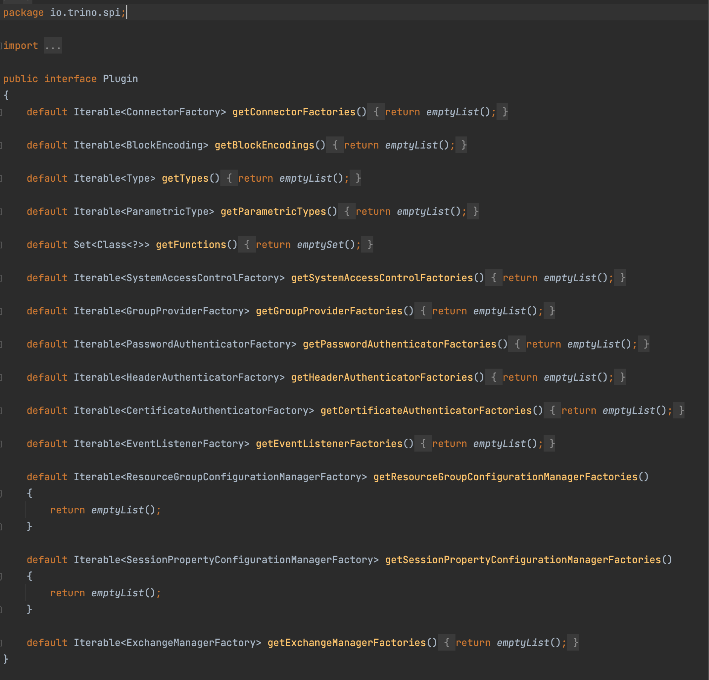
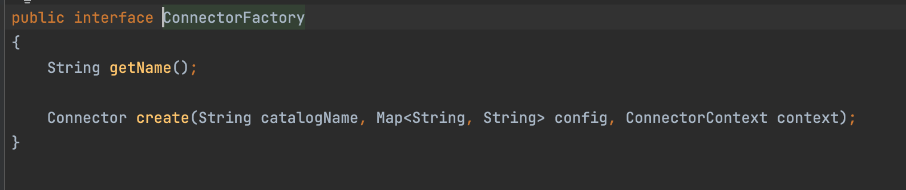
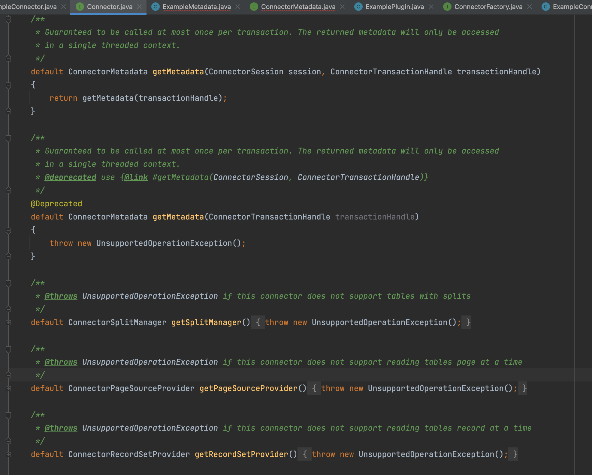
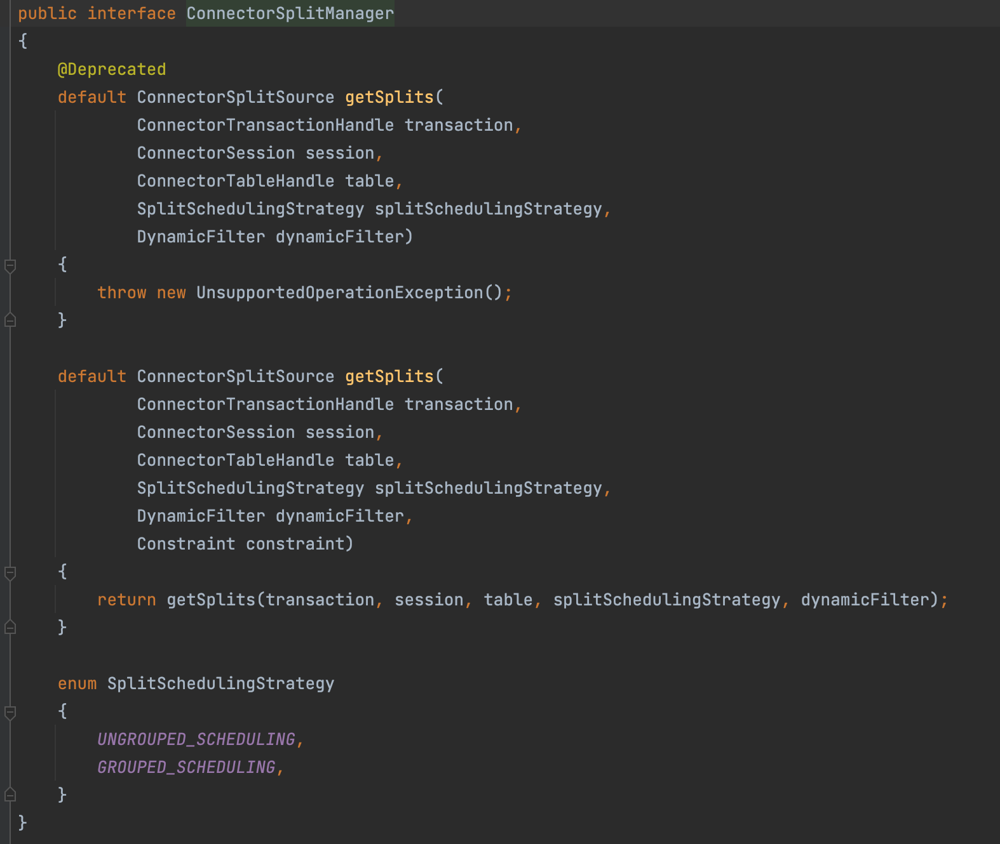
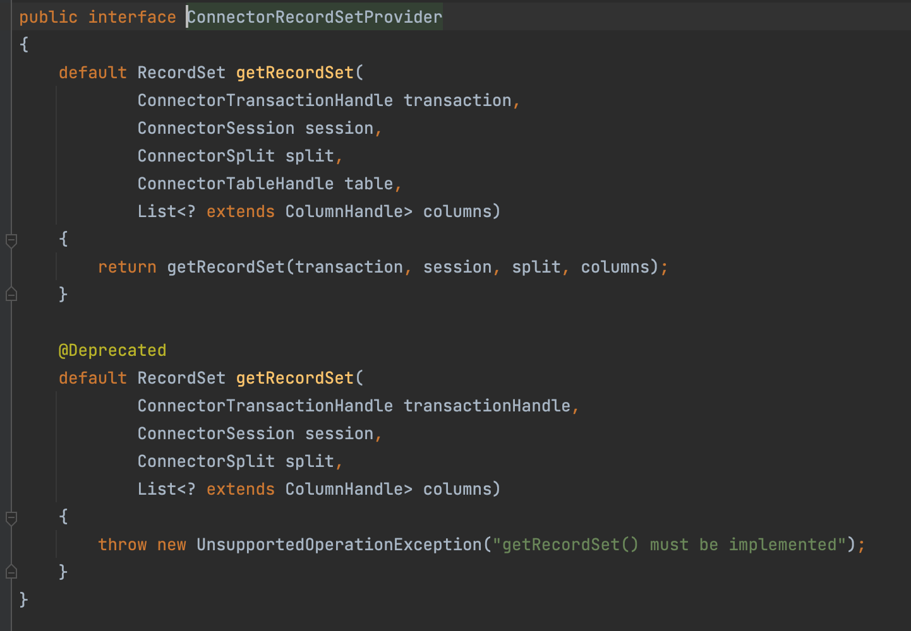
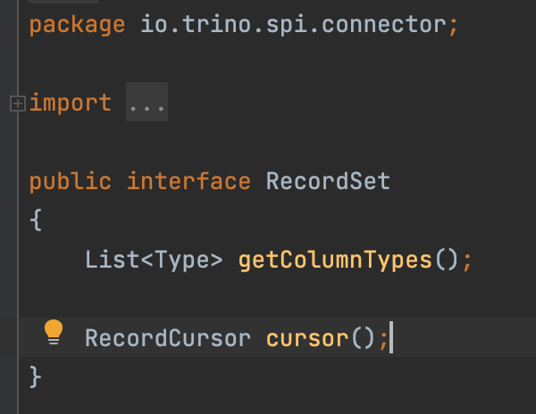
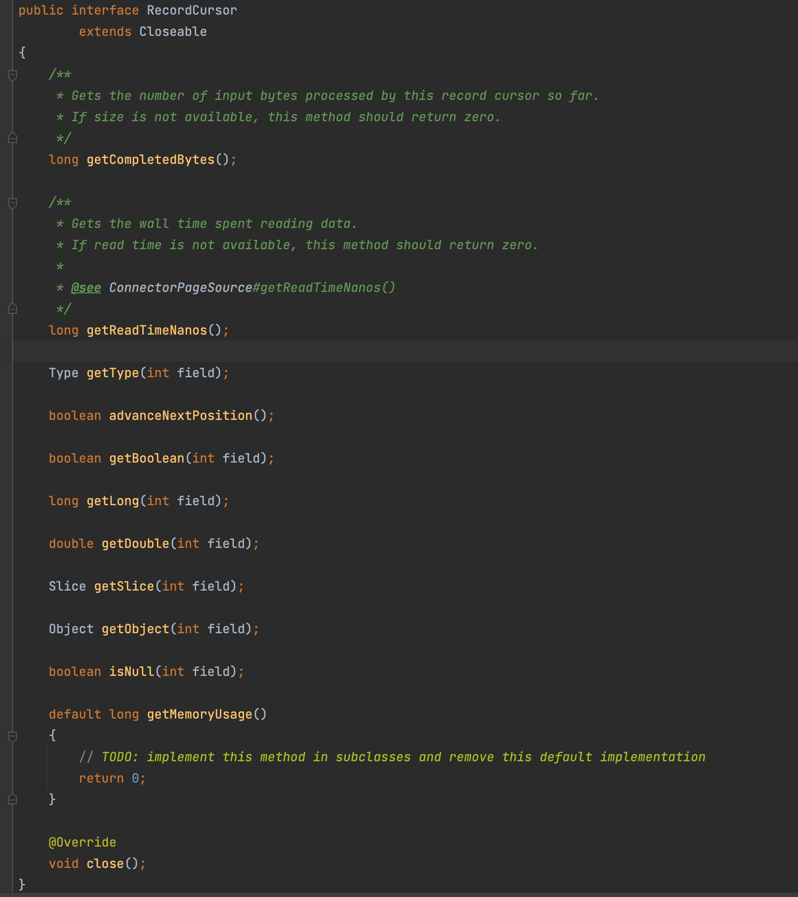
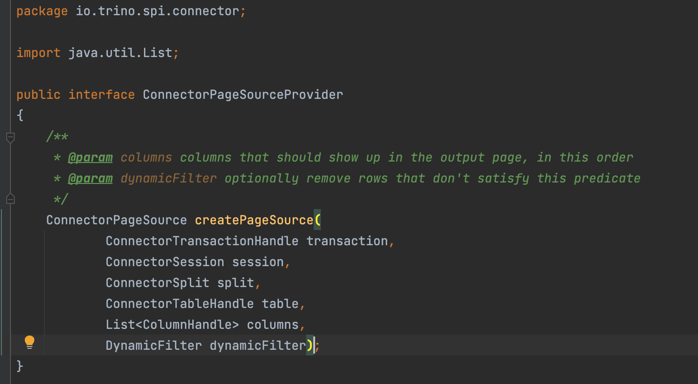
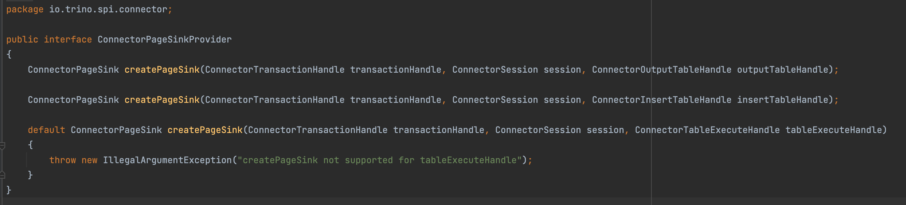

# Connector

连接器为 Trino 提供了连接任意数据源的接口。

每个连接器在底层数据源上提供了一个基于表的抽象。只要数据可以用 Trino 支持的数据类型表示成表、列和行，就可以创建连接器并让查询引擎使用这些数据进行查询处理。

Trino 提供了服务提供者接口(service provider interface，SPI)——一种用于实现连接器 的 API。

## SPI

实现Trino连接器，需要实现plugin接口，并实现其中的接口，plugin接口中定义了下面方法：

## ConnectorFactory

调用Plugin接口的getConnectorFactories方法，获取ConnectorFactory实例。

通过ConnectorFactory可以获取Connector的名称和对象实例。

ConnectorFactory的create()中的config参数包括catalog配置文件中的所有配置。

一个简单的Connector实现要包含以下服务实例:

- ConnectorMetadata
- ConnectorSplitManager
- ConnectorRecordSetProvider 或 ConnectorPageSourceProvider

## ConnectorMetadata

通过ConnectorMetadata接口能获取到schema, table, column列表，以及数据源所特有的元数据信息。

一个只读的Connector需要实现下面方法：

- `listSchemaNames`
- `listTables`
- `streamTableColumns`
- `getTableHandle`
- `getTableMetadata`
- `getColumnHandles`
- `getColumnMetadata`

ConnectorMetadata还允许实现其他功能：

- 创建、更改和删除schema、table、column、view和materialized views
- Schema, table 和 view授权
- 执行table函数
- 提供表统计信息、在写入和分析所选表时收集统计信息
- 数据增删改查
- 角色和权限管理
- 下推操作：包括谓词下推、TopN、join、聚合、表函数调用等

## ConnectorSplitManager

split管理器将表中的数据分成一个个块，然后将这些块分发给不同的worker节点处理 。例如，hive连接器先列出每个分区的文件，然后将每个文件分为一个或者多个split。

## ConnectorRecordSetProvider

通过ConnectorRecordSetProvider获取数据，传输给Trino执行引擎。

获取是需要传入ConnectorTableHandle，它是ConnectorMetadata生成查询计划和优化期间创建的一个虚拟表，是对表数据进行某些操作而派生的虚拟表，比如filter，limit等操作。

### RecordSet

ConnectorRecordSetProvider返回的RecordSet内部会创建一个RecordCursor对象，使用它来读取每一行的列值，RecordSet只包括ColumnHandle对应的请求列的数据。

### RecordCursor

RecordCursor读取的是当前行的数据，调用advanceNextPosition()切换到下一行。

RecordCursor.getType(int field)返回field的数据类型。

通过下列方法中返回field的值

- `getBoolean(int field)`
- `getLong(int field)`
- `getDouble(int field)`
- `getSlice(int field)`
- `getObject(int field)`

## ConnectorPageSourceProvider

与ConnectorRecordSetProvider相似，都是获取数据传输给Trino执行引擎。区别在于ConnectorRecordSetProvider提供的是RecordSet对象，而ConnectorPageSourceProvider提供的是ConnectorPageSource。

其中ConnectorPageSource 会创建 Page 对象。

如果Connector接口实现类中没有提供ConnectorRecordSetProvider的方法，默认使用实现类RecordPageSourceProvider，它将ConnectorRecordSetProvider中创建的RecordSet记录转化为Page。

如果Connector实现类中提供了ConnectorPageSourceProvider，将直接使用ConnectorPageSourceProvider创建Page，而不会用到ConnectorRecordSetProvider。这样可以避免执行时RecordSet转化为Page的开销。

## ConnectorPageSinkProvider

如果要修改数据就需要实现ConnectorPageSinkProvider，它会从Trino执行引擎中消费数据，创建ConnectorPageSink对象。

