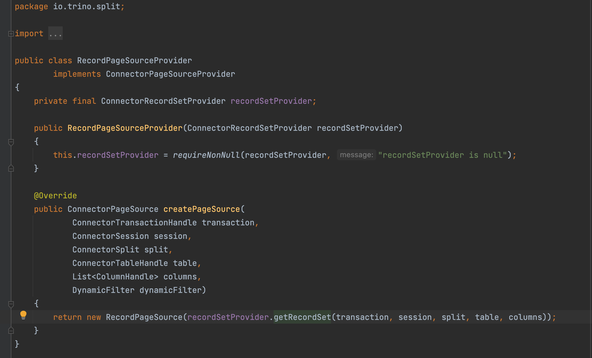

# Connector

Trino 存储与计算分离的核心是基于连接器的架构。连接器为 Trino提供了连接任意数据源的接口。

每个连接器在底层数据源上提供了一个基于表的抽象。只要数据可以用 Trino 支持的数据类型表示成表、列和行，就可以创建连接器并让查询引擎使用这些数据进行查询处理。

Trino 提供了服务提供者接口(service provider interface，SPI)——一种用于实现连接器 的 API。通过在连接器中实现 SPI，Trino 就可以在内部使用标准操作来连接到任意数据源并执行操作。连接器负责处理与特定数据源相关的细节。

连接器实现 API 的三个部分:

- 获取表、视图、schema 元数据的操作;
- 产生数据分区的逻辑单位的操作，用于 Trino 的并行读写;
-  在源数据和查询引擎所需的内存数据格式之间进行转换的数据读取和写入组件。

服务端程序在启动时以插件的形式加载连接器。连接器由 catalog 属性文件中特定的参数配置，并从插件目录中加载。

## Plugin

实现Trino连接器，需要实现plugin接口，并实现其中的接口，plugin接口中定义了下面方法：


## ConnectorFactory

调用Plugin接口的getConnectorFactories方法，获取ConnectorFactory实例。

通过ConnectorFactory可以获取Connector的名称和对象实例。


ConnectorFactory的create()中的config参数包括catalog配置文件中的所有配置。

一个简单的Connector实现要包含以下服务实例:

- ConnectorMetadata
- ConnectorSplitManager
- ConnectorRecordSetProvider 或 ConnectorPageSourceProvider


## ConnectorMetadata

ConnectorMetadata提供了对数据源元数据的管理和各种操作，比如列举schema, table, column信息，创建表，添加分区。

一个只读的Connector需要实现下面方法：

- `listSchemaNames`
- `listTables`
- `streamTableColumns`
- `getTableHandle`
- `getTableMetadata`
- `getColumnHandles`
- `getColumnMetadata`


ConnectorMetadata还允许实现其他功能：

- 创建、更改和删除schema、table、column、view和materialized views
- Schema, table 和 view授权
- 执行table函数
- 提供表统计信息、在写入和分析所选表时收集统计信息
- 数据增删改查
- 角色和权限管理
- 下推操作：包括谓词下推、TopN、join、聚合、表函数调用等


## ConnectorSplitManager

split管理器将表中的数据分成一个个块，然后将这些块分发给不同的worker节点处理 。例如，hive连接器先列出每个分区的文件，然后将每个文件分为一个或者多个split。


## ConnectorRecordSetProvider

通过ConnectorRecordSetProvider获取split的数据，传输给Trino执行引擎。

获取是需要传入ConnectorTableHandle，它是ConnectorMetadata生成查询计划和优化期间创建的一个虚拟表，是对表数据进行某些操作而派生的虚拟表，比如filter，limit等操作。


### RecordSet

ConnectorRecordSetProvider返回的RecordSet内部会创建一个RecordCursor对象，使用它来读取每一行的列值，RecordSet只包括ColumnHandle对应的请求列的数据。


### RecordCursor


RecordCursor读取的是当前行的数据，调用advanceNextPosition()切换到下一行。

RecordCursor.getType(int field)返回field的数据类型。

通过下列方法中返回field的值

- `getBoolean(int field)`
- `getLong(int field)`
- `getDouble(int field)`
- `getSlice(int field)`
- `getObject(int field)`

## ConnectorPageSourceProvider

与ConnectorRecordSetProvider相似，都是获取数据传输给Trino执行引擎。区别在于ConnectorRecordSetProvider提供的是RecordSet对象，而ConnectorPageSourceProvider提供的是ConnectorPageSource。

其中ConnectorPageSource 会创建 Page 对象。


如果Connector接口实现类中没有提供ConnectorRecordSetProvider的方法，默认使用实现类RecordPageSourceProvider，它将ConnectorRecordSetProvider中创建的RecordSet记录转化为Page。



如果Connector实现类中提供了ConnectorPageSourceProvider，将直接使用ConnectorPageSourceProvider创建Page，而不会用到ConnectorRecordSetProvider。这样可以避免执行时RecordSet转化为Page的开销。

## ConnectorPageSinkProvider

如果要修改数据就需要实现ConnectorPageSinkProvider，它会从Trino执行引擎中消费数据，创建ConnectorPageSink对象。


# Trino注册Plugin

Trino启动时读取部署的plugin目录，构造类加载器，调用PluginManager.loadPlugins()注册plugin。

```java
injector.getInstance(PluginManager.class).loadPlugins();
```

PluginManager.loadPlugins()调用了ServerPluginsProvider的loadPlugins()

```java
@Override
public void loadPlugins(Loader loader, ClassLoaderFactory createClassLoader)
{
    executeUntilFailure(
            executor,
            listFiles(installedPluginsDir).stream()
                    .filter(File::isDirectory)
                    .map(file -> (Callable<?>) () -> {
                        loader.load(file.getAbsolutePath(), () ->
                                createClassLoader.create(file.getName(), buildClassPath(file)));
                        return null;
                    })
                    .collect(toImmutableList()));
}
```

最终调用PluginManager.installPluginInternal()

```java
for (ConnectorFactory connectorFactory : plugin.getConnectorFactories()) {
    log.info("Registering connector %s", connectorFactory.getName());
    connectorManager.addConnectorFactory(connectorFactory, duplicatePluginClassLoaderFactory);
}
```

ConnectorManager.addConnectorFactory()将connectorFactory存放到了connectorFactories中

```java
ConcurrentMap<String, InternalConnectorFactory> connectorFactories = new ConcurrentHashMap<>()

...
  
InternalConnectorFactory existingConnectorFactory = connectorFactories.putIfAbsent(
        connectorFactory.getName(),
        new InternalConnectorFactory(connectorFactory, duplicatePluginClassLoaderFactory));
```


# Trino加载Catalog

Trino启动时读取catalog配置目录中的catalog properties配置文件，依次加载创建各个catalog。

```java
injector.getInstance(StaticCatalogStore.class).loadCatalogs();
```

在StaticCatalogStore.loadCatalogs()调用了ConnectorManager.createCatalog()

```java
connectorManager.createCatalog(catalogName, connectorName, ImmutableMap.copyOf(properties));
```

在ConnectorManager.createCatalog()中创建Connector和catalog

```java
MaterializedConnector connector = new MaterializedConnector(
        catalogName,
        createConnector(catalogName, factory.getConnectorFactory(), duplicatePluginClassLoaderFactory, properties),
        duplicatePluginClassLoaderFactory::destroy);


Catalog catalog = new Catalog(
                catalogName.getCatalogName(),
                connector.getCatalogName(),
                connectorName,
                connector.getConnector(),
                securityManagement,
                informationSchemaConnector.getCatalogName(),
                informationSchemaConnector.getConnector(),
                systemConnector.getCatalogName(),
                systemConnector.getConnector());


addConnectorInternal(connector);
catalogManager.registerCatalog(catalog);
```

在ConnectorManager.createConnector()中调用ConnectorFactory.create()创建了Connector

```
connectorFactory.create(catalogName.getCatalogName(), properties, context)
```

