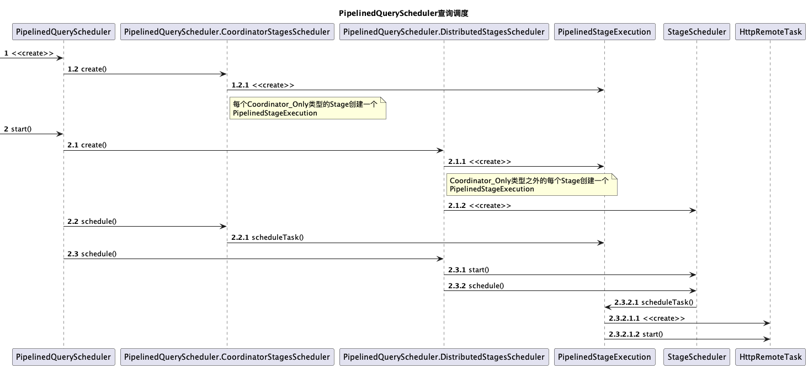
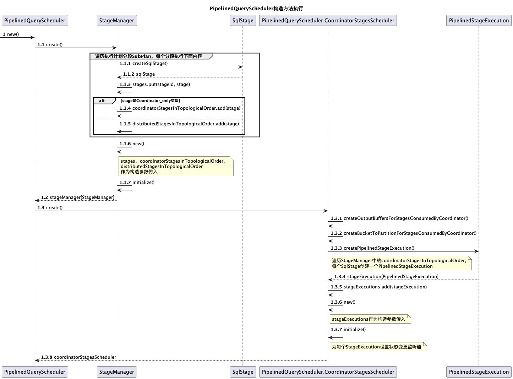
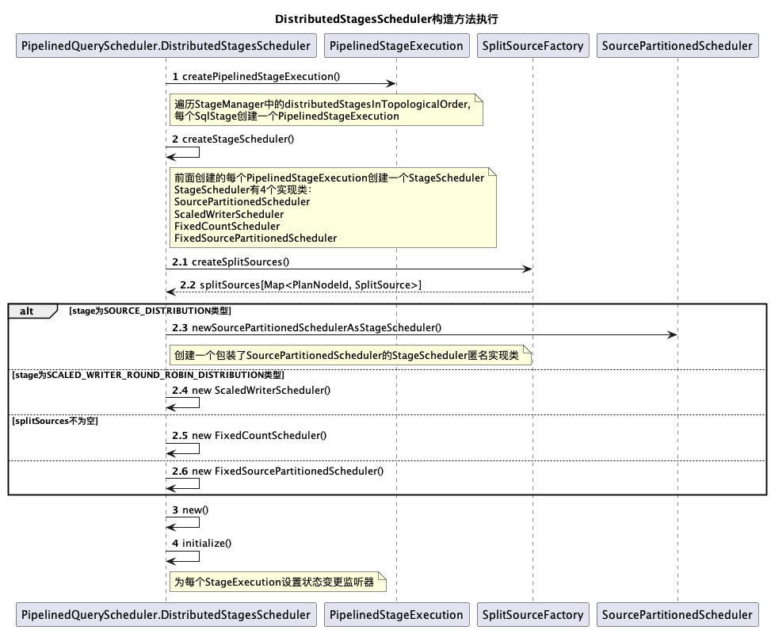

Trino根据生成的逻辑执行计划将其拆分成多个具有层级关系的Stage，每个Stage会进一步分解为若干个Task，并将Task调度到不同的Worker节点上执行，每个的Stage有不同的调度策略。

查询调度的入口在SqlQueryExecution.start()中，根据不同的重试策略选择QueryScheduler实现类，然后调用QueryScheduler的start()方法启动查询调度。（本文针对trino的405版本源码进行分析）

当重试策略为NONE或QUERY时，采用PipelinedQueryScheduler进行调度，重试策略为TASK时，采用EventDrivenFaultTolerantQueryScheduler或FaultTolerantQueryScheduler，其中FaultTolerantQueryScheduler已过时，被EventDrivenFaultTolerantQueryScheduler替代，因此下面主要对PipelinedQueryScheduler和EventDrivenFaultTolerantQueryScheduler进行分析。


# QueryScheduler

## PipelinedQueryScheduler
PipelinedQueryScheduler的大致调度过程如下图所示：



在PipelinedQueryScheduler中创建PipelinedQueryScheduler.CoordinatorStagesScheduler 和PipelinedQueryScheduler.DistributedStagesScheduler两个Stage调度器：
PipelinedQueryScheduler.CoordinatorStagesScheduler负责Coordinator_Only类型的Stage调度
PipelinedQueryScheduler.DistributedStagesScheduler负责Coordinator_Only类型之外的所有Stage的调度。


PipelinedQueryScheduler的构造方法调用详细流程如下图所示：




### CoordinatorStagesScheduler

在PipelinedQueryScheduler的构造方法中会调用CoordinatorStagesScheduler.create()，create()方法的调用过程可参考PipelinedQueryScheduler构造方法执行图。

当调用PipelinedQueryScheduler的start()启动查询调度时，会调用CoordinatorStagesScheduler.schedule()，直接选择coordinator节点运行Coordinator_Only类型的Stage的任务。

```java
 public synchronized void schedule()
        {
            if (!scheduled.compareAndSet(false, true)) {
                return;
            }
            TaskFailureReporter failureReporter = new TaskFailureReporter(distributedStagesScheduler);
            queryStateMachine.addOutputTaskFailureListener(failureReporter);

						//选择当前coordinator运行任务
            InternalNode coordinator = nodeScheduler.createNodeSelector(queryStateMachine.getSession(), Optional.empty()).selectCurrentNode();
            for (StageExecution stageExecution : stageExecutions) {
                //调度任务，创建HttpRemoteTask
                Optional<RemoteTask> remoteTask = stageExecution.scheduleTask(
                        coordinator,
                        0,
                        ImmutableMultimap.of());
                //更新stageExecution状态为调度完成
                stageExecution.schedulingComplete();
                //为任务绑定SourceTask失败监听器
                remoteTask.ifPresent(task -> coordinatorTaskManager.addSourceTaskFailureListener(task.getTaskId(), failureReporter));
                //如果查询状态为STARTING，且remoteTask已创建，则更新查询状态为Running
                if (queryStateMachine.getQueryState() == STARTING && remoteTask.isPresent()) {
                    queryStateMachine.transitionToRunning();
                }
            }
        }
```

### DistributedStagesScheduler

DistributedStagesScheduler的create()的执行流程如下所示：



##### DistributedStagesScheduler.create()

其中PipelinedQueryScheduler.DistributedStagesScheduler.create()的源码如下：

```java
public static DistributedStagesScheduler create(
                QueryStateMachine queryStateMachine,
                SplitSchedulerStats schedulerStats,
                NodeScheduler nodeScheduler,
                NodePartitioningManager nodePartitioningManager,
                StageManager stageManager,
                CoordinatorStagesScheduler coordinatorStagesScheduler,
                ExecutionPolicy executionPolicy,
                FailureDetector failureDetector,
                ScheduledExecutorService executor,
                SplitSourceFactory splitSourceFactory,
                int splitBatchSize,
                DynamicFilterService dynamicFilterService,
                TableExecuteContextManager tableExecuteContextManager,
                RetryPolicy retryPolicy,
                int attempt)
        {
            DistributedStagesSchedulerStateMachine stateMachine = new DistributedStagesSchedulerStateMachine(queryStateMachine.getQueryId(), executor);

            Map<PartitioningHandle, NodePartitionMap> partitioningCacheMap = new HashMap<>();
            Function<PartitioningHandle, NodePartitionMap> partitioningCache = partitioningHandle ->
                    partitioningCacheMap.computeIfAbsent(partitioningHandle, handle -> nodePartitioningManager.getNodePartitioningMap(
                            queryStateMachine.getSession(),
                            handle.equals(SCALED_WRITER_HASH_DISTRIBUTION) ? FIXED_HASH_DISTRIBUTION : handle));

  					//为每一个Stage创建bucketToPartition
            Map<PlanFragmentId, Optional<int[]>> bucketToPartitionMap = createBucketToPartitionMap(
                    coordinatorStagesScheduler.getBucketToPartitionForStagesConsumedByCoordinator(),
                    stageManager,
                    partitioningCache);
  
            //为每一个Stage创建PipelinedOutputBufferManager，根据Stage对应PlanFragment的Partitioning类型，选择不同的PipelinedOutputBufferManager实现类
						//FIXED_BROADCAST_DISTRIBUTION类型选择BroadcastPipelinedOutputBufferManager
						//SCALED_WRITER_ROUND_ROBIN_DISTRIBUTION选择ScaledPipelinedOutputBufferManager
						//其他类型选择PartitionedPipelinedOutputBufferManager
            Map<PlanFragmentId, PipelinedOutputBufferManager> outputBufferManagers = createOutputBufferManagers(
                    coordinatorStagesScheduler.getOutputBuffersForStagesConsumedByCoordinator(),
                    stageManager,
                    bucketToPartitionMap);

            TaskLifecycleListener coordinatorTaskLifecycleListener = coordinatorStagesScheduler.getTaskLifecycleListener();
  					//当开启重启机制，仅在查询完成时关闭coordinator上的exchange clients
            if (retryPolicy != RetryPolicy.NONE) {
                TaskLifecycleListenerBridge taskLifecycleListenerBridge = new TaskLifecycleListenerBridge(coordinatorTaskLifecycleListener);
                coordinatorTaskLifecycleListener = taskLifecycleListenerBridge;
                stateMachine.addStateChangeListener(state -> {
                    if (state == DistributedStagesSchedulerState.FINISHED) {
                        taskLifecycleListenerBridge.notifyNoMoreSourceTasks();
                    }
                });
            }

            Map<StageId, StageExecution> stageExecutions = new HashMap<>();
            for (SqlStage stage : stageManager.getDistributedStagesInTopologicalOrder()) {
                Optional<SqlStage> parentStage = stageManager.getParent(stage.getStageId());
              
                //获取任务生命周期监听器
                TaskLifecycleListener taskLifecycleListener;
                if (parentStage.isEmpty() || parentStage.get().getFragment().getPartitioning().isCoordinatorOnly()) {
                    // output will be consumed by coordinator
                    taskLifecycleListener = coordinatorTaskLifecycleListener;
                }
                else {
                    StageId parentStageId = parentStage.get().getStageId();
                    StageExecution parentStageExecution = requireNonNull(stageExecutions.get(parentStageId), () -> "execution is null for stage: " + parentStageId);
                    taskLifecycleListener = parentStageExecution.getTaskLifecycleListener();
                }

                PlanFragment fragment = stage.getFragment();
              
                //创建PipelinedStageExecution
                StageExecution stageExecution = createPipelinedStageExecution(
                        stageManager.get(fragment.getId()),
                        outputBufferManagers,
                        taskLifecycleListener,
                        failureDetector,
                        executor,
                        bucketToPartitionMap.get(fragment.getId()),
                        attempt);
                stageExecutions.put(stage.getStageId(), stageExecution);
            }

            ImmutableMap.Builder<StageId, StageScheduler> stageSchedulers = ImmutableMap.builder();
            for (StageExecution stageExecution : stageExecutions.values()) {
                List<StageExecution> children = stageManager.getChildren(stageExecution.getStageId()).stream()
                        .map(stage -> requireNonNull(stageExecutions.get(stage.getStageId()), () -> "stage execution not found for stage: " + stage))
                        .collect(toImmutableList());
              
                //创建StageScheduler
                StageScheduler scheduler = createStageScheduler(
                        queryStateMachine,
                        stageExecution,
                        splitSourceFactory,
                        children,
                        partitioningCache,
                        nodeScheduler,
                        nodePartitioningManager,
                        splitBatchSize,
                        dynamicFilterService,
                        executor,
                        tableExecuteContextManager);
                stageSchedulers.put(stageExecution.getStageId(), scheduler);
            }

            DistributedStagesScheduler distributedStagesScheduler = new DistributedStagesScheduler(
                    stateMachine,
                    queryStateMachine,
                    schedulerStats,
                    stageManager,
                    executionPolicy.createExecutionSchedule(stageExecutions.values()),
                    stageSchedulers.buildOrThrow(),
                    ImmutableMap.copyOf(stageExecutions),
                    dynamicFilterService);
  
            //为每个StageExecution设置状态变更监听器
            distributedStagesScheduler.initialize();
            return distributedStagesScheduler;
        }


```
createStageScheduler()创建StageScheduler的源码如下：

```java
        private static StageScheduler createStageScheduler(
                QueryStateMachine queryStateMachine,
                StageExecution stageExecution,
                SplitSourceFactory splitSourceFactory,
                List<StageExecution> childStageExecutions,
                Function<PartitioningHandle, NodePartitionMap> partitioningCache,
                NodeScheduler nodeScheduler,
                NodePartitioningManager nodePartitioningManager,
                int splitBatchSize,
                DynamicFilterService dynamicFilterService,
                ScheduledExecutorService executor,
                TableExecuteContextManager tableExecuteContextManager)
        {
            Session session = queryStateMachine.getSession();
            PlanFragment fragment = stageExecution.getFragment();
          
            //获取PlanFragment的Partitioning类型
            PartitioningHandle partitioningHandle = fragment.getPartitioning();
            //只有从数据源表获取数据的Stage，splitSources不为空，比如含有TableScanNode时
            Map<PlanNodeId, SplitSource> splitSources = splitSourceFactory.createSplitSources(session, fragment);
            
            if (!splitSources.isEmpty()) {
                queryStateMachine.addStateChangeListener(new StateChangeListener<>()
                {
                    private final AtomicReference<Collection<SplitSource>> splitSourcesReference = new AtomicReference<>(splitSources.values());

                    @Override
                    public void stateChanged(QueryState newState)
                    {
                        if (newState.isDone()) {
                            // ensure split sources are closed and release memory
                            Collection<SplitSource> sources = splitSourcesReference.getAndSet(null);
                            if (sources != null) {
                                closeSplitSources(sources);
                            }
                        }
                    }
                });
            }

            //当partitioning为SOURCE_DISTRIBUTION类型时，创建SourcePartitionedScheduler
            if (partitioningHandle.equals(SOURCE_DISTRIBUTION)) {
                // nodes are selected dynamically based on the constraints of the splits and the system load
                Entry<PlanNodeId, SplitSource> entry = getOnlyElement(splitSources.entrySet());
                PlanNodeId planNodeId = entry.getKey();
                SplitSource splitSource = entry.getValue();
                Optional<CatalogHandle> catalogHandle = Optional.of(splitSource.getCatalogHandle())
                        .filter(catalog -> !catalog.getType().isInternal());
                NodeSelector nodeSelector = nodeScheduler.createNodeSelector(session, catalogHandle);
                SplitPlacementPolicy placementPolicy = new DynamicSplitPlacementPolicy(nodeSelector, stageExecution::getAllTasks);

                return newSourcePartitionedSchedulerAsStageScheduler(
                        stageExecution,
                        planNodeId,
                        splitSource,
                        placementPolicy,
                        splitBatchSize,
                        dynamicFilterService,
                        tableExecuteContextManager,
                        () -> childStageExecutions.stream().anyMatch(StageExecution::isAnyTaskBlocked));
            }

            if (partitioningHandle.equals(SCALED_WRITER_ROUND_ROBIN_DISTRIBUTION)) {
                Supplier<Collection<TaskStatus>> sourceTasksProvider = () -> childStageExecutions.stream()
                        .map(StageExecution::getTaskStatuses)
                        .flatMap(List::stream)
                        .collect(toImmutableList());
                Supplier<Collection<TaskStatus>> writerTasksProvider = stageExecution::getTaskStatuses;

                ScaledWriterScheduler scheduler = new ScaledWriterScheduler(
                        stageExecution,
                        sourceTasksProvider,
                        writerTasksProvider,
                        nodeScheduler.createNodeSelector(session, Optional.empty()),
                        executor,
                        getWriterMinSize(session),
                        isTaskScaleWritersEnabled(session) ? getTaskScaleWritersMaxWriterCount(session) : getTaskWriterCount(session));

                whenAllStages(childStageExecutions, StageExecution.State::isDone)
                        .addListener(scheduler::finish, directExecutor());

                return scheduler;
            }

            if (splitSources.isEmpty()) {
                // all sources are remote
                //实际调用nodePartitioningManager.getNodePartitioningMap()
                //partitioning为SINGLE时，随机选择一个节点加入到NodePartitionMap中
                //partitioning为FIXED时，随机选择多个节点，数量不超过hash_partition_count
                //partitioning为COORDINATOR_ONLY时，选择Coordinator节点加入
                NodePartitionMap nodePartitionMap = partitioningCache.apply(partitioningHandle);
                List<InternalNode> partitionToNode = nodePartitionMap.getPartitionToNode();
                checkCondition(!partitionToNode.isEmpty(), NO_NODES_AVAILABLE, "No worker nodes available");
                return new FixedCountScheduler(stageExecution, partitionToNode);
            }

            //存储 local source PlanNodeId
            List<PlanNodeId> schedulingOrder = fragment.getPartitionedSources();
            Optional<CatalogHandle> catalogHandle = partitioningHandle.getCatalogHandle();
            checkArgument(catalogHandle.isPresent(), "No catalog handle for partitioning handle: %s", partitioningHandle);

            BucketNodeMap bucketNodeMap;
            List<InternalNode> stageNodeList;
          
            //创建BucketNodeMap
            if (fragment.getRemoteSourceNodes().stream().allMatch(node -> node.getExchangeType() == REPLICATE)) {
                //没有RemoteSourceNode或者所有RemoteSourceNode的ExchangeType为REPLICATE
                //由对应的Connector提供的ConnectorNodePartitioningProvider提供bucketNodeMap
                bucketNodeMap = nodePartitioningManager.getBucketNodeMap(session, partitioningHandle);
                //获取所有节点
                stageNodeList = new ArrayList<>(nodeScheduler.createNodeSelector(session, catalogHandle).allNodes());
                Collections.shuffle(stageNodeList);
            }
            else {
                // remote source requires nodePartitionMap
                //实际调用nodePartitioningManager.getNodePartitioningMap()
                //partitioning为SINGLE时，随机选择一个节点加入到NodePartitionMap中
                //partitioning为FIXED时，随机选择多个节点，数量不超过hash_partition_count
                //partitioning为COORDINATOR_ONLY时，选择Coordinator节点加入
                NodePartitionMap nodePartitionMap = partitioningCache.apply(partitioningHandle);
                stageNodeList = nodePartitionMap.getPartitionToNode();
                bucketNodeMap = nodePartitionMap.asBucketNodeMap();
            }

            //FixedSourcePartitionedScheduler构造方法中会为每一个local source创建SourcePartitionedScheduler
            //SplitPlacementPolicy为BucketedSplitPlacementPolicy
            return new FixedSourcePartitionedScheduler(
                    stageExecution,
                    splitSources,
                    schedulingOrder,
                    stageNodeList,
                    bucketNodeMap,
                    splitBatchSize,
                    nodeScheduler.createNodeSelector(session, catalogHandle),
                    dynamicFilterService,
                    tableExecuteContextManager);
        }

```


##### DistributedStagesScheduler.schedule()

```java
       public void schedule()
        {
            checkState(started.compareAndSet(false, true), "already started");

            try (SetThreadName ignored = new SetThreadName("Query-%s", queryStateMachine.getQueryId())) {
                //调用所有StageScheduler的start()
                stageSchedulers.values().forEach(StageScheduler::start);
              
                while (!executionSchedule.isFinished()) {
                    List<ListenableFuture<Void>> blockedStages = new ArrayList<>();
                    //获取未调度的StageExecution的集合
                    StagesScheduleResult stagesScheduleResult = executionSchedule.getStagesToSchedule();
                    for (StageExecution stageExecution : stagesScheduleResult.getStagesToSchedule()) {
                        stageExecution.beginScheduling();

                        //执行调度
                        ScheduleResult result = stageSchedulers.get(stageExecution.getStageId())
                                .schedule();

                        ...
                        }
                    }

                    ...
                    //处理阻塞的Stage
                }

                ...
            }
            catch (Throwable t) {
                fail(t, Optional.empty());
            }
            finally {
                ...
                //关闭StageScheduler
            }
        }

```


### StageScheduler

#### SourcePartitionedScheduler

SourcePartitionedScheduler负责Source Stage调度，它实现了SourceScheduler接口，可用于未分组或分组的pipeline，但需要调用方负责相应地初始化驱动程序组。

SourcePartitionedScheduler的start() 通过立即调度收集动态筛选器的任务来避免死锁，因为在流水线执行中，动态过滤器和join操作在同一个阶段被采集。这可能会导致在生成split之前等待动态筛选器的source stage join和连接器出现死锁（当动态筛选器至少需要一个probe task才能收集时，probe splits可能会被阻塞）。为了克服这个问题，为运行broadcast join操作的source stages创建初始任务。此任务允许在不安排任何probe splits的情况下进行动态筛选器收集。

```java
    public synchronized void start()
    {
        //当动态过滤器需要采集任务时，才提前调度任务
        if (dynamicFilterService.isCollectingTaskNeeded(stageExecution.getStageId().getQueryId(), stageExecution.getFragment())) {
            //将Stage状态更新为Scheduling
            stageExecution.beginScheduling();
            //随机选择一个节点执行任务
            createTaskOnRandomNode();
        }
    }

 		private void createTaskOnRandomNode()
    {
        checkState(scheduledTasks.isEmpty(), "Stage task is already scheduled on node");
        List<InternalNode> allNodes = splitPlacementPolicy.allNodes();
        checkState(allNodes.size() > 0, "No nodes available");
        //随机选择一个节点
        InternalNode node = allNodes.get(ThreadLocalRandom.current().nextInt(0, allNodes.size()));
        //在该Node上启动一个Task运行,所传split为空
        scheduleTask(node, ImmutableMultimap.of());
    }

```

**SourcePartitionedScheduler调度执行**

Source Task执行逻辑如下：

1. 根据split放置策略，生成Node与Split的对应关系；

2. 根据Node与Split的对应关系，在指定Node上启动Source Task处理位于该Node上的Splits。

```java
@Override
public synchronized ScheduleResult schedule()
{
     ...
       
    if (blockedFuture.isEmpty() && !pendingSplits.isEmpty()) {
        if (!placementFuture.isDone()) {
            blockedFuture = Optional.of(placementFuture);
            blockedOnPlacements = true;
        }
        else {
            //计算split的位置
            SplitPlacementResult splitPlacementResult = splitPlacementPolicy.computeAssignments(pendingSplits);
            //splitAssignment为Multimap<InternalNode, Split>类型，存放Node与Split的对应关系，记录了每个Node上存在哪些split
            splitAssignment = splitPlacementResult.getAssignments();
            //移除成功放置的split
            splitAssignment.values().forEach(pendingSplits::remove);
            overallSplitAssignmentCount += splitAssignment.size(); 
             //如果没有完成split放置，标记scheduleGroup为Blocked
            if (!pendingSplits.isEmpty()) {
                placementFuture = splitPlacementResult.getBlocked();
                blockedFuture = Optional.of(placementFuture);
                blockedOnPlacements = true;
            }
        }
    }

    ...

    //分配成功放置的split，完成Source Task的启动和执行
    overallNewTasks.addAll(assignSplits(splitAssignment));

    // 如果不分配新的split，则更新状态并绑定完成事件
    if (pendingSplits.isEmpty() && state == State.SPLITS_SCHEDULED) {
        log.debug("stage id: %s, node: %s; transitioning to FINISHED", stageExecution.getStageId(), partitionedNode);
        state = State.FINISHED;

        ...

        return new ScheduleResult(
                true,
                overallNewTasks.build(),
                overallSplitAssignmentCount);
    }

    if (blockedFuture.isEmpty()) {
        log.debug("stage id: %s, node: %s; assigned %s splits (not blocked)", stageExecution.getStageId(), partitionedNode, overallSplitAssignmentCount);
        return new ScheduleResult(false, overallNewTasks.build(), overallSplitAssignmentCount);
    }

    //处理阻塞任务
    if (anySourceTaskBlocked.getAsBoolean()) {
        ...
    }

    ScheduleResult.BlockedReason blockedReason = blockedOnNextSplitBatch ? WAITING_FOR_SOURCE : SPLIT_QUEUES_FULL;
    log.debug("stage id: %s, node: %s; assigned %s splits (blocked reason %s)", stageExecution.getStageId(), partitionedNode, overallSplitAssignmentCount, blockedReason);
    return new ScheduleResult(
            false,
            overallNewTasks.build(),
            nonCancellationPropagating(blockedFuture.get()),
            blockedReason,
            overallSplitAssignmentCount);
}
```

assignSplits()方法对传入的splitAssignment进行遍历，每个Node执行下面操作：

1. 根据Node获取该Node上的Task
2. 若Task为空，则根据Node和splits创建一个新的任务，否则将该Node上的Splits提交给运行在该Node上的Task进行处理。

```java
		private Set<RemoteTask> assignSplits(Multimap<InternalNode, Split> splitAssignment)
    {
        ImmutableSet.Builder<RemoteTask> newTasks = ImmutableSet.builder();

        ImmutableSet<InternalNode> nodes = ImmutableSet.copyOf(splitAssignment.keySet());
        for (InternalNode node : nodes) {
            ImmutableMultimap<PlanNodeId, Split> splits = ImmutableMultimap.<PlanNodeId, Split>builder()
                    .putAll(partitionedNode, splitAssignment.get(node))
                    .build();
            //如果任务已创建，则直接从scheduledTasks中获取
            RemoteTask task = scheduledTasks.get(node);
            //task不为空,将当前Node上的Splits更新到运行在该Node的Task中需要处理的Split列表汇总
            if (task != null) {
                task.addSplits(splits);
            }
            else {
                //该Node没有启动Task,在该Node上启动一个Task运行，该Task用于处理splits
                scheduleTask(node, splits).ifPresent(newTasks::add);
            }
        }
        return newTasks.build();
    }
```

新任务的创建是由scheduleTask()完成的，该方法在指定的Node上启动一个Task并执行。实际调用的是PipelinedStageExecution的scheduleTask()。

```java
private Optional<RemoteTask> scheduleTask(InternalNode node, Multimap<PlanNodeId, Split> initialSplits)
{
    Optional<RemoteTask> remoteTask = stageExecution.scheduleTask(node, partitionIdAllocator.getNextId(), initialSplits);
    remoteTask.ifPresent(task -> scheduledTasks.put(node, task));
    return remoteTask;
}
```


```java
    @Override
    public synchronized Optional<RemoteTask> scheduleTask(
            InternalNode node,
            int partition,
            Multimap<PlanNodeId, Split> initialSplits)
    {
        if (stateMachine.getState().isDone()) {
            return Optional.empty();
        }

        checkArgument(!tasks.containsKey(partition), "A task for partition %s already exists", partition);

        //获取当前Stage的outputBuffer
        OutputBuffers outputBuffers = outputBufferManagers.get(stage.getFragment().getId()).getOutputBuffers();

        //在Node上创建一个Task
        Optional<RemoteTask> optionalTask = stage.createTask(
                node,
                partition,
                attempt,
                bucketToPartition,
                outputBuffers,
                initialSplits,
                ImmutableSet.of(),
                Optional.empty());

        if (optionalTask.isEmpty()) {
            return Optional.empty();
        }

        RemoteTask task = optionalTask.get();

        tasks.put(partition, task);

        //遍历上游Stage中的所有Task,为每个Task创建ExchangeSplit
        ImmutableMultimap.Builder<PlanNodeId, Split> exchangeSplits = ImmutableMultimap.builder();
        sourceTasks.forEach((fragmentId, sourceTask) -> {
            TaskStatus status = sourceTask.getTaskStatus();
            if (status.getState() != TaskState.FINISHED) {
                //exchangeSources为当前Stage中的RemoteSourceNode
                PlanNodeId planNodeId = exchangeSources.get(fragmentId).getId();
                exchangeSplits.put(planNodeId, createExchangeSplit(sourceTask, task));
            }
        });

        allTasks.add(task.getTaskId());

        //将上游Task的输出对应的exchangeSplits添加到当前Task的split列表中
        task.addSplits(exchangeSplits.build());
        completeSources.forEach(task::noMoreSplits);

        //为任务绑定状态变更监听器
        task.addStateChangeListener(this::updateTaskStatus);

        //启动任务
        task.start();
				
        //触发下游Stage对应Task的任务创建事件，为下游Stage设置输入Split
        taskLifecycleListener.taskCreated(stage.getFragment().getId(), task);

        //更新Source Task的OutputBuffer
        OutputBufferId outputBufferId = new OutputBufferId(task.getTaskId().getPartitionId());
        updateSourceTasksOutputBuffers(outputBufferManager -> outputBufferManager.addOutputBuffer(outputBufferId));

        return Optional.of(task);
    }

```


PipelinedStageExecution.getTaskLifecycleListener()

```java
		public TaskLifecycleListener getTaskLifecycleListener()
    {
        return new TaskLifecycleListener()
        {
            @Override
            public void taskCreated(PlanFragmentId fragmentId, RemoteTask task)
            {
                sourceTaskCreated(fragmentId, task);
            }

            ...
        };
    }


    //当Source Task创建时，会调用该方法，为当前Stage添加Split，
    //并遍历当前Stage的所有Task,根据Source Task创建split，添加到对应Task的Split列表中
    private synchronized void sourceTaskCreated(PlanFragmentId fragmentId, RemoteTask sourceTask)
    {
        requireNonNull(fragmentId, "fragmentId is null");

				//exchangeSources为当前Stage中的RemoteSourceNode
        RemoteSourceNode remoteSource = exchangeSources.get(fragmentId);
        checkArgument(remoteSource != null, "Unknown remote source %s. Known sources are %s", fragmentId, exchangeSources.keySet());

        //添加Source Task
        sourceTasks.put(fragmentId, sourceTask);
				
        //获取Source Task的outputBuffer，添加到source Task的OutputBuffers中
        PipelinedOutputBufferManager outputBufferManager = outputBufferManagers.get(fragmentId);
        sourceTask.setOutputBuffers(outputBufferManager.getOutputBuffers());

        //遍历当前Stage的所有Task,根据Source Task创建split，添加到Task的Split列表中
        for (RemoteTask destinationTask : getAllTasks()) {
            destinationTask.addSplits(ImmutableMultimap.of(remoteSource.getId(), createExchangeSplit(sourceTask, destinationTask)));
        }
    }

		private static Split createExchangeSplit(RemoteTask sourceTask, RemoteTask destinationTask)
    {
        //根据id从分配给Task的OutputBuffer中获取结果
        URI exchangeLocation = sourceTask.getTaskStatus().getSelf();
        //获取Source Task的split url地址
        URI splitLocation = uriBuilderFrom(exchangeLocation).appendPath("results").appendPath(String.valueOf(destinationTask.getTaskId().getPartitionId())).build();
        //根据Source Task的TaskId和url地址创建Split
        return new Split(REMOTE_CATALOG_HANDLE, new RemoteSplit(new DirectExchangeInput(sourceTask.getTaskId(), splitLocation.toString())));
    }
```


PipelinedQueryScheduler.QueryOutputTaskLifecycleListener

当Stage的父Stage为空（没有下游Stage）时，会绑定QueryOutputTaskLifecycleListener作为TaskLifecycleListener

```java
private static class QueryOutputTaskLifecycleListener
            implements TaskLifecycleListener
    {
        ...

        @Override
        public void taskCreated(PlanFragmentId fragmentId, RemoteTask task)
        {
            URI taskUri = uriBuilderFrom(task.getTaskStatus().getSelf())
                    .appendPath("results")
                    .appendPath("0").build();
            DirectExchangeInput input = new DirectExchangeInput(task.getTaskId(), taskUri.toString());
            //更新查询输出结果
            queryStateMachine.updateInputsForQueryResults(ImmutableList.of(input), false);
        }

        ...
    }
```


####  FixedSourcePartitionedScheduler


#### FixedCountScheduler


#### ScaledWriterScheduler


## EventDrivenFaultTolerantQueryScheduler
