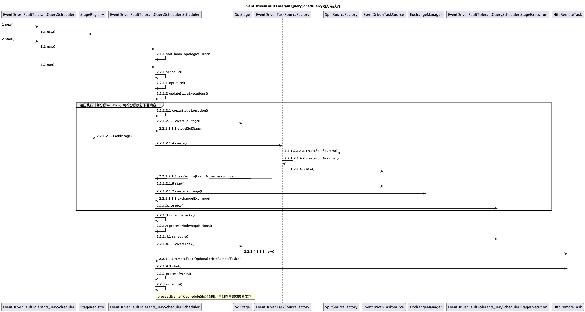

Trino根据生成的逻辑执行计划将其拆分成多个具有层级关系的Stage，每个Stage会进一步分解为若干个Task，并将Task调度到不同的Worker节点上执行，每个的Stage有不同的调度策略。

查询调度的入口在SqlQueryExecution.start()中，根据不同的重试策略选择QueryScheduler实现类，然后调用QueryScheduler的start()方法启动查询调度。（本文针对trino的405版本源码进行分析）

当重试策略为NONE或QUERY时，采用PipelinedQueryScheduler进行调度，重试策略为TASK时，采用EventDrivenFaultTolerantQueryScheduler或FaultTolerantQueryScheduler，其中FaultTolerantQueryScheduler已过时，被EventDrivenFaultTolerantQueryScheduler替代，因此下面主要对PipelinedQueryScheduler和EventDrivenFaultTolerantQueryScheduler进行分析。


# QueryScheduler

## PipelinedQueryScheduler
当重试策略为NONE或QUERY时，PipelinedQueryScheduler负责查询调度。
PipelinedQueryScheduler的大致调度过程如下图所示：


在PipelinedQueryScheduler中创建PipelinedQueryScheduler.CoordinatorStagesScheduler 和PipelinedQueryScheduler.DistributedStagesScheduler两个Stage调度器：

PipelinedQueryScheduler.CoordinatorStagesScheduler负责Coordinator_Only类型的Stage调度

PipelinedQueryScheduler.DistributedStagesScheduler负责Coordinator_Only类型之外的所有Stage的调度。


PipelinedQueryScheduler的构造方法调用详细流程如下：

1.遍历逻辑执行计划中所有的SubPlan，每个SubPlan创建一个SqlStage，负责跟踪来自同一stage的任务的执行统计信息，在执行完成时提供最终stage信息。

2.将Stage分成两类，Coordinator_only类型的Stage存放到coordinatorStagesInTopologicalOrder中，其他类型存放到distributedStagesInTopologicalOrder中。

3.创建CoordinatorStagesScheduler


### CoordinatorStagesScheduler

在PipelinedQueryScheduler的构造方法中会调用CoordinatorStagesScheduler.create()，create()方法的调用过程可参考PipelinedQueryScheduler构造方法执行图。

CoordinatorStagesScheduler的创建步骤如下：

1.为Coordinator消费的Stage创建的OutputBuffer：创建的OutputBuffer都存放到Map<PlanFragmentId, PipelinedOutputBufferManager>中，每个Stage对应一个PipelinedOutputBufferManager，由其负责对应Stage的OutputBuffer管理，先为Output Stage创建PipelinedOutputBufferManager，然后遍历所有coordinatorStagesInTopologicalOrder中的Stage，为其上游Stage创建PipelinedOutputBufferManager。上述创建的是PartitionedPipelinedOutputBufferManager。

2.为Coordinator消费的Stage创建的BucketToPartition：创建的BucketToPartition存放在Map<PlanFragmentId, Optional<int[]>>中，先添加SINGLE_PARTITION（SINGLE_PARTITION = new int[] {0}）作为Output Stage的BucketToPartition，然后遍历所有coordinatorStagesInTopologicalOrder中的Stage，为上游Stage添加BucketToPartition，同样添加SINGLE_PARTITION作为BucketToPartition。

3.遍历上一步coordinatorStagesInTopologicalOrder中的所有Coordinator_only类型的Stage，为每个Stage创建PipelinedStageExecution，通过PipelinedStageExecution将流水线中的stage连接在一起，添加任务时通知上游stage添加output buffer，下游stage更新source task列表。

4.创建CoordinatorStagesScheduler，并为上一步创建的所有PipelinedStageExecution绑定事件变更事件。

当调用PipelinedQueryScheduler的start()启动查询调度时，会调用CoordinatorStagesScheduler.schedule()，直接选择coordinator节点运行Coordinator_Only类型的Stage的任务。

```java
 public synchronized void schedule()
        {
            if (!scheduled.compareAndSet(false, true)) {
                return;
            }
            TaskFailureReporter failureReporter = new TaskFailureReporter(distributedStagesScheduler);
            queryStateMachine.addOutputTaskFailureListener(failureReporter);

            //选择当前coordinator运行任务
            InternalNode coordinator = nodeScheduler.createNodeSelector(queryStateMachine.getSession(), Optional.empty()).selectCurrentNode();
            for (StageExecution stageExecution : stageExecutions) {
                //调度任务，创建HttpRemoteTask
                Optional<RemoteTask> remoteTask = stageExecution.scheduleTask(
                        coordinator,
                        0,
                        ImmutableMultimap.of());
                //更新stageExecution状态为调度完成
                stageExecution.schedulingComplete();
                //为任务绑定SourceTask失败监听器
                remoteTask.ifPresent(task -> coordinatorTaskManager.addSourceTaskFailureListener(task.getTaskId(), failureReporter));
                //如果查询状态为STARTING，且remoteTask已创建，则更新查询状态为Running
                if (queryStateMachine.getQueryState() == STARTING && remoteTask.isPresent()) {
                    queryStateMachine.transitionToRunning();
                }
            }
        }
```

### DistributedStagesScheduler
DistributedStagesScheduler负责Coordinator_Only类型之外的所有Stage的调度。

#### DistributedStagesScheduler创建

DistributedStagesScheduler的create()的执行流程如下所示：


其中PipelinedQueryScheduler.DistributedStagesScheduler.create()的源码如下：

```java
public static DistributedStagesScheduler create(
                QueryStateMachine queryStateMachine,
                SplitSchedulerStats schedulerStats,
                NodeScheduler nodeScheduler,
                NodePartitioningManager nodePartitioningManager,
                StageManager stageManager,
                CoordinatorStagesScheduler coordinatorStagesScheduler,
                ExecutionPolicy executionPolicy,
                FailureDetector failureDetector,
                ScheduledExecutorService executor,
                SplitSourceFactory splitSourceFactory,
                int splitBatchSize,
                DynamicFilterService dynamicFilterService,
                TableExecuteContextManager tableExecuteContextManager,
                RetryPolicy retryPolicy,
                int attempt)
        {
            DistributedStagesSchedulerStateMachine stateMachine = new DistributedStagesSchedulerStateMachine(queryStateMachine.getQueryId(), executor);

            Map<PartitioningHandle, NodePartitionMap> partitioningCacheMap = new HashMap<>();
            Function<PartitioningHandle, NodePartitionMap> partitioningCache = partitioningHandle ->
                    partitioningCacheMap.computeIfAbsent(partitioningHandle, handle -> nodePartitioningManager.getNodePartitioningMap(
                            queryStateMachine.getSession(),
                            handle.equals(SCALED_WRITER_HASH_DISTRIBUTION) ? FIXED_HASH_DISTRIBUTION : handle));

            //为每一个Stage创建bucketToPartition，先添加coordinatorStagesScheduler中创建的BucketToPartition，然后遍历distributedStagesInTopologicalOrder，为其上游Stage创建BucketToPartition
            Map<PlanFragmentId, Optional<int[]>> bucketToPartitionMap = createBucketToPartitionMap(
                    coordinatorStagesScheduler.getBucketToPartitionForStagesConsumedByCoordinator(),
                    stageManager,
                    partitioningCache);
  
            //为每一个Stage创建PipelinedOutputBufferManager，先添加coordinatorStagesScheduler中创建的PipelinedOutputBufferManager，然后遍历distributedStagesInTopologicalOrder，为其上游Stage创建PipelinedOutputBufferManager
	    //根据Stage对应PlanFragment的Partitioning类型，选择不同的PipelinedOutputBufferManager实现类
            //FIXED_BROADCAST_DISTRIBUTION类型选择BroadcastPipelinedOutputBufferManager
	    //SCALED_WRITER_ROUND_ROBIN_DISTRIBUTION选择ScaledPipelinedOutputBufferManager
	    //其他类型选择PartitionedPipelinedOutputBufferManager
            Map<PlanFragmentId, PipelinedOutputBufferManager> outputBufferManagers = createOutputBufferManagers(
                    coordinatorStagesScheduler.getOutputBuffersForStagesConsumedByCoordinator(),
                    stageManager,
                    bucketToPartitionMap);

            TaskLifecycleListener coordinatorTaskLifecycleListener = coordinatorStagesScheduler.getTaskLifecycleListener();
	    //当开启重启机制，仅在查询完成时关闭coordinator上的exchange clients
            if (retryPolicy != RetryPolicy.NONE) {
                TaskLifecycleListenerBridge taskLifecycleListenerBridge = new TaskLifecycleListenerBridge(coordinatorTaskLifecycleListener);
                coordinatorTaskLifecycleListener = taskLifecycleListenerBridge;
                stateMachine.addStateChangeListener(state -> {
                    if (state == DistributedStagesSchedulerState.FINISHED) {
                        taskLifecycleListenerBridge.notifyNoMoreSourceTasks();
                    }
                });
            }

            Map<StageId, StageExecution> stageExecutions = new HashMap<>();
            for (SqlStage stage : stageManager.getDistributedStagesInTopologicalOrder()) {
                Optional<SqlStage> parentStage = stageManager.getParent(stage.getStageId());
              
                //获取下游Stage的TaskLifecycleListener
                TaskLifecycleListener taskLifecycleListener;
                if (parentStage.isEmpty() || parentStage.get().getFragment().getPartitioning().isCoordinatorOnly()) {
                    // output will be consumed by coordinator
                    taskLifecycleListener = coordinatorTaskLifecycleListener;
                }
                else {
                    StageId parentStageId = parentStage.get().getStageId();
                    StageExecution parentStageExecution = requireNonNull(stageExecutions.get(parentStageId), () -> "execution is null for stage: " + parentStageId);
                    taskLifecycleListener = parentStageExecution.getTaskLifecycleListener();
                }

                PlanFragment fragment = stage.getFragment();
              
                //创建PipelinedStageExecution
                StageExecution stageExecution = createPipelinedStageExecution(
                        stageManager.get(fragment.getId()),
                        outputBufferManagers,
                        taskLifecycleListener,
                        failureDetector,
                        executor,
                        bucketToPartitionMap.get(fragment.getId()),
                        attempt);
                stageExecutions.put(stage.getStageId(), stageExecution);
            }

            ImmutableMap.Builder<StageId, StageScheduler> stageSchedulers = ImmutableMap.builder();
            for (StageExecution stageExecution : stageExecutions.values()) {
                List<StageExecution> children = stageManager.getChildren(stageExecution.getStageId()).stream()
                        .map(stage -> requireNonNull(stageExecutions.get(stage.getStageId()), () -> "stage execution not found for stage: " + stage))
                        .collect(toImmutableList());
              
                //创建StageScheduler
                StageScheduler scheduler = createStageScheduler(
                        queryStateMachine,
                        stageExecution,
                        splitSourceFactory,
                        children,
                        partitioningCache,
                        nodeScheduler,
                        nodePartitioningManager,
                        splitBatchSize,
                        dynamicFilterService,
                        executor,
                        tableExecuteContextManager);
                stageSchedulers.put(stageExecution.getStageId(), scheduler);
            }

            DistributedStagesScheduler distributedStagesScheduler = new DistributedStagesScheduler(
                    stateMachine,
                    queryStateMachine,
                    schedulerStats,
                    stageManager,
                    executionPolicy.createExecutionSchedule(stageExecutions.values()),
                    stageSchedulers.buildOrThrow(),
                    ImmutableMap.copyOf(stageExecutions),
                    dynamicFilterService);
  
            //为每个StageExecution设置状态变更监听器
            distributedStagesScheduler.initialize();
            return distributedStagesScheduler;
        }

```

createStageScheduler()方法负责StageScheduler的创建，会根据不同类型的Stage选择不同的StageScheduler实现类。

StageScheduler的实现类有：

1.包装了SourcePartitionedScheduler的匿名类

2.FixedSourcePartitionedScheduler

3.FixedCountScheduler

4.ScaledWriterScheduler

createStageScheduler()创建StageScheduler的源码如下：

```java
        private static StageScheduler createStageScheduler(
                QueryStateMachine queryStateMachine,
                StageExecution stageExecution,
                SplitSourceFactory splitSourceFactory,
                List<StageExecution> childStageExecutions,
                Function<PartitioningHandle, NodePartitionMap> partitioningCache,
                NodeScheduler nodeScheduler,
                NodePartitioningManager nodePartitioningManager,
                int splitBatchSize,
                DynamicFilterService dynamicFilterService,
                ScheduledExecutorService executor,
                TableExecuteContextManager tableExecuteContextManager)
        {
            Session session = queryStateMachine.getSession();
            PlanFragment fragment = stageExecution.getFragment();
          
            //获取PlanFragment的Partitioning类型
            PartitioningHandle partitioningHandle = fragment.getPartitioning();
            //只有Source Stage(需要从数据源表查询数据)，splitSources不为空
            Map<PlanNodeId, SplitSource> splitSources = splitSourceFactory.createSplitSources(session, fragment);
            
            ...

            //当partitioning为SOURCE_DISTRIBUTION类型时，创建SourcePartitionedScheduler
            if (partitioningHandle.equals(SOURCE_DISTRIBUTION)) {
                // nodes are selected dynamically based on the constraints of the splits and the system load
                Entry<PlanNodeId, SplitSource> entry = getOnlyElement(splitSources.entrySet());
                PlanNodeId planNodeId = entry.getKey();
                SplitSource splitSource = entry.getValue();
                Optional<CatalogHandle> catalogHandle = Optional.of(splitSource.getCatalogHandle())
                        .filter(catalog -> !catalog.getType().isInternal());
                NodeSelector nodeSelector = nodeScheduler.createNodeSelector(session, catalogHandle);
		//创建动态Split放置策略
                SplitPlacementPolicy placementPolicy = new DynamicSplitPlacementPolicy(nodeSelector, stageExecution::getAllTasks);

                return newSourcePartitionedSchedulerAsStageScheduler(
                        stageExecution,
                        planNodeId,
                        splitSource,
                        placementPolicy,
                        splitBatchSize,
                        dynamicFilterService,
                        tableExecuteContextManager,
                        () -> childStageExecutions.stream().anyMatch(StageExecution::isAnyTaskBlocked));
            }

            //当partitioning为SCALED_WRITER_ROUND_ROBIN_DISTRIBUTION类型时，创建ScaledWriterScheduler
            if (partitioningHandle.equals(SCALED_WRITER_ROUND_ROBIN_DISTRIBUTION)) {
                Supplier<Collection<TaskStatus>> sourceTasksProvider = () -> childStageExecutions.stream()
                        .map(StageExecution::getTaskStatuses)
                        .flatMap(List::stream)
                        .collect(toImmutableList());
                Supplier<Collection<TaskStatus>> writerTasksProvider = stageExecution::getTaskStatuses;

                ScaledWriterScheduler scheduler = new ScaledWriterScheduler(
                        stageExecution,
                        sourceTasksProvider,
                        writerTasksProvider,
                        nodeScheduler.createNodeSelector(session, Optional.empty()),
                        executor,
                        getWriterMinSize(session),
                        isTaskScaleWritersEnabled(session) ? getTaskScaleWritersMaxWriterCount(session) : getTaskWriterCount(session));

                whenAllStages(childStageExecutions, StageExecution.State::isDone)
                        .addListener(scheduler::finish, directExecutor());

                return scheduler;
            }

            //如果不是Source Stage，则创建FixedCountScheduler
            if (splitSources.isEmpty()) {
                // all sources are remote
                //实际调用nodePartitioningManager.getNodePartitioningMap()
                //partitioning为SINGLE时，随机选择一个节点加入到NodePartitionMap中
                //partitioning为FIXED时，随机选择多个节点，数量不超过hash_partition_count
                //partitioning为COORDINATOR_ONLY时，选择Coordinator节点加入
                NodePartitionMap nodePartitionMap = partitioningCache.apply(partitioningHandle);
                List<InternalNode> partitionToNode = nodePartitionMap.getPartitionToNode();
                checkCondition(!partitionToNode.isEmpty(), NO_NODES_AVAILABLE, "No worker nodes available");
                return new FixedCountScheduler(stageExecution, partitionToNode);
            }

            //存储 local source PlanNodeId
            List<PlanNodeId> schedulingOrder = fragment.getPartitionedSources();
            Optional<CatalogHandle> catalogHandle = partitioningHandle.getCatalogHandle();
            checkArgument(catalogHandle.isPresent(), "No catalog handle for partitioning handle: %s", partitioningHandle);

            BucketNodeMap bucketNodeMap;
            List<InternalNode> stageNodeList;
          
            //创建BucketNodeMap
            if (fragment.getRemoteSourceNodes().stream().allMatch(node -> node.getExchangeType() == REPLICATE)) {
                //没有RemoteSourceNode或者所有RemoteSourceNode的ExchangeType为REPLICATE
                //由对应的Connector提供的ConnectorNodePartitioningProvider提供bucketNodeMap
                bucketNodeMap = nodePartitioningManager.getBucketNodeMap(session, partitioningHandle);
                //获取所有节点
                stageNodeList = new ArrayList<>(nodeScheduler.createNodeSelector(session, catalogHandle).allNodes());
                Collections.shuffle(stageNodeList);
            }
            else {
                // remote source requires nodePartitionMap
                //实际调用nodePartitioningManager.getNodePartitioningMap()
                //partitioning为SINGLE时，随机选择一个节点加入到NodePartitionMap中
                //partitioning为FIXED时，随机选择多个节点，数量不超过hash_partition_count
                //partitioning为COORDINATOR_ONLY时，选择Coordinator节点加入
                NodePartitionMap nodePartitionMap = partitioningCache.apply(partitioningHandle);
                stageNodeList = nodePartitionMap.getPartitionToNode();
                bucketNodeMap = nodePartitionMap.asBucketNodeMap();
            }

            //FixedSourcePartitionedScheduler构造方法中会为每一个local source创建SourcePartitionedScheduler
            //SplitPlacementPolicy为BucketedSplitPlacementPolicy
            return new FixedSourcePartitionedScheduler(
                    stageExecution,
                    splitSources,
                    schedulingOrder,
                    stageNodeList,
                    bucketNodeMap,
                    splitBatchSize,
                    nodeScheduler.createNodeSelector(session, catalogHandle),
                    dynamicFilterService,
                    tableExecuteContextManager);
        }

```

#### DistributedStagesScheduler调度
DistributedStagesScheduler.schedule()执行步骤如下：

1.调用所有StageScheduler的start()，只有SourcePartitionedScheduler.start()会执行相关初始化操作，其他StageScheduler的start()内容为空，不做任何操作。

2.当执行调度没有完成时，会循环执行后续步骤。

3.获取未调度的StageExecution的集合，调用每个StageExecution对应的StageScheduler的schedule()，进行Stage调度，并返回调度结果。

4.根据调度结果更新状态。

5.处理阻塞的Stage。

```java
       public void schedule()
        {
            checkState(started.compareAndSet(false, true), "already started");

            try (SetThreadName ignored = new SetThreadName("Query-%s", queryStateMachine.getQueryId())) {
                //调用所有StageScheduler的start()
                stageSchedulers.values().forEach(StageScheduler::start);
              
                while (!executionSchedule.isFinished()) {
                    List<ListenableFuture<Void>> blockedStages = new ArrayList<>();
                    //获取未调度的StageExecution的集合
                    StagesScheduleResult stagesScheduleResult = executionSchedule.getStagesToSchedule();
                    for (StageExecution stageExecution : stagesScheduleResult.getStagesToSchedule()) {
                        stageExecution.beginScheduling();

                        //执行调度
                        ScheduleResult result = stageSchedulers.get(stageExecution.getStageId())
                                .schedule();

                        ...
                        }
                    }

                    ...
                    //处理阻塞的Stage
                }

                ...
            }
            catch (Throwable t) {
                fail(t, Optional.empty());
            }
            finally {
                ...
                //关闭StageScheduler
            }
        }

```

查询有3种执行策略，分别为phased、all-at-once和legacy-phased，可通过query.execution-policy配置指定，默认的执行策略为phased。

这3种执行策略对应了ExecutionSchedule的三个实现类：

1.PhasedExecutionSchedule ：按顺序调度各Stage，避免由于Stage间的依赖性造成阻塞，此策略最大限度地提高集群资源的利用率。

2.AllAtOnceExecutionSchedule：一次性调度所有Stage。因此，集群资源的利用率最初很高，但是Stage间的依赖性通常会导致等待时间更长，从而增加整个查询阻塞时间。

3.LegacyPhasedExecutionSchedule ：具有与PhasedExecutionSchedule相似的功能，但该策略会维持Stage运行数量最小化，从而增加查询阻塞时间。

### PipelinedStageExecution
PipelinedStageExecution负责将流水线中的stage连接在一起，添加任务时通知上游stage添加output buffer，下游stage更新source task列表，以及stage执行状态转换。

#### PipelinedStageExecution创建
通过调用PipelinedStageExecution的createPipelinedStageExecution()创建PipelinedStageExecution，对应的源码如下：

```java
    public static PipelinedStageExecution createPipelinedStageExecution(
            SqlStage stage,
            Map<PlanFragmentId, PipelinedOutputBufferManager> outputBufferManagers,
            TaskLifecycleListener taskLifecycleListener,
            FailureDetector failureDetector,
            Executor executor,
            Optional<int[]> bucketToPartition,
            int attempt)
    {
        //创建Stage状态器
        PipelinedStageStateMachine stateMachine = new PipelinedStageStateMachine(stage.getStageId(), executor);
        
        //遍历当前Stage的所有RemoteSourceNode，将RemoteSourceNode对应的上游Stage的planFragmentId映射添加到exchangeSources中
        ImmutableMap.Builder<PlanFragmentId, RemoteSourceNode> exchangeSources = ImmutableMap.builder();
        for (RemoteSourceNode remoteSourceNode : stage.getFragment().getRemoteSourceNodes()) {
            for (PlanFragmentId planFragmentId : remoteSourceNode.getSourceFragmentIds()) {
                exchangeSources.put(planFragmentId, remoteSourceNode);
            }
        }
        
        PipelinedStageExecution execution = new PipelinedStageExecution(
                stateMachine,
                stage,
                outputBufferManagers,
                taskLifecycleListener,
                failureDetector,
                bucketToPartition,
                exchangeSources.buildOrThrow(),
                attempt);
        
        //为StageExecution设置状态变更监听器
        execution.initialize();
        return execution;
    }


    private void initialize()
    {
        stateMachine.addStateChangeListener(state -> {
            if (!state.canScheduleMoreTasks()) {
                //通知下游Stage，当前Stage已无新增任务
                taskLifecycleListener.noMoreTasks(stage.getFragment().getId());
                //通知上游Stage的PipelinedOutputBufferManager已无更多OutputBuffer，并更新上游Task的OutputBuffer
                updateSourceTasksOutputBuffers(PipelinedOutputBufferManager::noMoreBuffers);
            }
        });
    }

    private synchronized void updateSourceTasksOutputBuffers(Consumer<PipelinedOutputBufferManager> updater)
    {

        for (PlanFragmentId sourceFragment : exchangeSources.keySet()) {
            PipelinedOutputBufferManager outputBufferManager = outputBufferManagers.get(sourceFragment);
            //更新outputBufferManager中的outputBuffer，添加outputBuffer或者通知PipelinedOutputBufferManager已无更多outputBuffer
            updater.accept(outputBufferManager);
            //更新所有上游Task的OutputBuffer
            for (RemoteTask sourceTask : sourceTasks.get(sourceFragment)) {
                sourceTask.setOutputBuffers(outputBufferManager.getOutputBuffers());
            }
        }
    }
```

 #### PipelinedStageExecution任务调度


```java
    public synchronized Optional<RemoteTask> scheduleTask(
            InternalNode node,
            int partition,
            Multimap<PlanNodeId, Split> initialSplits)
    {
        if (stateMachine.getState().isDone()) {
            return Optional.empty();
        }

        checkArgument(!tasks.containsKey(partition), "A task for partition %s already exists", partition);

        //获取当前Stage的outputBuffer
        OutputBuffers outputBuffers = outputBufferManagers.get(stage.getFragment().getId()).getOutputBuffers();

        //在Node上创建一个Task
        Optional<RemoteTask> optionalTask = stage.createTask(
                node,
                partition,
                attempt,
                bucketToPartition,
                outputBuffers,
                initialSplits,
                ImmutableSet.of(),
                Optional.empty());

        if (optionalTask.isEmpty()) {
            return Optional.empty();
        }

        RemoteTask task = optionalTask.get();

        tasks.put(partition, task);

        //遍历上游Stage中的所有Task,为每个Task创建ExchangeSplit,添加到exchangeSplits中
        ImmutableMultimap.Builder<PlanNodeId, Split> exchangeSplits = ImmutableMultimap.builder();
        sourceTasks.forEach((fragmentId, sourceTask) -> {
            TaskStatus status = sourceTask.getTaskStatus();
            if (status.getState() != TaskState.FINISHED) {
                //exchangeSources为当前Stage中的RemoteSourceNode
                PlanNodeId planNodeId = exchangeSources.get(fragmentId).getId();
                exchangeSplits.put(planNodeId, createExchangeSplit(sourceTask, task));
            }
        });

        allTasks.add(task.getTaskId());

        //将上游Task输出对应的exchangeSplits添加到当前Task的split列表中
        task.addSplits(exchangeSplits.build());
        completeSources.forEach(task::noMoreSplits);

        //为任务绑定状态变更监听器
        task.addStateChangeListener(this::updateTaskStatus);

        //启动任务
        task.start();

        //触发下游Stage的taskCreated事件，更新下游Stage的Source Task或更新查询结果
        taskLifecycleListener.taskCreated(stage.getFragment().getId(), task);

        //根据Task的PartitionId生成OutputBufferId
        OutputBufferId outputBufferId = new OutputBufferId(task.getTaskId().getPartitionId());
        //将生成的outputBufferId添加到上游Stage的outputBufferManager中，并更新上游Task的OutputBuffer
        updateSourceTasksOutputBuffers(outputBufferManager -> outputBufferManager.addOutputBuffer(outputBufferId));

        return Optional.of(task);
    }


```


#### TaskLifecycleListener
TaskLifecycleListener负责Task创建和Task执行结束事件处理，TaskLifecycleListener接口中有下面两个接口:

```java
public interface TaskLifecycleListener
{
    void taskCreated(PlanFragmentId fragmentId, RemoteTask task);

    void noMoreTasks(PlanFragmentId fragmentId);
}
```


TaskLifecycleListener有3个实现类：

1.PipelinedQueryScheduler.QueryOutputTaskLifecycleListener

负责更新查询结果的输入，最终的Output Stage会绑定这个TaskLifecycleListener

2.PipelinedStageExecution.getTaskLifecycleListener()中创建的匿名TaskLifecycleListener

当没有开启重启策略，且存在父Stage时，会绑定父Stage中创建的TaskLifecycleListener

3.PipelinedQueryScheduler.TaskLifecycleListenerBridge

当开启重启策略时使用该实现类，创建时需要传入TaskLifecycleListener，实际上是对两种实现类的包装。


##### QueryOutputTaskLifecycleListener

当父Stage为空（没有下游Stage）时，会绑定QueryOutputTaskLifecycleListener作为TaskLifecycleListener。

```java
private static class QueryOutputTaskLifecycleListener
            implements TaskLifecycleListener
    {
        private final QueryStateMachine queryStateMachine;

        private QueryOutputTaskLifecycleListener(QueryStateMachine queryStateMachine)
        {
            this.queryStateMachine = requireNonNull(queryStateMachine, "queryStateMachine is null");
        }

        @Override
        public void taskCreated(PlanFragmentId fragmentId, RemoteTask task)
        {
            URI taskUri = uriBuilderFrom(task.getTaskStatus().getSelf())
                    .appendPath("results")
                    .appendPath("0").build();
            DirectExchangeInput input = new DirectExchangeInput(task.getTaskId(), taskUri.toString());
            //更新查询结果的输入，将任务输出添加到输入队列中
            queryStateMachine.updateInputsForQueryResults(ImmutableList.of(input), false);
        }

        @Override
        public void noMoreTasks(PlanFragmentId fragmentId)
        {
            //更新查询结果的输入，第二个参数为true，表示已无更多输入
            queryStateMachine.updateInputsForQueryResults(ImmutableList.of(), true);
        }
    }
```


##### PipelinedStageExecution.getTaskLifecycleListener()

当没有开启重启策略，且存在父Stage时，会调用下游Stage的PipelinedStageExecution.getTaskLifecycleListener()获取TaskLifecycleListener，并作为构造参数传入。

```java
    public TaskLifecycleListener getTaskLifecycleListener()
    {
        return new TaskLifecycleListener()
        {
            @Override
            public void taskCreated(PlanFragmentId fragmentId, RemoteTask task)
            {
                sourceTaskCreated(fragmentId, task);
            }

            @Override
            public void noMoreTasks(PlanFragmentId fragmentId)
            {
                noMoreSourceTasks(fragmentId);
            }
        };
    }


    //当上游Task创建时，会调用该方法，更新当前Stage的SourceTask列表
    //并遍历当前Stage的所有Task，创建ExchangeSplit，添加到对应Task的Split列表中
    private synchronized void sourceTaskCreated(PlanFragmentId fragmentId, RemoteTask sourceTask)
    {
        requireNonNull(fragmentId, "fragmentId is null");

        //exchangeSources为当前Stage中的RemoteSourceNode
        RemoteSourceNode remoteSource = exchangeSources.get(fragmentId);
        checkArgument(remoteSource != null, "Unknown remote source %s. Known sources are %s", fragmentId, exchangeSources.keySet());

        //添加Source Task
        sourceTasks.put(fragmentId, sourceTask);

        //获取Source Task的outputBuffer，添加到source Task的OutputBuffers中
        PipelinedOutputBufferManager outputBufferManager = outputBufferManagers.get(fragmentId);
        sourceTask.setOutputBuffers(outputBufferManager.getOutputBuffers());

        //遍历当前Stage的所有Task,根据Source Task创建split，添加到Task的Split列表中
        for (RemoteTask destinationTask : getAllTasks()) {
            destinationTask.addSplits(ImmutableMultimap.of(remoteSource.getId(), createExchangeSplit(sourceTask, destinationTask)));
        }
    }

    private static Split createExchangeSplit(RemoteTask sourceTask, RemoteTask destinationTask)
    {
        //根据id从分配给Task的OutputBuffer中获取结果
        URI exchangeLocation = sourceTask.getTaskStatus().getSelf();
        //获取Source Task的split url地址
        URI splitLocation = uriBuilderFrom(exchangeLocation).appendPath("results").appendPath(String.valueOf(destinationTask.getTaskId().getPartitionId())).build();
        //根据Source Task的TaskId和url地址创建Split
        return new Split(REMOTE_CATALOG_HANDLE, new RemoteSplit(new DirectExchangeInput(sourceTask.getTaskId(), splitLocation.toString())));
    }

    private synchronized void noMoreSourceTasks(PlanFragmentId fragmentId)
    {
        RemoteSourceNode remoteSource = exchangeSources.get(fragmentId);
        checkArgument(remoteSource != null, "Unknown remote source %s. Known sources are %s", fragmentId, exchangeSources.keySet());

        //添加执行完成的上游Stage的fragmentId
        completeSourceFragments.add(fragmentId);

        //如果RemoteSourceNode对应的上游Stage都执行完成，将其添加到completeSources中，并通知所有Task上游Stage执行完成
        if (completeSourceFragments.containsAll(remoteSource.getSourceFragmentIds())) {
            completeSources.add(remoteSource.getId());
            for (RemoteTask task : getAllTasks()) {
                task.noMoreSplits(remoteSource.getId());
            }
        }
    }
```


##### PipelinedQueryScheduler.TaskLifecycleListenerBridge
PipelinedQueryScheduler.TaskLifecycleListenerBridge实际上是调用构造参数传入的TaskLifecycleListener，也就是调用的是QueryOutputTaskLifecycleListener或者PipelinedStageExecution.getTaskLifecycleListener()；
如果父Stage为空（没有下游Stage）时，调用的是QueryOutputTaskLifecycleListener，否则调用的是PipelinedStageExecution.getTaskLifecycleListener()。

区别在于TaskLifecycleListenerBridge中多了notifyNoMoreSourceTasks()，在DistributedStagesScheduler.create()使用了该方法，用于在查询完成时关闭coordinator上的exchange clients。

```java
     private static class TaskLifecycleListenerBridge
            implements TaskLifecycleListener
    {
        private final TaskLifecycleListener listener;

        @GuardedBy("this")
        private final Set<PlanFragmentId> noMoreSourceTasks = new HashSet<>();
        @GuardedBy("this")
        private boolean done;

        private TaskLifecycleListenerBridge(TaskLifecycleListener listener)
        {
            this.listener = requireNonNull(listener, "listener is null");
        }

        @Override
        public synchronized void taskCreated(PlanFragmentId fragmentId, RemoteTask task)
        {
            checkState(!done, "unexpected state");
            listener.taskCreated(fragmentId, task);
        }

        @Override
        public synchronized void noMoreTasks(PlanFragmentId fragmentId)
        {
            checkState(!done, "unexpected state");
            noMoreSourceTasks.add(fragmentId);
        }

        public synchronized void notifyNoMoreSourceTasks()
        {
            checkState(!done, "unexpected state");
            done = true;
            noMoreSourceTasks.forEach(listener::noMoreTasks);
        }
    }
```


### StageScheduler

#### SourcePartitionedScheduler

SourcePartitionedScheduler负责Source Stage调度，它实现了SourceScheduler接口，可用于未分组或分组的pipeline，但需要调用方负责相应地初始化驱动程序组。

SourcePartitionedScheduler的start() 通过立即调度收集动态筛选器的任务来避免死锁，因为在流水线执行中，动态过滤器和join操作在同一个Stage被采集。这可能会导致在生成split之前等待动态筛选器的source stage join和连接器出现死锁（当动态筛选器至少需要一个probe task才能收集时，probe splits可能会被阻塞）。为了克服这个问题，为运行broadcast join操作的source stages创建初始任务。此任务允许在不安排任何probe splits的情况下进行动态筛选器收集。

##### SourcePartitionedScheduler启动执行
```java
    public synchronized void start()
    {
        //当动态过滤器需要采集任务时，才提前调度任务
        if (dynamicFilterService.isCollectingTaskNeeded(stageExecution.getStageId().getQueryId(), stageExecution.getFragment())) {
            //将Stage状态更新为Scheduling
            stageExecution.beginScheduling();
            //随机选择一个节点创建执行任务
            createTaskOnRandomNode();
        }
    }
    
    private void createTaskOnRandomNode()
    {
        checkState(scheduledTasks.isEmpty(), "Stage task is already scheduled on node");
        List<InternalNode> allNodes = splitPlacementPolicy.allNodes();
        checkState(allNodes.size() > 0, "No nodes available");
        //随机选择一个节点
        InternalNode node = allNodes.get(ThreadLocalRandom.current().nextInt(0, allNodes.size()));
        //在该Node上启动一个Task运行,所传split为空
        scheduleTask(node, ImmutableMultimap.of());
    }

```

##### SourcePartitionedScheduler调度执行

Source Task执行逻辑如下：

1. 根据split放置策略，生成Node与Split的对应关系；

2. 根据Node与Split的对应关系，在指定Node上启动Source Task处理位于该Node上的Splits。

```java
@Override
public synchronized ScheduleResult schedule()
{
     ...
       
    if (blockedFuture.isEmpty() && !pendingSplits.isEmpty()) {
        if (!placementFuture.isDone()) {
            blockedFuture = Optional.of(placementFuture);
            blockedOnPlacements = true;
        }
        else {
            //计算split的位置
            SplitPlacementResult splitPlacementResult = splitPlacementPolicy.computeAssignments(pendingSplits);
            //splitAssignment为Multimap<InternalNode, Split>类型，存放Node与Split的对应关系，记录了每个Node上存在哪些split
            splitAssignment = splitPlacementResult.getAssignments();
            //移除成功放置的split
            splitAssignment.values().forEach(pendingSplits::remove);
            overallSplitAssignmentCount += splitAssignment.size(); 
             //如果没有完成split放置，标记scheduleGroup为Blocked
            if (!pendingSplits.isEmpty()) {
                placementFuture = splitPlacementResult.getBlocked();
                blockedFuture = Optional.of(placementFuture);
                blockedOnPlacements = true;
            }
        }
    }

    ...

    //分配成功放置的split，完成Source Task的启动和执行
    overallNewTasks.addAll(assignSplits(splitAssignment));

    // 如果不分配新的split，则更新状态并绑定完成事件
    if (pendingSplits.isEmpty() && state == State.SPLITS_SCHEDULED) {
        log.debug("stage id: %s, node: %s; transitioning to FINISHED", stageExecution.getStageId(), partitionedNode);
        state = State.FINISHED;

        ...

        return new ScheduleResult(
                true,
                overallNewTasks.build(),
                overallSplitAssignmentCount);
    }

    if (blockedFuture.isEmpty()) {
        log.debug("stage id: %s, node: %s; assigned %s splits (not blocked)", stageExecution.getStageId(), partitionedNode, overallSplitAssignmentCount);
        return new ScheduleResult(false, overallNewTasks.build(), overallSplitAssignmentCount);
    }

    //处理阻塞任务
    if (anySourceTaskBlocked.getAsBoolean()) {
        ...
    }

    ScheduleResult.BlockedReason blockedReason = blockedOnNextSplitBatch ? WAITING_FOR_SOURCE : SPLIT_QUEUES_FULL;
    log.debug("stage id: %s, node: %s; assigned %s splits (blocked reason %s)", stageExecution.getStageId(), partitionedNode, overallSplitAssignmentCount, blockedReason);
    return new ScheduleResult(
            false,
            overallNewTasks.build(),
            nonCancellationPropagating(blockedFuture.get()),
            blockedReason,
            overallSplitAssignmentCount);
}
```

assignSplits()方法对传入的splitAssignment进行遍历，每个Node执行下面操作：

1. 根据Node获取该Node上的Task

2. 若Task为空，则根据Node和splits创建一个新的任务，否则将该Node上的Splits提交给运行在该Node上的Task进行处理。

```java
		private Set<RemoteTask> assignSplits(Multimap<InternalNode, Split> splitAssignment)
    {
        ImmutableSet.Builder<RemoteTask> newTasks = ImmutableSet.builder();

        ImmutableSet<InternalNode> nodes = ImmutableSet.copyOf(splitAssignment.keySet());
        for (InternalNode node : nodes) {
            ImmutableMultimap<PlanNodeId, Split> splits = ImmutableMultimap.<PlanNodeId, Split>builder()
                    .putAll(partitionedNode, splitAssignment.get(node))
                    .build();
            //如果任务已创建，则直接从scheduledTasks中获取
            RemoteTask task = scheduledTasks.get(node);
            //task不为空,将当前Node上的Splits更新到运行在该Node的Task中需要处理的Split列表汇总
            if (task != null) {
                task.addSplits(splits);
            }
            else {
                //该Node没有启动Task,在该Node上启动一个Task运行，该Task用于处理splits
                scheduleTask(node, splits).ifPresent(newTasks::add);
            }
        }
        return newTasks.build();
    }
```

新任务的创建是由scheduleTask()完成的，该方法在指定的Node上启动一个Task并执行。实际调用的是PipelinedStageExecution的scheduleTask()。

```java
private Optional<RemoteTask> scheduleTask(InternalNode node, Multimap<PlanNodeId, Split> initialSplits)
{
    Optional<RemoteTask> remoteTask = stageExecution.scheduleTask(node, partitionIdAllocator.getNextId(), initialSplits);
    remoteTask.ifPresent(task -> scheduledTasks.put(node, task));
    return remoteTask;
}
```

####  FixedSourcePartitionedScheduler

##### FixedSourcePartitionedScheduler创建
FixedSourcePartitionedScheduler创建时，会为每个splitSource创建一个SourcePartitionedScheduler，由其负责splitSource的调度。

```java
 public FixedSourcePartitionedScheduler(
            StageExecution stageExecution,
            Map<PlanNodeId, SplitSource> splitSources,
            List<PlanNodeId> schedulingOrder,
            List<InternalNode> nodes,
            BucketNodeMap bucketNodeMap,
            int splitBatchSize,
            NodeSelector nodeSelector,
            DynamicFilterService dynamicFilterService,
            TableExecuteContextManager tableExecuteContextManager)
    {
        ...

        //使用内部类FixedSourcePartitionedScheduler.BucketedSplitPlacementPolicy作为SourceScheduler的SplitPlacementPolicy
        BucketedSplitPlacementPolicy splitPlacementPolicy = new BucketedSplitPlacementPolicy(nodeSelector, nodes, bucketNodeMap, stageExecution::getAllTasks);

        ArrayList<SourceScheduler> sourceSchedulers = new ArrayList<>();

        partitionIdAllocator = new PartitionIdAllocator();
        scheduledTasks = new HashMap<>();
	//遍历所有Source,每个Source创建一个SourcePartitionedScheduler，添加到sourceSchedulers中
        for (PlanNodeId planNodeId : schedulingOrder) {
            SplitSource splitSource = splitSources.get(planNodeId);
            SourceScheduler sourceScheduler = newSourcePartitionedSchedulerAsSourceScheduler(
                    stageExecution,
                    planNodeId,
                    splitSource,
                    splitPlacementPolicy,
                    splitBatchSize,
                    dynamicFilterService,
                    tableExecuteContextManager,
                    () -> true,
                    partitionIdAllocator,
                    scheduledTasks);

            sourceSchedulers.add(sourceScheduler);
        }
        this.sourceSchedulers = new ArrayDeque<>(sourceSchedulers);
    }
```

##### FixedSourcePartitionedScheduler调度执行
FixedSourcePartitionedScheduler调度执行步骤如下：

1.如果已调度Task为空，则创建Task，并将其存放到newTasks列表中

2.遍历所有的SourcePartitionedScheduler，依次执行其schedule()方法进行调度，调度完成后从sourceSchedulers中移除SourcePartitionedScheduler

3.返回调度结果，调度结果包括是否调度完成，newTasks列表和调度完成的Split数量，如果存在阻塞的Split，还会返回阻塞原因和阻塞的split

```java
    public ScheduleResult schedule()
    {
        // schedule a task on every node in the distribution
        List<RemoteTask> newTasks = ImmutableList.of();
	
	//当scheduledTasks为空时，每个Node创建一个Task
        if (scheduledTasks.isEmpty()) {
            ImmutableList.Builder<RemoteTask> newTasksBuilder = ImmutableList.builder();
            for (InternalNode node : nodes) {
                Optional<RemoteTask> task = stageExecution.scheduleTask(node, partitionIdAllocator.getNextId(), ImmutableMultimap.of());
                if (task.isPresent()) {
		    //创建的任务存放在scheduledTasks，作为SourceScheduler构造参数传入，SourceScheduler.schedule()执行时，相同Node上不会重复创建Task
                    scheduledTasks.put(node, task.get());
                    newTasksBuilder.add(task.get());
                }
            }
            newTasks = newTasksBuilder.build();
        }

        ...
	//遍历所有的sourceScheduler，依次执行其schedule()方法进行调度
        while (!sourceSchedulers.isEmpty()) {
            SourceScheduler scheduler = sourceSchedulers.peek();
            ScheduleResult schedule = scheduler.schedule();
            splitsScheduled += schedule.getSplitsScheduled();
            blocked = schedule.getBlocked();

            if (schedule.getBlockedReason().isPresent()) {
                blockedReason = schedule.getBlockedReason().get();
            }
            else {
                blockedReason = null;
            }

            // if the source is not done scheduling, stop scheduling for now
            if (!blocked.isDone() || !schedule.isFinished()) {
                break;
            }

            stageExecution.schedulingComplete(scheduler.getPlanNodeId());
            sourceSchedulers.remove().close();
        }

        if (blockedReason != null) {
            return new ScheduleResult(sourceSchedulers.isEmpty(), newTasks, blocked, blockedReason, splitsScheduled);
        }
        checkState(blocked.isDone(), "blockedReason not provided when scheduler is blocked");
        return new ScheduleResult(sourceSchedulers.isEmpty(), newTasks, splitsScheduled);
    }
```


#### FixedCountScheduler

FixedCountScheduler直接在构造方法中的传入的每个Node上创建执行任务，由PipelinedStageExecution负责Task的调度。

```java
    public FixedCountScheduler(StageExecution stageExecution, List<InternalNode> partitionToNode)
    {
        requireNonNull(stageExecution, "stage is null");
        this.taskScheduler = (node, partition) -> stageExecution.scheduleTask(node, partition, ImmutableMultimap.of());
        this.partitionToNode = requireNonNull(partitionToNode, "partitionToNode is null");
    }

    public ScheduleResult schedule()
    {
    	//在每个Node上创建一个Task
        List<RemoteTask> newTasks = IntStream.range(0, partitionToNode.size())
                .mapToObj(partition -> taskScheduler.scheduleTask(partitionToNode.get(partition), partition))
                .filter(Optional::isPresent)
                .map(Optional::get)
                .collect(toImmutableList());

        return new ScheduleResult(true, newTasks, 0);
    }
```


#### ScaledWriterScheduler
ScaledWriterScheduler允许 Trino 动态地扩展writer Task的数量，当写入遇到瓶颈，且每个writer的平均物理数据量超过最小阈值时，将添加新的任务。

当scale-writers配置开启时，会使用ScaledWriterScheduler负责写操作的Stage调度，否则使用FixedCountScheduler。

ScaledWriterScheduler调度执行的步骤如下：

1.获取可创建的Task数量

2.如果可创建Task数量不为0，则随机选择Node运行Task

```java
    public ScheduleResult schedule()
    {
        List<RemoteTask> writers = scheduleTasks(getNewTaskCount());

        future.set(null);
        future = SettableFuture.create();
        executor.schedule(() -> future.set(null), 200, MILLISECONDS);

        return new ScheduleResult(done.get(), writers, future, WRITER_SCALING, 0);
    }
    
    //获取新增Task数量
    private int getNewTaskCount()
    {
        //已调度Node为空时，新增一个Task
        if (scheduledNodes.isEmpty()) {
            return 1;
        }

	//计算当前Stage所有写入Writer Task已写入数据大小总和
        long writtenBytes = writerTasksProvider.get().stream()
                .map(TaskStatus::getPhysicalWrittenDataSize)
                .mapToLong(DataSize::toBytes)
                .sum();

        // When there is a big data skewness, there could be a bottleneck due to the skewed workers even if most of the workers are not over-utilized.
        // Check both, weighted output buffer over-utilization rate and average output buffer over-utilization rate, in case when there are many over-utilized small tasks
        // due to fewer not-over-utilized big skewed tasks.
        if ((isWeightedBufferFull() || isAverageBufferFull()) && (writtenBytes >= (writerMinSizeBytes * maxTaskWriterCount * scheduledNodes.size()))) {
            return 1;
        }

        return 0;
    }
    
    private List<RemoteTask> scheduleTasks(int count)
    {
        if (count == 0) {
            return ImmutableList.of();
        }

        //为新增Task随机选择执行Node，已执行Task的Node会被排除，由此每个Node节点只会运行一个当前Stage的Task
        List<InternalNode> nodes = nodeSelector.selectRandomNodes(count, scheduledNodes);

        checkCondition(!scheduledNodes.isEmpty() || !nodes.isEmpty(), NO_NODES_AVAILABLE, "No nodes available to run query");

        ImmutableList.Builder<RemoteTask> tasks = ImmutableList.builder();
        for (InternalNode node : nodes) {
            //在对应Node上创建并执行任务
            Optional<RemoteTask> remoteTask = stage.scheduleTask(node, scheduledNodes.size(), ImmutableMultimap.of());
            //任务创建后，添加到tasks，并将创建了Task的Node加入到scheduledNodes中
            remoteTask.ifPresent(task -> {
                tasks.add(task);
                scheduledNodes.add(node);
            });
        }

        return tasks.build();
    }
```

## EventDrivenFaultTolerantQueryScheduler
当重试策略为Task时，EventDrivenFaultTolerantQueryScheduler负责查询调度。



### Scheduler查询调度
EventDrivenFaultTolerantQueryScheduler.Scheduler.run()负责查询调度，源码如下：
```java
        public void run()
        {
            ...
            try {
	        //先进行调度，如果调度没有完成，则进入循环
                if (schedule()) {
                    //循环处理事件，当事件队列有Event.ABORT事件时，跳出循环
                    while (processEvents()) {
                        if (schedulingDelayer.getRemainingDelayInMillis() > 0) {
                            continue;
                        }
                        //进行调度，调度完成时跳出循环
                        if (!schedule()) {
                            break;
                        }
                    }
                }
            }
            catch (Throwable t) {
                failure = Optional.of(t);
            }

            ...
        }
```

EventDrivenFaultTolerantQueryScheduler.Scheduler.processEvents()负责事件处理，从事件队列eventQueue获取事件，按照FIFO顺序处理事件。

```java
        private boolean processEvents()
        {
            try {
                //eventQueue为阻塞队列LinkedBlockingQueue
                //等待事件队列存在事件
                Event event = eventQueue.poll(1, MINUTES);
                if (event == null) {
                    return true;
                }
                eventBuffer.add(event);
            }
            catch (InterruptedException e) {
                Thread.currentThread().interrupt();
                throw new RuntimeException(e);
            }

            while (true) {
                //从事件队列批量获取多了事件，存放到eventBuffer中，eventBuffer容量为100
                eventQueue.drainTo(eventBuffer, EVENT_BUFFER_CAPACITY - eventBuffer.size());
                if (eventBuffer.isEmpty()) {
                    return true;
                }
                for (Event e : eventBuffer) {
                    if (e == Event.ABORT) {
                        return false;
                    }
                    if (e == Event.WAKE_UP) {
                        continue;
                    }
                    //处理事件
                    e.accept(this);
                }
                eventBuffer.clear();
            }
        }
```

EventDrivenFaultTolerantQueryScheduler.Scheduler.schedule()源码如下：

```java
        private boolean schedule()
        {
            if (checkComplete()) {
                return false;
            }
            //执行计划再优化，当前版本暂未实现优化
            optimize();
            //创建或者更新StageExecution
            updateStageExecutions();
            //Task的调度，为Task分配执行节点
            scheduleTasks();
            //遍历分配好节点的任务。启动任务执行
            processNodeAcquisitions();
            return true;
        }
```

EventDrivenFaultTolerantQueryScheduler.Scheduler.updateStageExecutions()负责StageExecution的创建和更新。

```java
        private void updateStageExecutions()
        {
            Set<StageId> currentPlanStages = new HashSet<>();
            PlanFragmentId rootFragmentId = plan.getFragment().getId();
            for (SubPlan subPlan : planInTopologicalOrder) {
                PlanFragmentId fragmentId = subPlan.getFragment().getId();
                StageId stageId = getStageId(fragmentId);
                currentPlanStages.add(stageId);
                //当所有上游Stage的StageExecution都已创建并执行完成，且StageExecution还未创建时，创建StageExecution
                if (isReadyForExecution(subPlan) && !stageExecutions.containsKey(stageId)) {
                    createStageExecution(subPlan, fragmentId.equals(rootFragmentId), nextSchedulingPriority++);
                }
            }
            stageExecutions.forEach((stageId, stageExecution) -> {
                if (!currentPlanStages.contains(stageId)) {
                    //执行计划再优化时，stage会被重写，原来旧的stageExecution需要被移除
                    stageExecution.abort();
                }
            });
        }
	
        //判断SubPlan是否可以执行
        //当所有上游Stage的StageExecution都已创建，并且执行完成，才可执行
        private boolean isReadyForExecution(SubPlan subPlan)
        {
            for (SubPlan child : subPlan.getChildren()) {
                StageExecution childExecution = stageExecutions.get(getStageId(child.getFragment().getId()));
                if (childExecution == null) {
                    return false;
                }
                if (childExecution.getState() != StageState.FINISHED) {
                    return false;
                }
            }
            return true;
        }
```

EventDrivenFaultTolerantQueryScheduler.Scheduler.scheduleTasks()负责Task的调度，即为Task分配执行节点。

Task调度的步骤如下：

1. 当调度任务队列不为空时，从其中获取ScheduledTask，根据Task对应StageExecutiond的Node和内存要求分配Node，分配完成后，向事件队列添加Event.WAKE_UP事件

2. 分配好Node的任务添加到nodeAcquisitions中，当其数量达到每个Stage等待节点分配的最大任务数（默认为5，可通过max-tasks-waiting-for-node-per-stage配置指定）时，停止任务分配

```java
        private void scheduleTasks()
        {
            //maxTasksWaitingForNode为每个Stage等待节点分配的最大任务数，达到这个数量后会暂停Stage的新任务调度，默认为5，可通过max-tasks-waiting-for-node-per-stage配置修改数量
            while (nodeAcquisitions.size() < maxTasksWaitingForNode && !schedulingQueue.isEmpty()) {
                ScheduledTask scheduledTask = schedulingQueue.poll();
                verify(scheduledTask != null, "scheduledTask is null");
                //根据stageId从stageExecutions中获取StageExecution
                StageExecution stageExecution = getStageExecution(scheduledTask.stageId());
                //如果StageExecution执行完成则跳过
                if (stageExecution.getState().isDone()) {
                    continue;
                }
                int partitionId = scheduledTask.partitionId();
                //获取对应StagePartition的节点要求，包括节点地址信息
                Optional<NodeRequirements> nodeRequirements = stageExecution.getNodeRequirements(partitionId);
                //nodeRequirements为空表示执行完成
                if (nodeRequirements.isEmpty()) {
                    continue;
                }
                //获取对应StagePartition的内存要求，需要的内存大小
                MemoryRequirements memoryRequirements = stageExecution.getMemoryRequirements(partitionId);
                //根据节点和内存要求申请节点租约NodeLease
                NodeLease lease = nodeAllocator.acquire(nodeRequirements.get(), memoryRequirements.getRequiredMemory());

                //当申请到Node时，向事件队列添加Event.WAKE_UP事件
                //NodeLease.getNode()返回类型为ListenableFuture<InternalNode>，相关使用可参考 https://www.cnblogs.com/seedss/p/12762209.html
                lease.getNode().addListener(() -> eventQueue.add(Event.WAKE_UP), queryExecutor);

                nodeAcquisitions.put(scheduledTask, lease);
            }
        }
```

EventDrivenFaultTolerantQueryScheduler.Scheduler.processNodeAcquisitions()负责创建执行任务，执行步骤如下：

1. 遍历已分配好节点的ScheduledTask，在指定节点创建并执行RemoteTask

2. 绑定任务状态变更事件

3. 任务执行完成后释放节点租约

```java
        private void processNodeAcquisitions()
        {
            Iterator<Map.Entry<ScheduledTask, NodeLease>> nodeAcquisitionIterator = nodeAcquisitions.entrySet().iterator();

            //遍历nodeAcquisitions
            while (nodeAcquisitionIterator.hasNext()) {
                Map.Entry<ScheduledTask, NodeLease> nodeAcquisition = nodeAcquisitionIterator.next();
                //获取调度任务ScheduledTask
                ScheduledTask scheduledTask = nodeAcquisition.getKey();
                //获取任务分配的节点租约
                NodeLease nodeLease = nodeAcquisition.getValue();
                StageExecution stageExecution = getStageExecution(scheduledTask.stageId());

                //如果StageExecution执行完成，则移除nodeAcquisition，并释放节点租约
                if (stageExecution.getState().isDone()) {
                    nodeAcquisitionIterator.remove();
                    nodeLease.release();
                }

                //当任务节点分配完成，创建执行任务
                else if (nodeLease.getNode().isDone()) {
                    nodeAcquisitionIterator.remove();
                    try {
                        //获取任务执行节点
                        InternalNode node = getDone(nodeLease.getNode());
                        //创建任务
                        Optional<RemoteTask> remoteTask = stageExecution.schedule(scheduledTask.partitionId(), node);

                        //任务创建成功后绑定事件监听器
                        remoteTask.ifPresent(task -> {
                            //当需要更新ExchangeSinkInstanceHandle时，向事件队列添加RemoteTaskExchangeSinkUpdateRequiredEvent事件
                            task.addStateChangeListener(createExchangeSinkInstanceHandleUpdateRequiredListener());

                            //任务执行完成后释放节点租约
                            task.addStateChangeListener(taskStatus -> {
                                if (taskStatus.getState().isDone()) {
                                    nodeLease.release();
                                }
                            });

                            task.addFinalTaskInfoListener(taskExecutionStats::update);
                            //当任务执行完成，向事件队列添加RemoteTaskCompletedEvent事件
                            task.addFinalTaskInfoListener(taskInfo -> eventQueue.add(new RemoteTaskCompletedEvent(taskInfo.getTaskStatus())));
                            //关联taskId
                            nodeLease.attachTaskId(task.getTaskId());
                            //启动任务执行
                            task.start();

                            if (queryStateMachine.getQueryState() == QueryState.STARTING) {
                                queryStateMachine.transitionToRunning();
                            }
                        });

                        //当Stage或StagePartition执行完成时，释放节点租约
                        if (remoteTask.isEmpty()) {
                            nodeLease.release();
                        }
                    }
                    catch (ExecutionException e) {
                        throw new UncheckedExecutionException(e);
                    }
                }
            }
        }
```


### StageExecution
StageExecution负责Stage的启动和Task调度。

#### StageExecution创建

StageExecution在EventDrivenFaultTolerantQueryScheduler.Scheduler.createStageExecution()中创建，创建步骤如下：

1.创建SqlStage

2.获取所有上游Stage的Exchange，添加到sourceExchanges中

3.估算每个RemoteSourceNode输出数据大小

4.创建EventDrivenTaskSource 并调用其start()加载上游Stage或本地数据源表中的Split

5.为当前Stage创建Exchange，用来存储Task执行过程中生成的中间数据

6.创建StageExecution，存放到EventDrivenFaultTolerantQueryScheduler.Scheduler的stageExecutions中

7.获取上游StageExecution的ExchangeSourceOutputSelector

```java
        private void createStageExecution(SubPlan subPlan, boolean rootFragment, int schedulingPriority)
        {
            //负责资源的关闭，通过register()方法注册资源，注册的资源需实现Closeable接口的close()方法，在调用Closer.close()时，会调用所有注册资源的close()关闭资源
            Closer closer = Closer.create();

            try {
                PlanFragment fragment = subPlan.getFragment();
                Session session = queryStateMachine.getSession();

                StageId stageId = getStageId(fragment.getId());
                //创建SqlStage
                SqlStage stage = SqlStage.createSqlStage(
                        stageId,
                        fragment,
                        TableInfo.extract(session, metadata, fragment),
                        remoteTaskFactory,
                        session,
                        summarizeTaskInfo,
                        nodeTaskMap,
                        queryExecutor,
                        schedulerStats);
                closer.register(stage::abort);
                stageRegistry.add(stage);
                stage.addFinalStageInfoListener(status -> queryStateMachine.updateQueryInfo(Optional.ofNullable(stageRegistry.getStageInfo())));

                ImmutableMap.Builder<PlanFragmentId, Exchange> sourceExchanges = ImmutableMap.builder();
                Map<PlanFragmentId, OutputDataSizeEstimate> outputEstimates = new HashMap<>();

                for (SubPlan child : subPlan.getChildren()) {
                    PlanFragmentId childFragmentId = child.getFragment().getId();
                    //从stageExecutions中获取上游StageExecution
                    StageExecution childExecution = getStageExecution(getStageId(childFragmentId));
                    //将上游Stage的Exchange添加到sourceExchanges中
                    sourceExchanges.put(childFragmentId, childExecution.getExchange());
                    outputEstimates.put(childFragmentId, childExecution.getOutputDataSize());
                    //stageConsumers存储上游与下游Stage的映射关系
                    stageConsumers.put(childExecution.getStageId(), stageId);
                }

                //估算每个RemoteSourceNode的输出数据大小，存储到outputDataSizeEstimates中
                ImmutableMap.Builder<PlanNodeId, OutputDataSizeEstimate> outputDataSizeEstimates = ImmutableMap.builder();
                for (RemoteSourceNode remoteSource : stage.getFragment().getRemoteSourceNodes()) {
                    List<OutputDataSizeEstimate> estimates = new ArrayList<>();
                    for (PlanFragmentId fragmentId : remoteSource.getSourceFragmentIds()) {
                        OutputDataSizeEstimate fragmentEstimate = outputEstimates.get(fragmentId);
                        verify(fragmentEstimate != null, "fragmentEstimate not found for fragment %s", fragmentId);
                        estimates.add(fragmentEstimate);
                    }
                    // merge estimates for all source fragments of a single remote source
                    outputDataSizeEstimates.put(remoteSource.getId(), OutputDataSizeEstimate.merge(estimates));
                }

                //创建EventDrivenTaskSource
                EventDrivenTaskSource taskSource = closer.register(taskSourceFactory.create(
                        createTaskSourceCallback(stageId),
                        session,
                        fragment,
                        sourceExchanges.buildOrThrow(),
                        partitioningSchemeFactory.get(fragment.getPartitioning()),
                        stage::recordGetSplitTime,
                        outputDataSizeEstimates.buildOrThrow()));
                taskSource.start();

                //获取容错执行分区方案
                FaultTolerantPartitioningScheme sinkPartitioningScheme = partitioningSchemeFactory.get(fragment.getPartitioningScheme().getPartitioning().getHandle());
              
                //创建当前Stage对应的Exchange，用来存储Task执行过程中生成的中间数据
                ExchangeContext exchangeContext = new ExchangeContext(queryStateMachine.getQueryId(), new ExchangeId("external-exchange-" + stage.getStageId().getId()));
                boolean preserveOrderWithinPartition = rootFragment && stage.getFragment().getPartitioning().equals(SINGLE_DISTRIBUTION);
                Exchange exchange = closer.register(exchangeManager.createExchange(
                        exchangeContext,
                        sinkPartitioningScheme.getPartitionCount(),
                        preserveOrderWithinPartition));

                //是否是Coordinator_only类型的Stage
                boolean coordinatorStage = stage.getFragment().getPartitioning().equals(COORDINATOR_DISTRIBUTION);

                //创建StageExecution
                StageExecution execution = new StageExecution(
                        queryStateMachine,
                        taskDescriptorStorage,
                        stage,
                        taskSource,
                        sinkPartitioningScheme,
                        exchange,
                        memoryEstimatorFactory.createPartitionMemoryEstimator(),
                        // do not retry coordinator only tasks
                        coordinatorStage ? 1 : maxTaskExecutionAttempts,
                        schedulingPriority,
                        dynamicFilterService);

                stageExecutions.put(execution.getStageId(), execution);

                for (SubPlan child : subPlan.getChildren()) {
                    PlanFragmentId childFragmentId = child.getFragment().getId();
                    StageExecution childExecution = getStageExecution(getStageId(childFragmentId));
                    //每次添加SourceOutputSelector，会将同一个RemoteSourceNode对应的所有Stage的ExchangeSourceOutputSelector进行合并
                    execution.setSourceOutputSelector(childFragmentId, childExecution.getSinkOutputSelector());
                }
            }
            catch (Throwable t) {
                try {
                    closer.close();
                }
                catch (Throwable closerFailure) {
                    if (closerFailure != t) {
                        t.addSuppressed(closerFailure);
                    }
                }
                throw t;
            }
        }
```


##### EventDrivenTaskSource

在创建StageExecution的过程中会调用EventDrivenTaskSourceFactory.create()创建EventDrivenTaskSource

```java
public EventDrivenTaskSource create(
        Callback callback,
        Session session,
        PlanFragment fragment,
        Map<PlanFragmentId, Exchange> sourceExchanges,
        FaultTolerantPartitioningScheme sourcePartitioningScheme,
        LongConsumer getSplitTimeRecorder,
        Map<PlanNodeId, OutputDataSizeEstimate> outputDataSizeEstimates)
{
    //remoteSources存放上游Stage的PlanFragmentId和RemoteSourceNode的映射关系
    ImmutableMap.Builder<PlanFragmentId, PlanNodeId> remoteSources = ImmutableMap.builder();
    for (RemoteSourceNode remoteSource : fragment.getRemoteSourceNodes()) {
        for (PlanFragmentId sourceFragment : remoteSource.getSourceFragmentIds()) {
            remoteSources.put(sourceFragment, remoteSource.getId());
        }
    }
    //单个容错任务的所有任务输入的目标大小，默认为4G，可通过fault-tolerant-execution-target-task-input-size配置设置
    long targetPartitionSizeInBytes = getFaultTolerantExecutionTargetTaskInputSize(session).toBytes();
    //计算Split的标准大小
    //getFaultTolerantExecutionTargetTaskSplitCount(session)为单个容错任务的目标Split数量（split weight感知），默认为64，可通过fault-tolerant-execution-target-task-split-count配置设置
    long standardSplitSizeInBytes = targetPartitionSizeInBytes / getFaultTolerantExecutionTargetTaskSplitCount(session);
    //单个容错任务的split最大数量（基于计数），默认为256，可通过fault-tolerant-execution-max-task-split-count配置设置
    int maxTaskSplitCount = getFaultTolerantExecutionMaxTaskSplitCount(session);
    return new EventDrivenTaskSource(
            session.getQueryId(),
            tableExecuteContextManager,
            sourceExchanges,
            remoteSources.buildOrThrow(),
            () -> splitSourceFactory.createSplitSources(session, fragment),
            //根据Partitioning类型选择不同的SplitAssigner实现类，返回实现类有：
            //SingleDistributionSplitAssigner
            //ArbitraryDistributionSplitAssigner
            //HashDistributionSplitAssigner
            createSplitAssigner(
                    session,
                    fragment,
                    outputDataSizeEstimates,
                    sourcePartitioningScheme,
                    targetPartitionSizeInBytes,
                    standardSplitSizeInBytes,
                    maxTaskSplitCount),
            callback,
            executor,
            splitBatchSize,
            standardSplitSizeInBytes,
            sourcePartitioningScheme,
            getSplitTimeRecorder);
}
```

当EventDrivenTaskSource创建完成后，调用其start()，加载Split，加载过程如下：

1. 为上游所有Stage的Exchange分别创建一个ExchangeSplitLoader
2. 为所有本地SplitSource（从数据源表获取数据）分别创建一个TableScanSplitLoader
3. 调用所有SplitLoader的start()加载Split

```java
public synchronized void start()
{
    checkState(!started, "already started");
    checkState(!closed, "already closed");
    started = true;
    try {
        //遍历上游Stage的Exchange，每个ExchangeSplitSource创建一个SplitLoader，存放在splitLoaders中
        List<SplitLoader> splitLoaders = new ArrayList<>();
        for (Map.Entry<PlanFragmentId, Exchange> entry : sourceExchanges.entrySet()) {
            PlanFragmentId fragmentId = entry.getKey();
            PlanNodeId remoteSourceNodeId = getRemoteSourceNode(fragmentId);
            // doesn't have to be synchronized by assignerLock until the loaders are started
            allSources.add(remoteSourceNodeId);
            ExchangeSourceHandleSource handleSource = closer.register(entry.getValue().getSourceHandles());
            ExchangeSplitSource splitSource = closer.register(new ExchangeSplitSource(handleSource, targetExchangeSplitSizeInBytes));
            SplitLoader splitLoader = closer.register(createExchangeSplitLoader(fragmentId, remoteSourceNodeId, splitSource));
            splitLoaders.add(splitLoader);
        }
        //遍历所有的本地Source，每个本地SplitSource创建一个SplitLoader，添加到splitLoaders中
        for (Map.Entry<PlanNodeId, SplitSource> entry : splitSourceSupplier.get().entrySet()) {
            PlanNodeId planNodeId = entry.getKey();
            // doesn't have to be synchronized by assignerLock until the loaders are started
            allSources.add(planNodeId);
            SplitLoader splitLoader = closer.register(createTableScanSplitLoader(planNodeId, entry.getValue()));
            splitLoaders.add(splitLoader);
        }
        //如果splitLoaders为空，调用EventDrivenTaskSource.Callback的相应回调事件
        if (splitLoaders.isEmpty()) {
            executor.execute(() -> {
                try {
                    synchronized (assignerLock) {
                        assigner.finish().update(callback);
                    }
                }
                catch (Throwable t) {
                    fail(t);
                }
            });
        }
        //如果splitLoaders不为空，调用所有SplitLoader的start()加载Split
        else {
            splitLoaders.forEach(SplitLoader::start);
        }
    }
    catch (Throwable t) {
        try {
            closer.close();
        }
        catch (Throwable closerFailure) {
            if (closerFailure != t) {
                t.addSuppressed(closerFailure);
            }
        }
        throw t;
    }
}

```

调用createExchangeSplitLoader()为每个ExchangeSplitSource创建SplitLoader，构造方法中传入SplitLoader.Callback回调事件，Split更新时触发EventDrivenTaskSource回调事件，向Scheduler中的事件队列添加相关事件。

```java
private SplitLoader createExchangeSplitLoader(PlanFragmentId fragmentId, PlanNodeId remoteSourceNodeId, ExchangeSplitSource splitSource)
{
    return new SplitLoader(
            splitSource,
            executor,
	    //获取Split对应的partitionId
            ExchangeSplitSource::getSplitPartition,
            new SplitLoader.Callback()
            {
                @Override
                public void update(ListMultimap<Integer, Split> splits, boolean noMoreSplitsForFragment)
                {
                    try {
                        synchronized (assignerLock) {
                            //如果上游Stage的SplitSource split都加载完成，将上游Stage的fragmentId添加到finishedFragments中
			    if (noMoreSplitsForFragment) {
                                finishedFragments.add(fragmentId);
                            }
			    //判断SplitSource对应的RemoteSourceNode的所有上游Stage是否全部加载完成
                            boolean noMoreSplitsForRemoteSource = finishedFragments.containsAll(remoteSourceFragments.get(remoteSourceNodeId));
			    //获取Split放置结果，并触发EventDrivenTaskSource回调事件，向Scheduler中的事件队列添加相关事件
                            assigner.assign(remoteSourceNodeId, splits, noMoreSplitsForRemoteSource).update(callback);
			    //如果RemoteSourceNode的所有Split加载完成，向EventDrivenTaskSource的finishedSources添加RemoteSourceNode的NodeId
                            if (noMoreSplitsForRemoteSource) {
                                finishedSources.add(remoteSourceNodeId);
                            }
			    //如果所有的SplitSource都加载完成，完成split放置，并触发EventDrivenTaskSource回调事件
                            if (finishedSources.containsAll(allSources)) {
                                assigner.finish().update(callback);
                            }
                        }
                    }
                    catch (Throwable t) {
                        fail(t);
                    }
                }

                @Override
                public void failed(Throwable t)
                {
                    fail(t);
                }
            },
            splitBatchSize,
            getSplitTimeRecorder);
}
```


调用createTableScanSplitLoader()为每个本地SplitSource创建SplitLoader，构造方法中传入SplitLoader.Callback回调事件，Split更新时触发EventDrivenTaskSource回调事件，向Scheduler中的事件队列添加相关事件。

```java
    private SplitLoader createTableScanSplitLoader(PlanNodeId planNodeId, SplitSource splitSource)
    {
        return new SplitLoader(
                splitSource,
                executor,
                //获取Split对应的partitionId
                this::getSplitPartition,
                new SplitLoader.Callback()
                {
                    @Override
                    public void update(ListMultimap<Integer, Split> splits, boolean noMoreSplits)
                    {
                        try {
                            synchronized (assignerLock) {
                                //获取Split放置结果，并触发EventDrivenTaskSource回调事件，向Scheduler中的事件队列添加相关事件
                                assigner.assign(planNodeId, splits, noMoreSplits).update(callback);
                                if (noMoreSplits) {
                                    //如果TableScanNode的所有split都加载完成，向EventDrivenTaskSource的finishedSources添加TableScanNode的NodeId
                                    finishedSources.add(planNodeId);

                                    Optional<List<Object>> tableExecuteSplitsInfo = splitSource.getTableExecuteSplitsInfo();
                                    tableExecuteSplitsInfo.ifPresent(info -> {
                                        TableExecuteContext tableExecuteContext = tableExecuteContextManager.getTableExecuteContextForQuery(queryId);
                                        tableExecuteContext.setSplitsInfo(info);
                                    });
                                }
                                //如果所有的Source都完成，完成split放置，并触发EventDrivenTaskSource回调事件
                                if (finishedSources.containsAll(allSources)) {
                                    assigner.finish().update(callback);
                                }
                            }
                        }
                        catch (Throwable t) {
                            fail(t);
                        }
                    }

                    @Override
                    public void failed(Throwable t)
                    {
                        fail(t);
                    }
                },
                splitBatchSize,
                getSplitTimeRecorder);
    }
```

##### SplitLoader

每个SplitLoader负责单个SplitSource的加载，调用SplitLoader.start()方法加载对应SplitSource的Split，start()通过processNext()进行加载，执行步骤如下：

1.每次从SplitSource获取一个SplitBatch，SplitBatch的数据最大大小由query.schedule-split-batch-size配置指定，默认为1000

2.SplitBatch加载完成后，触发EventDrivenTaskSource回调事件，向Scheduler中的事件队列添加相关TaskSourceEvent事件

3.如果SplitSource的Split没加载完，继续重复前两步加载数据，直到所有Split加载完成。

```java
private synchronized void processNext()
{
    if (closed) {
        return;
    }
    verify(splitLoadingFuture == null || splitLoadingFuture.isDone(), "splitLoadingFuture is still running");
    long start = System.nanoTime();
    //splitBatchSize由query.schedule-split-batch-size配置指定，默认为1000
    splitLoadingFuture = splitSource.getNextBatch(splitBatchSize);
    Futures.addCallback(splitLoadingFuture, new FutureCallback<>()
    {
        @Override
        public void onSuccess(SplitBatch result)
        {
            try {
                getSplitTimeRecorder.accept(start);
                //将Split根据partitionId进行分类
		//splitToPartition::applyAsInt获取split的partitionId
                ListMultimap<Integer, Split> splits = result.getSplits().stream()
                        .collect(toImmutableListMultimap(splitToPartition::applyAsInt, Function.identity()));
                boolean finished = result.isLastBatch() && splitSource.isFinished();
                //调用构造方法传入的回调事件，触发EventDrivenTaskSource回调事件，向Scheduler中的事件队列添加相关TaskSourceEvent事件
                callback.update(splits, finished);
		//如果SplitSource的split没有加载完成，继续加载下一个SplitBatch
                if (!finished) {
                    processNext();
                }
            }
            catch (Throwable t) {
                callback.failed(t);
            }
        }

        @Override
        public void onFailure(Throwable t)
        {
            callback.failed(t);
        }
    }, executor);
}
```

#### StageExecution调度

StageExecution在EventDrivenFaultTolerantQueryScheduler.StageExecution.schedule()负责任务调度，执行步骤如下：

1.从对应StagePartition从获取Split添加到Split列表中

2.获取上游Stage的ExchangeSourceOutputSelector，每个RemoteSourceNode的ExchangeSourceOutputSelector创建一个RemoteSplit，添加到split列表中

3.如果RemoteSourceNode或TableScanNode节点所有split加载完成，将其NodeId添加到noMoreSplits中

4.创建OutputBuffer，存储Task输出结果，输出结果通过Exchange存储到文件系统

5.创建RemoteTask，前面创建的Split列表、noMoreSplits和OutputBuffer都作为构造参数传入

```java
        public Optional<RemoteTask> schedule(int partitionId, InternalNode node)
        {
            if (getState().isDone()) {
                return Optional.empty();
            }

            StagePartition partition = getStagePartition(partitionId);
            verify(partition.getRemainingAttempts() >= 0, "remaining attempts is expected to be greater than or equal to zero: %s", partition.getRemainingAttempts());

            if (partition.isFinished()) {
                return Optional.empty();
            }

            //获取上游Stage的ExchangeSourceOutputSelector，key为RemoteSourceNode的NodeId,value为对应RemoteSourceNode所有SourceFragment合并后的ExchangeSourceOutputSelector
	    Map<PlanNodeId, ExchangeSourceOutputSelector> outputSelectors = getSourceOutputSelectors();

            ListMultimap<PlanNodeId, Split> splits = ArrayListMultimap.create();
	    //从StagePartition获取Split，添加到split列表中
            splits.putAll(partition.getSplits());
	    //每个ExchangeSourceOutputSelector创建一个RemoteSplit，添加到split列表中
            outputSelectors.forEach((planNodeId, outputSelector) -> splits.put(planNodeId, createOutputSelectorSplit(outputSelector)));

            Set<PlanNodeId> noMoreSplits = new HashSet<>();
	    //如果RemoteSourceNode节点所有split加载完成，将NodeId添加到noMoreSplits中
            for (RemoteSourceNode remoteSource : stage.getFragment().getRemoteSourceNodes()) {
                ExchangeSourceOutputSelector selector = outputSelectors.get(remoteSource.getId());
                if (selector != null && selector.isFinal() && partition.isNoMoreSplits(remoteSource.getId())) {
                    noMoreSplits.add(remoteSource.getId());
                }
            }
	    //如果TableScanNode节点所有split加载完成，将NodeId添加到noMoreSplits中
            for (PlanNodeId partitionedSource : stage.getFragment().getPartitionedSources()) {
                if (partition.isNoMoreSplits(partitionedSource)) {
                    noMoreSplits.add(partitionedSource);
                }
            }

            //获取当前执行次数，第一次执行时为0
	    int attempt = maxTaskExecutionAttempts - partition.getRemainingAttempts();
	    
	    //为当前Task创建SpoolingOutputBuffers，存储Task输出结果，输出结果通过Exchange存储到文件系统
            ExchangeSinkInstanceHandle exchangeSinkInstanceHandle = exchange.instantiateSink(partition.getExchangeSinkHandle(), attempt);
            SpoolingOutputBuffers outputBuffers = SpoolingOutputBuffers.createInitial(exchangeSinkInstanceHandle, sinkPartitioningScheme.getPartitionCount());
            /
	    //创建Task
	    Optional<RemoteTask> task = stage.createTask(
                    node,
                    partitionId,
                    attempt,
                    sinkPartitioningScheme.getBucketToPartitionMap(),
                    outputBuffers,
                    splits,
                    noMoreSplits,
                    Optional.of(partition.getMemoryRequirements().getRequiredMemory()));
            //task不为空时，将Task和OutputBuffer存储到StagePartition中
	    task.ifPresent(remoteTask -> partition.addTask(remoteTask, outputBuffers));
            return task;
        }

```

### 事件处理

EventDrivenFaultTolerantQueryScheduler是基于事件驱动的查询调度。

Event分为TaskSourceEvent和RemoteTaskEvent两种。

#### TaskSourceEvent

TaskSourceEvent有5个实现类：

PartitionsAddedEvent

NoMorePartitionsEvent	

PartitionsUpdatedEvent

PartitionsSealedEvent

TaskSourceFailureEvent

其中前4个实现类在调用SplitAssigner.AssignmentResult.update()方法时触发相应事件，最后一个在处理Split抛出异常时，调用EventDrivenTaskSource.fail()触发TaskSourceFailureEvent事件。

##### PartitionsAddedEvent

PartitionsAddedEvent事件处理时，会遍历PartitionsAddedEvent事件中的所有Partition，每个Partition创建一个StagePartition和ScheduledTask，并将后者添加到schedulingQueue中，EventDrivenFaultTolerantQueryScheduler.Scheduler.scheduleTasks()中会从schedulingQueue获取ScheduledTask进行任务调度。

```java
        @Override
        public void onPartitionsAdded(PartitionsAddedEvent event)
        {
            StageId stageId = event.getStageId();
	    //获取创建PartitionsAddedEvent事件对应的StageExecution
            StageExecution stageExecution = getStageExecution(stageId);
	    //遍历PartitionsAddedEvent中的Partition
            for (Partition partition : event.getPartitions()) {
	        //为每个Partition创建StagePartition，并创建一个ScheduledTask返回
                Optional<ScheduledTask> scheduledTask = stageExecution.addPartition(partition.partitionId(), partition.nodeRequirements());
		//ScheduledTask不为空时，将ScheduledTask添加到schedulingQueue中
                scheduledTask.ifPresent(task -> schedulingQueue.addOrUpdate(task, task.priority()));
            }
        }
```

EventDrivenFaultTolerantQueryScheduler.StageExecution.addPartition()调用时会创建StagePartition，然后创建并返回ScheduledTask。

```java
        public Optional<ScheduledTask> addPartition(int partitionId, NodeRequirements nodeRequirements)
        {
            if (getState().isDone()) {
                return Optional.empty();
            }

            //注册Exchange输出，创建ExchangeSinkHandle，用于后续创建或者更新OutputBuffer
	    ExchangeSinkHandle exchangeSinkHandle = exchange.addSink(partitionId);
            Session session = queryStateMachine.getSession();
	    //获取单个任务的估计内存量
	    //当stage的partitioning为COORDINATOR_DISTRIBUTION时，使用fault-tolerant-execution-coordinator-task-memory配置值，默认为2g
	    //否则使用fault-tolerant-execution-task-memory配置值，默认为5g
            DataSize defaultTaskMemory = stage.getFragment().getPartitioning().equals(COORDINATOR_DISTRIBUTION) ?
                    getFaultTolerantExecutionDefaultCoordinatorTaskMemory(session) :
                    getFaultTolerantExecutionDefaultTaskMemory(session);
		    
            //创建StagePartition
	    StagePartition partition = new StagePartition(
                    taskDescriptorStorage,
                    stage.getStageId(),
                    partitionId,
                    exchangeSinkHandle,
                    remoteSourceIds,
                    nodeRequirements,
                    partitionMemoryEstimator.getInitialMemoryRequirements(session, defaultTaskMemory),
		    //单个任务最大执行次数，为task-retry-attempts-per-task配置值+1，task-retry-attempts-per-task配置默认为4
                    maxTaskExecutionAttempts);
            checkState(partitions.putIfAbsent(partitionId, partition) == null, "partition with id %s already exist in stage %s", partitionId, stage.getStageId());
	    
	    //获取上游Stage的ExchangeSourceOutputSelector，并将同一个RemoteSourceNode的ExchangeSourceOutputSelector合并
	    //然后遍历每个RemoteSourceNode的ExchangeSourceOutputSelector，如果存在运行任务，则根据ExchangeSourceOutputSelector生成RemoteSplit，将RemoteSplit添加到运行Task中
            getSourceOutputSelectors().forEach((partition::updateExchangeSourceOutputSelector));
            remainingPartitions.add(partitionId);

            return Optional.of(new ScheduledTask(stage.getStageId(), partitionId, SPECULATIVE_EXECUTION_PRIORITY + schedulingPriority));
        }
```

##### NoMorePartitionsEvent
NoMorePartitionsEvent事件执行时会通知StageExecution执行完成，更新Stage状态为Finished，取消Stage所有RemoteTask，并释放相关资源。

```java
        @Override
        public void onNoMorePartitions(NoMorePartitionsEvent event)
        {
            StageExecution stageExecution = getStageExecution(event.getStageId());
	    //通知StageExecution执行完成，更新Stage状态为Finished，取消Stage所有RemoteTask，并释放相关资源
            stageExecution.noMorePartitions();
        }
```


##### PartitionsUpdatedEvent
PartitionsUpdatedEvent事件处理时会更新PartitionsUpdatedEvent中对应的StagePartition，将新增的Split添加到StagePartition，如果StagePartition中有RemoteTask任务，则将Split添加到所有RemoteTask中。

```java
        @Override
        public void onPartitionsUpdated(PartitionsUpdatedEvent event)
        {
            StageExecution stageExecution = getStageExecution(event.getStageId());
            for (PartitionUpdate partitionUpdate : event.getPartitionUpdates()) {
                //更新StagePartition，将Split添加到StagePartition中，如果StagePartition中有RemoteTask任务，则将Split添加到所有RemoteTask中
		stageExecution.updatePartition(
                        partitionUpdate.partitionId(),
                        partitionUpdate.planNodeId(),
                        partitionUpdate.splits(),
                        partitionUpdate.noMoreSplits());
            }
        }
```

EventDrivenFaultTolerantQueryScheduler.StageExecution.updatePartition()会将split添加到StagePartition中，如果StagePartition中有RemoteTask任务，则将Split添加到所有RemoteTask中。
```java
        public void updatePartition(int partitionId, PlanNodeId planNodeId, List<Split> splits, boolean noMoreSplits)
        {
            if (getState().isDone()) {
                return;
            }

            StagePartition partition = getStagePartition(partitionId);
	    //将split添加到StagePartition中，如果StagePartition中有RemoteTask任务，并将Split添加到所有RemoteTask中
            partition.addSplits(planNodeId, splits, noMoreSplits);
        }	
```


##### PartitionsSealedEvent
PartitionsSealedEvent事件的处理源码如下：

```java
        @Override
        public void onPartitionsSealed(PartitionsSealedEvent event)
        {
            StageId stageId = event.getStageId();
            StageExecution stageExecution = getStageExecution(stageId);
            event.getPartitionIds().forEach(partitionId -> {
                //将split添加到StagePartition中，如果StagePartition还没开始运行，则创建ScheduledTask并返回，否则返回空
		Optional<ScheduledTask> scheduledTask = stageExecution.sealPartition(partitionId);
		//如果scheduledTask不为空且不在nodeAcquisitions中，则将其添加到schedulingQueue中
                scheduledTask.ifPresent(task -> {
                    if (nodeAcquisitions.containsKey(task)) {
                        // task is already waiting for node
                        return;
                    }
                    schedulingQueue.addOrUpdate(task, task.priority());
                });
            });
        }
```

EventDrivenFaultTolerantQueryScheduler.StageExecution.sealPartition()会将split添加到StagePartition中，如果StagePartition还没开始运行，则创建ScheduledTask并返回，否则返回空。
```java
        public Optional<ScheduledTask> sealPartition(int partitionId)
        {
            if (getState().isDone()) {
                return Optional.empty();
            }

            StagePartition partition = getStagePartition(partitionId);
            partition.seal(partitionId);

            //如果StagePartition还没开始运行，则创建ScheduledTask并返回，否则返回空
	    if (!partition.isRunning()) {
                //如果StagePartition尚未运行，则更新其优先级
                return Optional.of(new ScheduledTask(stage.getStageId(), partitionId, schedulingPriority));
            }
            return Optional.empty();
        }	
```

##### TaskSourceFailureEvent
TaskSourceFailureEvent事件的处理源码如下：

```java
        @Override
        public void onTaskSourceFailure(TaskSourceFailureEvent event)
        {
            StageExecution stageExecution = getStageExecution(event.getStageId());
	    //更新Stage状态为Failed，放弃Stage所有RemoteTask执行
            stageExecution.fail(event.getFailure());
        }
```

#### RemoteTaskEvent
RemoteTaskEvent有两个实现类：

RemoteTaskExchangeSinkUpdateRequiredEvent : RemoteTask的ExchangeSinkInstanceHandle需要更新时触发

RemoteTaskCompletedEvent：RemoteTask完成时触发

##### RemoteTaskExchangeSinkUpdateRequiredEvent
RemoteTaskExchangeSinkUpdateRequiredEvent事件的处理源码如下：
```java
        @Override
        public void onRemoteTaskExchangeSinkUpdateRequired(RemoteTaskExchangeSinkUpdateRequiredEvent event)
        {
            TaskId taskId = event.getTaskStatus().getTaskId();
            StageExecution stageExecution = getStageExecution(taskId.getStageId());
	    //更新ExchangeSinkInstanceHandle
            stageExecution.updateExchangeSinkInstanceHandle(taskId);
        }
```

##### RemoteTaskCompletedEvent
RemoteTaskCompletedEvent事件的处理源码如下：
```java
        @Override
        public void onRemoteTaskCompleted(RemoteTaskCompletedEvent event)
        {
            TaskStatus taskStatus = event.getTaskStatus();
            TaskId taskId = taskStatus.getTaskId();
            TaskState taskState = taskStatus.getState();
            StageExecution stageExecution = getStageExecution(taskId.getStageId());
            if (taskState == TaskState.FINISHED) {
                stageExecution.taskFinished(taskId, taskStatus);
            }
            else if (taskState == TaskState.FAILED) {
                ExecutionFailureInfo failureInfo = taskStatus.getFailures().stream()
                        .findFirst()
                        .map(this::rewriteTransportFailure)
                        .orElseGet(() -> toFailure(new TrinoException(GENERIC_INTERNAL_ERROR, "A task failed for an unknown reason")));

                List<ScheduledTask> replacementTasks = stageExecution.taskFailed(taskId, failureInfo, taskStatus);
                replacementTasks.forEach(task -> schedulingQueue.addOrUpdate(task, task.priority()));

                if (shouldDelayScheduling(failureInfo.getErrorCode())) {
                    schedulingDelayer.startOrProlongDelayIfNecessary();
                    scheduledExecutorService.schedule(() -> eventQueue.add(Event.WAKE_UP), schedulingDelayer.getRemainingDelayInMillis(), MILLISECONDS);
                }
            }

            // update output selectors
            ExchangeSourceOutputSelector outputSelector = stageExecution.getSinkOutputSelector();
            for (StageId consumerStageId : stageConsumers.get(stageExecution.getStageId())) {
                getStageExecution(consumerStageId).setSourceOutputSelector(stageExecution.getStageFragmentId(), outputSelector);
            }
        }
```

### SplitAssigner

#### SingleDistributionSplitAssigner

#### HashDistributionSplitAssigner

#### ArbitraryDistributionSplitAssigner

