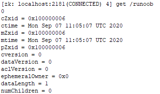

官网  https://zookeeper.apache.org/doc/r3.7.0/zookeeperOver.html

菜鸟教程  https://www.runoob.com/w3cnote/zookeeper-tutorial.html

# 1 zookeeper简介

ZooKeeper是一种开源的分布式应用协调服务。它为大型分布式计算提供开源的分布式配置服务、同步服务和命名注册。

ZooKeeper 的架构通过冗余服务实现高可用性。

它被设计成易于编程，并且使用了一个类似于文件系统的目录树结构的数据模型。

分布式应用程序可以基于它实现诸如数据发布/订阅、负载均衡、命名服务、分布式协调/通知、集群管理、Master 选举、分布式锁和分布式队列等功能。

## 1.1 特征

1. 顺序一致性 - 客户端的更新将按发送顺序应用。
2. 原子性 - 更新成功或失败。没有部分结果。
3. 统一视图 - 无论客户端连接到哪个服务器，客户端都将看到相同的服务视图。
4. 可靠性 - 一旦应用了更新，它将从那时起持续到客户端覆盖更新。
5. 及时性 - 系统的客户视图保证在特定时间范围内是最新的。


## 1.1 zookeeper 数据结构

zookkeeper 提供的名称空间非常类似于标准文件系统，key-value 的形式存储。名称 key 由斜线 **/** 分割的一系列路径元素，zookeeper 名称空间中的每个节点都是由一个路径标识。

每个节点存储的数据通常很小，在字节到千字节的范围内。*znode* 表示节点

Znodes维护一个统计结构，其中包括用于数据更改的版本号、ACL更改和时间戳


## 1.3 简单API

- *create* : 在树中的某个位置创建节点
- *delete* : 删除节点
- *exists* : 测试某个位置是否存在节点
- *get data* : 从节点读取数据
- *set data* : 向节点写入数据
- *get children* : 检索节点的子节点列表
- *sync* : 等待数据传播


**不要把zookeeper当数据库用，不能储存大量数据**


### CAP 理论

CAP 理论指出对于一个分布式计算系统来说，不可能同时满足以下三点：

- **一致性**：在分布式环境中，一致性是指数据在多个副本之间是否能够保持一致的特性，等同于所有节点访问同一份最新的数据副本。在一致性的需求下，当一个系统在数据一致的状态下执行更新操作后，应该保证系统的数据仍然处于一致的状态。
- **可用性：**每次请求都能获取到正确的响应，但是不保证获取的数据为最新数据。
- **分区容错性：**分布式系统在遇到任何网络分区故障的时候，仍然需要能够保证对外提供满足一致性和可用性的服务，除非是整个网络环境都发生了故障。

一个分布式系统最多只能同时满足一致性（Consistency）、可用性（Availability）和分区容错性（Partition tolerance）这三项中的两项。

在这三个基本需求中，最多只能同时满足其中的两项，P 是必须的，因此只能在 CP 和 AP 中选择，zookeeper 保证的是 CP，对比 spring cloud 系统中的注册中心 eruka 实现的是 AP。


### BASE 理论

BASE 是 Basically Available(基本可用)、Soft-state(软状态) 和 Eventually Consistent(最终一致性) 三个短语的缩写。

- **基本可用：**在分布式系统出现故障，允许损失部分可用性（服务降级、页面降级）。
- **软状态：**允许分布式系统出现中间状态。而且中间状态不影响系统的可用性。这里的中间状态是指不同的 data replication（数据备份节点）之间的数据更新可以出现延时的最终一致性。
- **最终一致性：**data replications 经过一段时间达到一致性。

BASE 理论是对 CAP 中的一致性和可用性进行一个权衡的结果，理论的核心思想就是：我们无法做到强一致，但每个应用都可以根据自身的业务特点，采用适当的方式来使系统达到最终一致性。


zookeeper 的三个端口作用

1、**2181** : 对 client 端提供服务

2、**2888** : 集群内机器通信使用

3、**3888** : 选举 leader 使用

```
#按 server.id = ip:port:port 修改集群配置文件zoo.cfg 
server.1=192.168.3.33:2888:3888
server.2=192.168.3.35:2888:3888
server.3=192.168.3.37:2888:3888
```


# 2 数据模型

## 2.1 znode

znodes的数据少于1M


**临时节点**（Ephemeral Nodes）

只要创建znode的会话是活动的，这些znode就会存在。当会话结束时，znode被删除。由于这种行为，临时znode不允许有子节点

可以使用getEphemerals() api获取会话的临时节点列表


**序列节点**（Sequence Nodes）

当创建znode时，你也可以请求ZooKeeper在路径的末尾添加一个单调递增的计数器。计数器的格式为%010d


**容器节点**（Container Nodes）

3.6.0版本之后添加

容器znode是特殊用途的znode，用于leader、lock等。当容器的最后一个子元素被删除时，该容器将成为将来某个时候服务器删除的候选对象。


**TTL Nodes**

3.6.0版本之后添加

当创建PERSISTENT或PERSISTENT SEQUENTIAL znode时，您可以选择为znode设置以毫秒为单位的TTL。如果znode没有在TTL中修改，并且没有子节点，那么它将成为将来某个时候被服务器删除的候选节点。

TTL节点必须通过System属性启用，因为它们在默认情况下是禁用的。


## 2.2 Time in ZooKeeper

**Zxid**   zookeeper事务id，对ZooKeeper状态的每一次更改都会收到一个zxid

**Version numbers**    对节点的每一次更改都会导致版本号增加。三个版本号分别是

​	version(对znode的数据的更改次数)

​	cversion(对znode的子节点的更改次数)

​	aclversion(对znode的ACL的更改次数)

**Ticks **  当使用多服务器ZooKeeper时，服务器使用ticks来定义事件的时间，如集群之间的状态上传、会话超时、连接超时等

**Real time**  ZooKeeper不使用实时时间或时钟时间，除了在znode创建和znode修改的stat结构中添加时间戳。


## 2.3 znode状态属性



| 字段           | 创建节点时的事务ID                                           |
| :------------- | :----------------------------------------------------------- |
| cZxid          | 创建节点时的事务ID                                           |
| ctime          | 创建节点时的时间                                             |
| mZxid          | 最后修改节点时的事务ID                                       |
| mtime          | 最后修改节点时的时间                                         |
| pZxid          | 表示该节点的子节点列表最后一次修改的事务ID，添加子节点或删除子节点就会影响子节点列表，但是修改子节点的数据内容则不影响该ID**（注意，只有子节点列表变更了才会变更pzxid，子节点内容变更不会影响pzxid）** |
| cversion       | 子节点版本号，子节点每次修改版本号加1                        |
| dataversion    | 数据版本号，数据每次修改该版本号加1                          |
| aclversion     | 权限版本号，权限每次修改该版本号加1                          |
| ephemeralOwner | 创建该临时节点的会话的sessionID。**（如果该节点是持久节点，那么这个属性值为0）** |
| dataLength     | 该节点的数据长度                                             |
| numChildren    | 该节点拥有子节点的数量**（只统计直接子节点的数量）**         |


# 3 会话Session

客户端与服务端之间的连接是基于 TCP 长连接，client 端连接 server 端默认的 2181 端口，也就是 session 会话。

从第一次连接建立开始，客户端开始会话的生命周期，客户端向服务端的ping包请求，每个会话都可以设置一个超时时间。


为了安全，服务器为会话id创建一个密码，任何ZooKeeper服务器都可以验证，客户端建立会话时，会获得session id的密码，当客户机与新服务器重新建立会话时，它就会发送带有会话id的密码。


**Timeout**：会话超时时间。客户端在构造 Zookeeper 实例时候，向服务端发送配置的超时时间，server 端会根据自己的超时时间限制最终确认会话的超时时间。要求超时至少是tickTime的2倍，最大是tickTime的20倍。

**TickTime**：下次会话超时时间点，默认 2000 毫秒。可在 zoo.cfg 配置文件中配置，便于 server 端对 session 会话实行**分桶策略管理**。

**isClosing**：该属性标记一个会话是否已经被关闭，当 server 端检测到会话已经超时失效，该会话标记为"已关闭"，不再处理该会话的新请求。


当集群在指定的会话超时时间**Timeout**内没有收到客户端消息时，就会发生过期

当会话过期，集群会删除这个session的所有临时节点，并通知watch了这些临时节点的客户端发生的改变。

过期的客户端不会收到过期通知，除非过期的客户端重连到集群，此时才能接收到会话过期通知。


客户端将发送一个PING请求以保持会话活跃


**Session 的状态**

下面介绍几个重要的状态：

- **connecting**：连接中，session 一旦建立，状态就是 connecting 状态，时间很短。
- **connected**：已连接，连接成功之后的状态。
- **disconnected**： 客户端与集群失去连接
- **expired**：最终客户端重新连接到集群，然后它会收到过期通知
- **closed**：已关闭，发生在 session 过期，一般由于网络故障客户端重连失败，服务器宕机或者客户端主动断开。

客户端将发送一个PING请求以保持会话活跃


**SessionMovedException **  3.2.0新增

有一个内部异常称为SessionMovedException，通常不会被客户端看到。

导致此错误的一般原因是客户端向服务器发送请求，但网络数据包被延迟，因此客户端超时并连接到一个新的服务器。当延迟的数据包到达第一个服务器时，旧的服务器检测到会话已经移动，并关闭客户端连接。客户端通常不会看到这个错误，因为他们没有从那些旧的连接中读取。

另一种情况是，两个客户机试图使用保存的会话id和密码重新建立相同的连接。其中一个客户端将重新建立连接，而第二个客户端将断开连接


**更新服务器列表**

调用一个概率负载平衡算法，更新服务器列表连接字符串

该算法可能导致客户端断开与当前主机的连接，目的是在新列表中实现每个服务器期望的统一连接数。如果客户端连接的当前主机不在新列表中，这个连接将会被丢弃。

例如，如果之前的连接字符串包含3台主机，而现在列表中包含这3台主机和另外2台主机，那么连接到这3台主机中的每台主机的40%的客户端将移动到其中一台新主机上，以平衡负载。该算法将导致客户端断开其与当前主机的连接(概率为0.4)，并在这种情况下导致客户端连接到随机选择的2个新主机中的一个。

另一个例子,假设我们有5台主机，要删除2台,与其中保留的3台主机建立连接的客户端保持连接,而所有客户机连接到2台删除主机需要搬到保留的3台主机,采用随机选取的方式选择这3台主机中的一个。如果断开连接，客户端将移动到一种特殊模式，使用概率算法(而不仅仅是轮询)选择要连接的新服务器。


**Local session**

由于在ZooKeeper中创建和关闭会话时需要quorum确认，花费成本很高，当需要处理数千个客户端连接时，它们成为ZooKeeper集合的瓶颈。

从3.5.0之后，提出了Local Session ,可以通过打开localsessionsenenabled来启用。

当*localSessionsUpgradingEnabled* 禁用时：

- 本地会话不能创建临时节点
- 当本地会话丢失，并且无法重连，本地会话和watch就会永久消失。如果在会话超时之前可以与同一个zk服务器重新建立连接，那么客户端可以继续，重连时不能连接其他的zk服务器。
- 当一个本地会话连接时，会话信息只维护在它所连接的zookeeper服务器上。leader不知道这样一个会话的创建，也没有写入磁盘的状态。
- ping、过期和其他会话状态维护由当前会话所连接的服务器来处理。


当*localSessionsUpgradingEnabled* 启用时：

- 本地会话可以自动升级为全局会话。
- 当创建一个新会话时，它将保存在包装好的LocalSessionTracker中。随后可以根据需要升级为全局会话(例如创建临时节点)。如果请求升级，会话将从本地集合中删除，同时保持相同的会话ID。
- 创建临时节点需要将会话从本地升级到全局。因为临时节点的创建严重依赖于全局会话。
- 升级期间的会话可以是本地会话和全局会话，但是两个线程不能同时调用升级操作。
- *ZooKeeperServer*(Standalone) uses *SessionTrackerImpl*; *LeaderZookeeper* uses *LeaderSessionTracker* which holds *SessionTrackerImpl*(global) and *LocalSessionTracker*(if enable); *FollowerZooKeeperServer* and *ObserverZooKeeperServer* use *LearnerSessionTracker* which holds *LocalSessionTracker*. 


什么时候会创建本地会话？

当处理ConnectRequest，并且createSession请求到达FinalRequestProcessor时，会创建一个本地会话。


# 4 Watch

watch事件是**一次性**的触发器，设置了watch事件的数据发生变化时，就会通知设置watch的客户端。

zookeeper维护了2个watch列表： data watches 和 child watches

getData() 和exists() 设置data watches. 

getChildren() 设置 child watches.

create()和delete()会触发创建/删除节点的data watches，和创建/删除节点的父节点的child watches


当客户端连接到新的服务器时，任何会话事件都会触发watch。

如果znode在断开连接时被创建和删除，断开连接前，znode还没有被创建，则watch将不会被触发。


3.6.0之后，客户端还可以在znode上设置永久、递归的监视，这些监视在被触发时不会被删除，并且会触发已注册znode以及任何子znode上的更改。


watch可以触发的事件和使之生效的方法调用

- **Created event:**   exists调用
- **Deleted event:**   exists, getData, getChildren调用
- **Changed event:**  exists ， getData调用
- **Child event:**  getChildren调用


watch是根据其他事件、其他watch和异步响应排序的。ZooKeeper客户端库确保每件事都被有序地分派。


# 5 权限控制 ACL


# ZooKeeper的工作原理


Zookeeper的核心是原子广播，这个机制保证了各个Server之间的同步。实现这个机制的协议叫做Zab协议。Zab协议有两种模式，它们分 别是恢复模式（选主）和广播模式（同步）。当服务启动或者在领导者崩溃后，Zab就进入了恢复模式，当领导者被选举出来，且大多数Server完成了和 leader的状态同步以后，恢复模式就结束了。状态同步保证了leader和Server具有相同的系统状态。

​    为了保证事务的顺序一致性，zookeeper采用了递增的事务id号（zxid）来标识事务。所有的提议（proposal）都在被提出的时候加上 了zxid。实现中zxid是一个64位的数字，它高32位是epoch用来标识leader关系是否改变，每次一个leader被选出来，它都会有一个 新的epoch，标识当前属于那个leader的统治时期。低32位用于递增计数。

每个Server在工作过程中有三种状态：

- LOOKING：当前Server不知道leader是谁，正在搜寻
- LEADING：当前Server即为选举出来的leader
- FOLLOWING：leader已经选举出来，当前Server与之同步

## 2.1 选主流程

   当leader崩溃或者leader失去大多数的follower，这时候zk进入恢复模式，恢复模式需要重新选举出一个新的leader，让所有的 Server都恢复到一个正确的状态。Zk的选举算法有两种：一种是基于basic paxos实现的，另外一种是基于fast paxos算法实现的。系统默认的选举算法为fast paxos。先介绍basic paxos流程：

​    1 .选举线程由当前Server发起选举的线程担任，其主要功能是对投票结果进行统计，并选出推荐的Server；

​    2 .选举线程首先向所有Server发起一次询问(包括自己)；

​    3 .选举线程收到回复后，验证是否是自己发起的询问(验证zxid是否一致)，然后获取对方的id(myid)，并存储到当前询问对象列表中，最后获取对方提议的leader相关信息(    id,zxid)，并将这些信息存储到当次选举的投票记录表中；

​    \4.  收到所有Server回复以后，就计算出zxid最大的那个Server，并将这个Server相关信息设置成下一次要投票的Server；

​    \5.  线程将当前zxid最大的Server设置为当前Server要推荐的Leader，如果此时获胜的Server获得n/2 + 1的Server票数， 设置当前推荐的leader为获胜的Server，将根据获胜的Server相关信息设置自己的状态，否则，继续这个过程，直到leader被选举出来。

  通过流程分析我们可以得出：要使Leader获得多数Server的支持，则Server总数必须是奇数2n+1，且存活的Server的数目不得少于n+1.

  每个Server启动后都会重复以上流程。在恢复模式下，如果是刚从崩溃状态恢复的或者刚启动的server还会从磁盘快照中恢复数据和会话信息，zk会记录事务日志并定期进行快照，方便在恢复时进行状态恢复。选主的具体流程图如下所示：

​                     

   fast paxos流程是在选举过程中，某Server首先向所有Server提议自己要成为leader，当其它Server收到提议以后，解决epoch和 zxid的冲突，并接受对方的提议，然后向对方发送接受提议完成的消息，重复这个流程，最后一定能选举出Leader。其流程图如下所示：

​             

## 2.2 同步流程

选完leader以后，zk就进入状态同步过程。

​    \1. leader等待server连接；

​    2 .Follower连接leader，将最大的zxid发送给leader；

​    3 .Leader根据follower的zxid确定同步点；

​    4 .完成同步后通知follower 已经成为uptodate状态；

​    5 .Follower收到uptodate消息后，又可以重新接受client的请求进行服务了。

流程图如下所示：

​                 

## 2.3 工作流程

### 2.3.1 Leader工作流程

Leader主要有三个功能：

​    1 .恢复数据；

​    2 .维持与Learner的心跳，接收Learner请求并判断Learner的请求消息类型；

​    3 .Learner的消息类型主要有PING消息、REQUEST消息、ACK消息、REVALIDATE消息，根据不同的消息类型，进行不同的处理。

​    PING消息是指Learner的心跳信息；REQUEST消息是Follower发送的提议信息，包括写请求及同步请求；ACK消息是 Follower的对提议的回复，超过半数的Follower通过，则commit该提议；REVALIDATE消息是用来延长SESSION有效时间。
Leader的工作流程简图如下所示，在实际实现中，流程要比下图复杂得多，启动了三个线程来实现功能。

​                 

### 2.3.2 Follower工作流程

Follower主要有四个功能：

​    \1. 向Leader发送请求（PING消息、REQUEST消息、ACK消息、REVALIDATE消息）；

​    2 .接收Leader消息并进行处理；

​    3 .接收Client的请求，如果为写请求，发送给Leader进行投票；

​    4 .返回Client结果。

Follower的消息循环处理如下几种来自Leader的消息：

​    1 .PING消息： 心跳消息；

​    2 .PROPOSAL消息：Leader发起的提案，要求Follower投票；

​    3 .COMMIT消息：服务器端最新一次提案的信息；

​    4 .UPTODATE消息：表明同步完成；

​    5 .REVALIDATE消息：根据Leader的REVALIDATE结果，关闭待revalidate的session还是允许其接受消息；

​    6 .SYNC消息：返回SYNC结果到客户端，这个消息最初由客户端发起，用来强制得到最新的更新。

Follower的工作流程简图如下所示，在实际实现中，Follower是通过5个线程来实现功能的。

​             

对于observer的流程不再叙述，observer流程和Follower的唯一不同的地方就是observer不会参加leader发起的投票。


